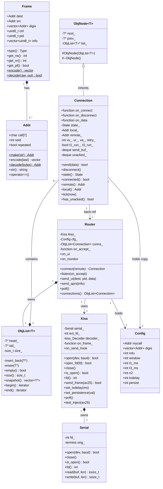
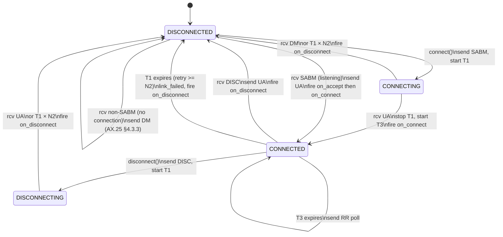
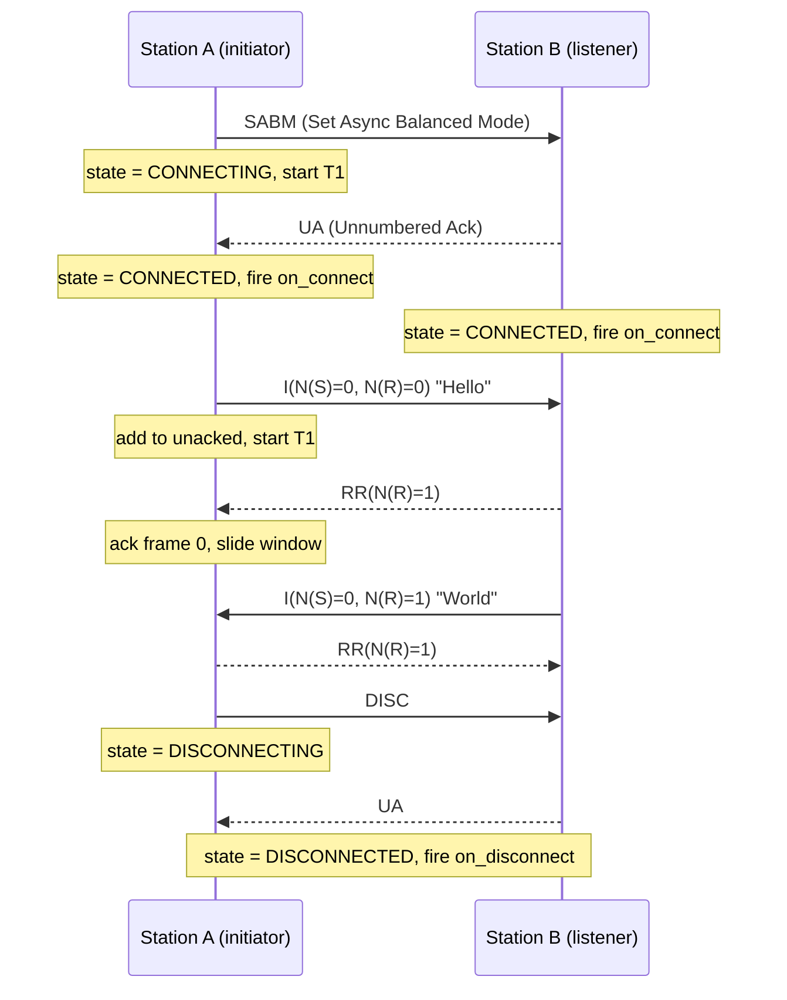
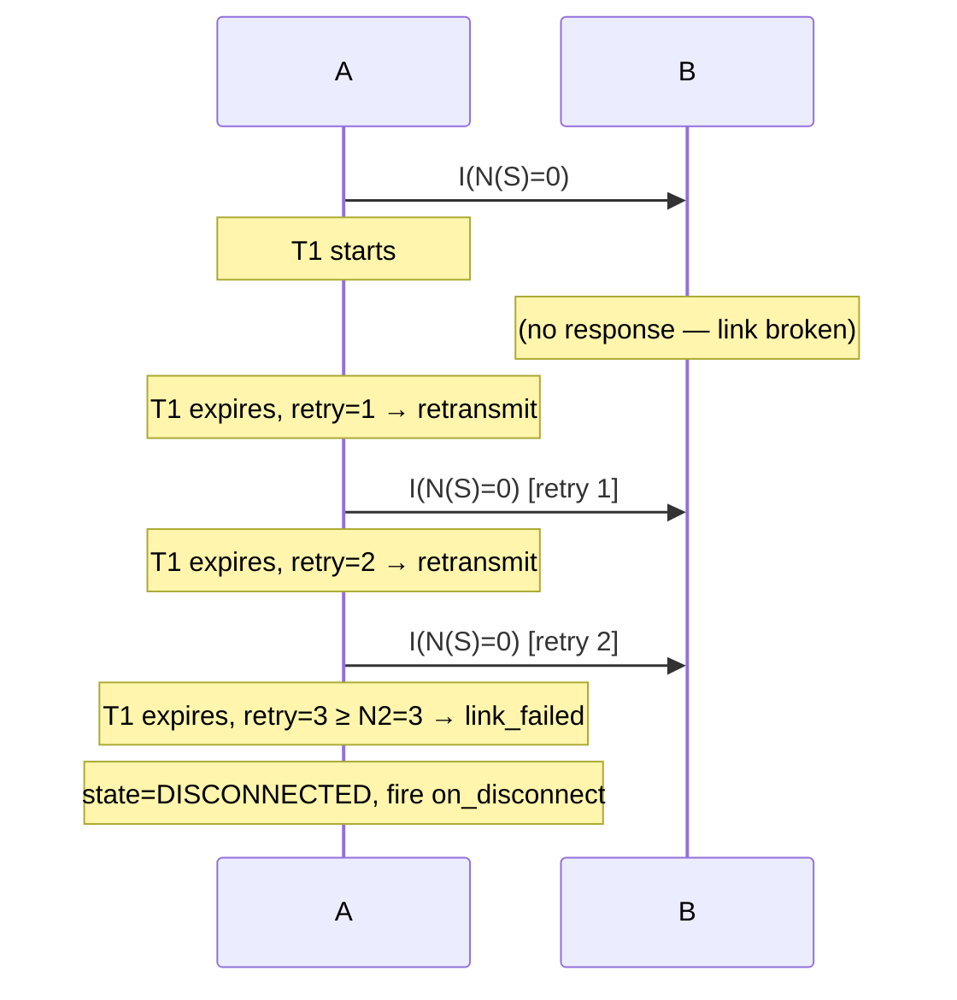
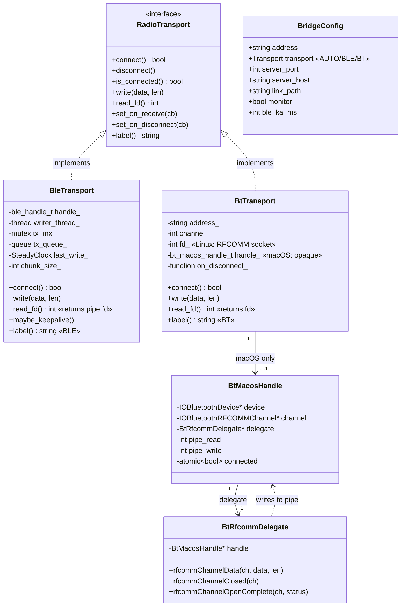
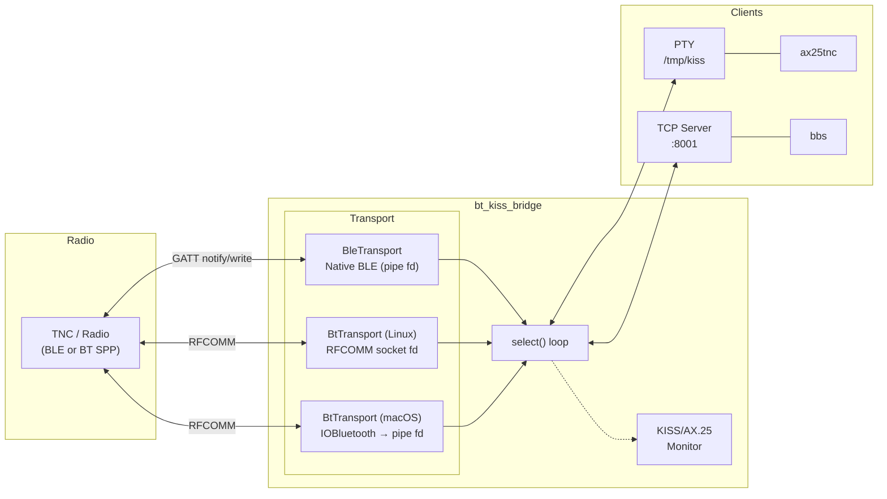

# KISSBBS — Design & Architecture Reference

> This document is the engineering reference for contributors. It covers protocol background,
> internal architecture, class relationships, state machines, and design rationale.
> For usage and operator documentation see [README.md](README.md).

## Table of Contents

1. [AX.25 Protocol](#1-ax25-protocol)
2. [KISS Protocol](#2-kiss-protocol)
3. [APRS](#3-aprs)
4. [ax25lib — Layer Architecture](#4-ax25lib--layer-architecture)
5. [Object Relationship Diagram (ax25lib)](#5-object-relationship-diagram-ax25lib)
6. [UML Class Diagram (ax25lib)](#6-uml-class-diagram-ax25lib)
7. [AX.25 State Machine](#7-ax25-state-machine)
8. [Connection Sequence Diagrams](#8-connection-sequence-diagrams)
9. [Intrusive Container — Design Notes (ObjNode / ObjList)](#9-intrusive-container--design-notes-objnode--objlist)
10. [bt_kiss_bridge — Architecture](#10-bt_kiss_bridge--architecture)
    - [Object Relationship Diagram](#object-relationship-diagram)
    - [UML Class Diagram](#uml-class-diagram)
    - [Data Flow Diagram](#data-flow-diagram)
11. [BLE Transport Implementation Notes](#11-ble-transport-implementation-notes)

---

## 1. AX.25 Protocol

AX.25 is the link-layer protocol used in amateur (ham) radio packet networks.
Think of it as a stripped-down Ethernet designed for half-duplex radio channels.

**Addresses** — Every station has a *callsign* (up to 6 characters, e.g. `W1AW`)
plus a 0–15 *SSID* suffix, written `W1AW-7`.  On the wire each address occupies
exactly 7 bytes: the 6 callsign characters shifted left by one bit, followed by
a flag byte carrying the SSID and housekeeping bits.

**Frame types**

| Type | Purpose |
|------|---------|
| UI (Unnumbered Information) | Connectionless datagram — used for APRS beacons |
| SABM | Set Asynchronous Balanced Mode — opens a connection |
| UA | Unnumbered Acknowledgement — accepts SABM or DISC |
| DM | Disconnected Mode — rejects SABM |
| DISC | Disconnect — closes a connection |
| I-frame | Information frame — carries sequenced data |
| RR | Receive Ready — acknowledges I-frames, resumes suspended flow |
| REJ | Reject — requests retransmission from a given sequence number |

**Connected mode** (what `Connection` implements) uses a sliding window
(Go-Back-N, mod-8) with two timers:

* **T1** — Retransmit timer.  Dynamically computed:
  `max(t1_ms, window × mtu × 40000 / baud)`.  This ensures T1 is long enough
  for the full window to transit slow links (BLE, 1200 baud, etc.).  Default
  minimum is 15 000 ms.  If T1 expires before an ACK arrives the frame is
  retransmitted with P=1 to poll the remote.  After *N2* retries the link is
  declared failed.
* **T3** — Keep-alive / inactivity timer.  If no data is exchanged within T3 the
  station sends an RR poll (P=1) to verify the link is still alive.

**P/F poll tracking** — The library tracks outstanding P=1 polls internally.
When the window fills, the last I-frame is sent with P=1 to solicit an RR
response from the remote.  Incoming RR/RNR with F=1 are matched against
outstanding polls so the library never echoes back a spurious RR.  Applications
never need to manage polling — it is fully transparent.

**TX pacing** — Outgoing frames are spaced by TXDELAY (default 400 ms) to give
half-duplex radios time for TX/RX turnaround.  After receiving a frame, the
router also enforces a turnaround delay before responding.

---

## 2. KISS Protocol

KISS ("Keep It Simple, Stupid") is a thin serial framing protocol that lets a
computer talk to a TNC (Terminal Node Controller — the radio modem).

The computer sends and receives raw AX.25 frames wrapped in a simple envelope:

```
FEND  CMD  DATA...  FEND
```

Special byte values are escaped inside DATA so they cannot be confused with
envelope markers:

| Raw byte | On wire |
|----------|---------|
| `0xC0` (FEND) | `0xDB 0xDC` |
| `0xDB` (FESC) | `0xDB 0xDD` |

The TNC handles everything physical: radio timing, flag bytes, and FCS
checksums.  The library never sees or generates those.

---

## 3. APRS

APRS (Automatic Packet Reporting System) is built on top of AX.25 UI frames
with PID `0xF0`, sent to the destination callsign `APRS`.  The library lets you
send position reports and person-to-person messages and receive/route incoming
ones.

---

## 4. ax25lib — Layer Architecture

```
Your Application
       │
       ▼
   ┌────────┐
   │ Router │  Manages connections; routes incoming frames; exposes on_ui
   └────────┘
       │
       ▼
   ┌────────┐
   │  Kiss  │  Transport-agnostic KISS framing layer
   └────────┘
       │  open(dev, baud)  ← serial port (Serial / termios)
       │  open_fd(fd)      ← any POSIX fd: TCP socket, PTY, pipe
       │
    (wire / socket / PTY)
       │
      TNC  ──── Radio ──── Remote station
```

The layer stack is **intentionally thin**: each layer does exactly one job and
calls the layer above via a `std::function` callback, making the stack easy to
test (swap the serial layer with an in-memory hook) and easy to adapt (plug in a
different physical layer without touching the rest).

---

## 5. Object Relationship Diagram (ax25lib)

```
                              ┌─────────────────────────────────────────┐
                              │              ax25lib.hpp/cpp             │
                              └─────────────────────────────────────────┘

  ┌──────────────────────────────────────────────────────────────────────────┐
  │  ObjNode<T>  (template)  — self-managing intrusive node                  │
  │  ─────────────────────────────────────────────────────────────────────── │
  │  # ObjNode(ObjList<T>&)   ← protected; auto-inserts on construction      │
  │  # ~ObjNode()              ← protected; auto-removes on destruction       │
  │  - next_ : T*                                                             │
  │  - prev_ : T*                                                             │
  │  - list_ : ObjList<T>*                                                    │
  └──────────────────────────────────────────────────────────────────────────┘
          ▲ inherits
          │
  ┌───────────────────────────────────────────────────────────────────────┐
  │  Connection  extends ObjNode<Connection>                               │
  │  ─────────────────────────────────────────────────────────────────────│
  │  Callbacks: on_connect, on_disconnect, on_data                         │
  │  State: DISCONNECTED / CONNECTING / CONNECTED / DISCONNECTING          │
  │  AX.25 vars: vs_, vr_, va_, retry_                                     │
  │  Timers: T1 (retransmit), T3 (keep-alive)                              │
  │  Queues: send_buf_, unacked_                                            │
  │  ─────────────────────────────────────────────────────────────────────│
  │  + send(data)                                                           │
  │  + disconnect()                                                         │
  │  + tick(now_ms)                                                         │
  │  + has_unacked() → bool   (true if unacked_ or send_buf_ non-empty)    │
  └───────────────────────────────────────────────────────────────────────┘
          │ lives in (inserted/removed automatically via ObjNode ctor/dtor)
          ▼
  ┌───────────────────────────────────────────────────────────────────────┐
  │  ObjList<Connection>  (intrusive doubly-linked list)                   │
  │  ─────────────────────────────────────────────────────────────────────│
  │  - head_, tail_, size_   (private)                                      │
  │  - insert_back(item)     (called by ObjNode ctor — not public)          │
  │  - erase(item)           (called by ObjNode dtor — not public)          │
  │  + empty()  size()  begin()  end()  snapshot()                          │
  └───────────────────────────────────────────────────────────────────────┘
          │ owned by
          ▼
  ┌───────────────────────────────────────────────────────────────────────┐
  │  Router                                                                │
  │  ─────────────────────────────────────────────────────────────────────│
  │  + connect(remote) → Connection*                                       │
  │  + listen(on_accept)                                                   │
  │  + send_ui(dest, pid, data)                                            │
  │  + send_aprs(info)                                                     │
  │  + poll()                                                              │
  │  Callbacks: on_ui (all UI frames), on_monitor (all frames)             │
  └───────────────────────────────────────────────────────────────────────┘
          │ holds reference to
          ▼
  ┌───────────────────────────────────────────────────────────────────────┐
  │  Kiss                                                                  │
  │  ─────────────────────────────────────────────────────────────────────│
  │  + open(device, baud)   ← serial port                                  │
  │  + open_fd(fd)          ← any POSIX fd (TCP socket, PTY, pipe…)        │
  │  + fd() → int           ← active file descriptor                       │
  │  + is_open() → bool                                                     │
  │  + send_frame(ax25_bytes)                                              │
  │  + poll()  — reads fd, fires on_frame for each complete AX.25 frame    │
  │  Hooks: on_send_hook (test/simulation), test_inject(payload)           │
  └───────────────────────────────────────────────────────────────────────┘
          │ owns
          ▼
  ┌───────────────────────────────────────────────────────────────────────┐
  │  Serial                                                                │
  │  ─────────────────────────────────────────────────────────────────────│
  │  + open(dev, baud)   close()                                           │
  │  + read(buf, len)    write(buf, len)                                   │
  │  fd_ : int           (non-blocking POSIX file descriptor)              │
  └───────────────────────────────────────────────────────────────────────┘

  Supporting types (used by the layers above)

  ┌──────────────┐   ┌───────────────────────────────────┐
  │  Addr        │   │  Frame                             │
  │  ────────────│   │  ─────────────────────────────────│
  │  call[7]     │   │  dest, src : Addr                  │
  │  ssid : int  │   │  digis : vector<Addr>              │
  │  make(str)   │   │  ctrl, pid : uint8_t               │
  │  encode()    │   │  info : vector<uint8_t>            │
  │  decode()    │   │  type() → IFrame/UI/SABM/...       │
  │  str()       │   │  encode() / decode()               │
  └──────────────┘   └───────────────────────────────────┘

  ┌────────────────────────────────────────────────────────────┐
  │  kiss namespace                                             │
  │  ──────────────────────────────────────────────────────────│
  │  Constants: FEND, FESC, TFEND, TFESC                        │
  │  encode(payload) → KISS-wrapped bytes                       │
  │  Decoder::feed(buf, len) → vector<kiss::Frame>              │
  └────────────────────────────────────────────────────────────┘

  ┌────────────────────────────────────────────────────────────┐
  │  Config                                                     │
  │  ──────────────────────────────────────────────────────────│
  │  mycall, digis, mtu, window, t1_ms, t3_ms, n2, …           │
  └────────────────────────────────────────────────────────────┘
```

---

## 6. UML Class Diagram (ax25lib)



---

## 7. AX.25 State Machine



---

## 8. Connection Sequence Diagrams

### Successful connect + data exchange + disconnect



### T1 retransmit and link failure



---

## 9. Intrusive Container — Design Notes (ObjNode / ObjList)

`ObjNode<T>` / `ObjList<T>` is an intrusive doubly-linked container inspired by
the Linux kernel's `list_head`.  Unlike `std::list`, which heap-allocates a
wrapper node for each element, the linkage (`next_`/`prev_` pointers) lives
**inside** the object itself — no extra allocation needed.

### Self-managing lifetime

The key improvement over a plain `Node<T>` base class is that **`ObjNode<T>`
owns the insert/remove responsibility** so developers never call `push_back` or
`remove` explicitly:

```cpp
// T must inherit ObjNode<T>.
// The constructor takes the list — insertion is automatic.
struct MySession : ObjNode<MySession> {
    std::string call;
    MySession(ObjList<MySession>& list, std::string c)
        : ObjNode<MySession>(list),   // ← inserts into list immediately
          call(std::move(c)) {}
    // destructor: ObjNode<MySession>::~ObjNode() fires automatically
    //             → removes from list with O(1), no search
};

ObjList<MySession> sessions;
{
    MySession a(sessions, "W1AW");
    MySession b(sessions, "N0CALL");
    assert(sessions.size() == 2);
}   // a and b destroyed → auto-removed
assert(sessions.empty());

// Heap allocation: delete triggers auto-remove too
auto* s = new MySession(sessions, "PY2XXX");
assert(sessions.size() == 1);
delete s;          // ← safe: auto-removed from list before memory is freed
assert(sessions.empty());
```

### API restrictions

* **Default constructor is `= delete`** — every `ObjNode<T>` must bind to an
  `ObjList<T>` at construction time.
* **Copy and move are `= delete`** — nodes are identity-based, not value-based.
* `ObjList<T>::insert_back` and `erase` are **private**, only callable by
  `ObjNode<T>` (friend).  User code never calls them.
* An object can belong to **one** list at a time (same trade-off as all
  intrusive containers).

### Advantages

| Property | Benefit |
|----------|---------|
| Zero extra allocation | No wrapper `list_node` struct on the heap |
| O(1) insert / remove | Pointer surgery only; no search |
| Safety by construction | Can't forget to insert; can't double-free the link |
| RAII-friendly | Scope exit or `delete` → automatic deregistration |

---

## 10. bt_kiss_bridge — Architecture

### Object Relationship Diagram

```
  ┌──────────────────────────────────────────────────────────────────────────────┐
  │  bt_kiss_bridge.cpp + bt_ble_native.h + bt_rfcomm_macos.h                   │
  └──────────────────────────────────────────────────────────────────────────────┘

  ┌──────────────────────────────────────────────────────────────────────────────┐
  │  RadioTransport  «interface»                                                 │
  │  ──────────────────────────────────────────────────────────────────────────  │
  │  + connect() → bool                                                          │
  │  + disconnect()                                                              │
  │  + is_connected() → bool                                                     │
  │  + write(data, len)                                                          │
  │  + read_fd() → int           (≥0 = fd for select(), all transports)         │
  │  + set_on_disconnect(cb)                                                     │
  │  + label() → "BLE" | "BT"                                                   │
  └──────────────────────────────────────────────────────────────────────────────┘
          ▲ implements                          ▲ implements
          │                                     │
  ┌───────────────────────────────┐   ┌────────────────────────────────────────┐
  │  BleTransport                 │   │  BtTransport                            │
  │  ─────────────────────────── │   │  ────────────────────────────────────── │
  │  ble_handle_t (native API)    │   │  Linux: BlueZ RFCOMM socket (fd_)       │
  │  Async TX queue + writer thd  │   │  macOS: IOBluetooth RFCOMM + pipe() fd  │
  │  Notify → pipe fd (RX)        │   │  Direct TX (::write / writeSync)        │
  │  BLE keep-alive timer         │   │  SDP auto-detect SPP channel (0x1101)   │
  │  read_fd() = pipe read fd     │   │  read_fd() = socket fd / pipe read fd   │
  └───────────────────────────────┘   └────────────────────────────────────────┘
                                              │
                                      ┌───────┴──────────────┐
                                      │                      │
                              ┌──────────────┐    ┌─────────────────────────┐
                              │ Linux (BlueZ) │    │ macOS (IOBluetooth)     │
                              │ ──────────── │    │ ─────────────────────── │
                              │ AF_BLUETOOTH  │    │ bt_rfcomm_macos.mm      │
                              │ BTPROTO_RFCOMM│    │ C-linkage API (extern)  │
                              │ socket fd     │    │ IOBluetoothRFCOMMChannel│
                              │ SDP via BlueZ │    │ delegate → pipe() fd    │
                              └──────────────┘    │ performSDPQuery         │
                                                  └─────────────────────────┘

  ┌──────────────────────────────────────────────────────────────────────────────┐
  │  Bridge Core  (do_bridge)                                                    │
  │  ──────────────────────────────────────────────────────────────────────────  │
  │  PTY pair (/tmp/kiss symlink) ←──── mutual exclusive ────→ TCP server       │
  │  select() loop: PTY + TCP clients + transport.read_fd()                      │
  │  KISS + AX.25 monitor (--monitor)                                            │
  │  Auto-reconnect (up to 10 retries, 5s pause)                                 │
  └──────────────────────────────────────────────────────────────────────────────┘

  ┌──────────────────────────────────────────────────────────────────────────────┐
  │  Discovery                                                                   │
  │  ──────────────────────────────────────────────────────────────────────────  │
  │  do_ble_scan()  → native BLE scan (BlueZ D-Bus / CoreBluetooth)              │
  │  do_bt_scan()   → HCI inquiry (Linux) / IOBluetoothDeviceInquiry (macOS)    │
  │  do_ble_inspect()→ GATT service + characteristic enumeration                 │
  │  do_bt_inspect() → SDP service browsing + RFCOMM channel extraction          │
  │  do_scan(AUTO)   → scans both BLE + BT on Linux and macOS                   │
  └──────────────────────────────────────────────────────────────────────────────┘
```

### UML Class Diagram



### Data Flow Diagram



---

## 11. BLE Transport Implementation Notes

### CCCD Subscription (Notify)

BLE peripherals only enter data-forwarding mode after the central device subscribes to
notifications — this is done by writing `0x0001` to the Client Characteristic Configuration
Descriptor (CCCD, UUID `0x2902`) on the notify characteristic.

The subscription is confirmed asynchronously via a delegate callback
(`didUpdateNotificationStateForCharacteristic` on macOS CoreBluetooth,
`StartNotify` D-Bus reply on Linux BlueZ). The transport **must wait** for this
confirmation before sending any KISS data — some radios (including the GA-5WB and
Vero VR-N76/VR-N7600) only enter KISS mode after CCCD is acknowledged.

Implementation: `NotifyWaiter` (`bt_ble_macos.mm`) — a `std::mutex` + `std::condition_variable`
that the CB delegate signals when the notification state update fires. The connect
function waits up to 5 s; if it times out it proceeds with a warning (some devices
fire the callback before we start waiting).

### Chunking vs ATT MTU

ATT MTU is the maximum ATT PDU size (default 23 bytes = 20 bytes payload + 3 header).
After MTU negotiation the effective payload is `ATT_MTU − 3`.

- `auto_chunk` = max payload the OS will accept in one write call (CoreBluetooth:
  `maximumWriteValueLengthForType:` already returns payload; BlueZ: ATT MTU − 3).
- `chunk_sz = 0` (no `--mtu`): write entire KISS frame in one call — let the OS/stack
  handle fragmentation internally.
- `chunk_sz = N` (`--mtu N`): split frame into N-byte writes. Use this only if the
  radio firmware has known issues with large writes.

### Write Without Response (WWR)

BLE write types:
- **Write With Response** (0x12): reliable, ACK'd, max payload = ATT_MTU − 3.
- **Write Without Response** (0x52): fire-and-forget, no ACK, max payload = ATT_MTU − 3.

Most KISS TNC BLE implementations use Write Without Response for throughput.
The transport auto-detects the write type from the characteristic properties.

### Direct Write (no buffering)

The write path calls `ble_write()` (which dispatches `writeValue:` on the CoreBluetooth
queue on macOS, or calls `org.bluez.GattCharacteristic1.WriteValue` on Linux) directly
from the calling thread. No separate writer thread or queue is used. This eliminates
latency from the former 50 ms polling loop and ensures KISS frames hit the radio
in the order and at the timing they arrive from the PTY/TCP client.
