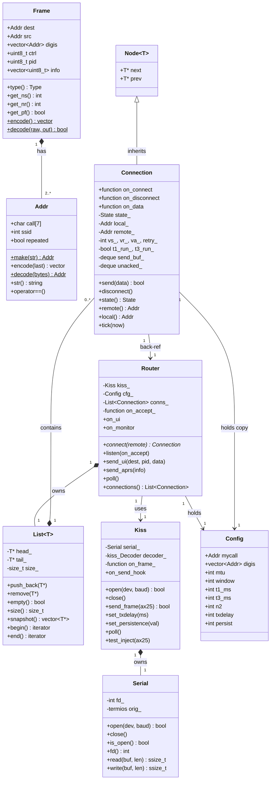
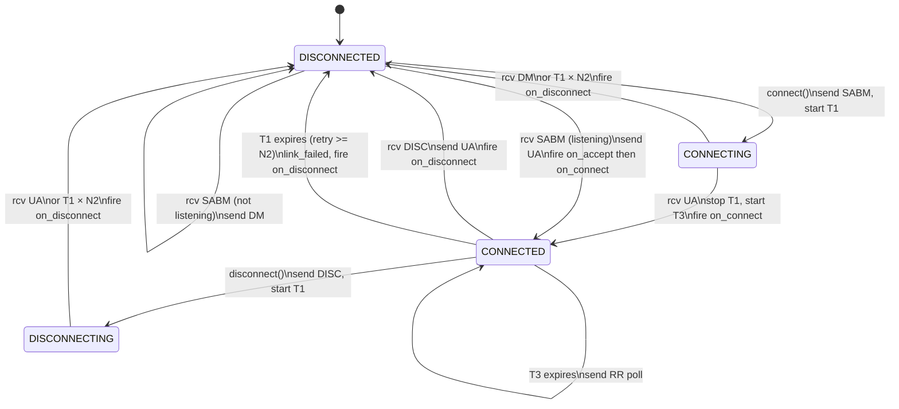
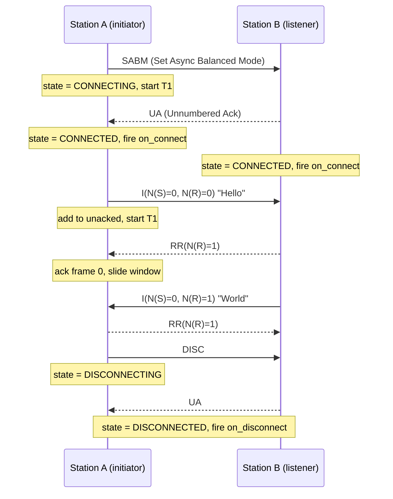
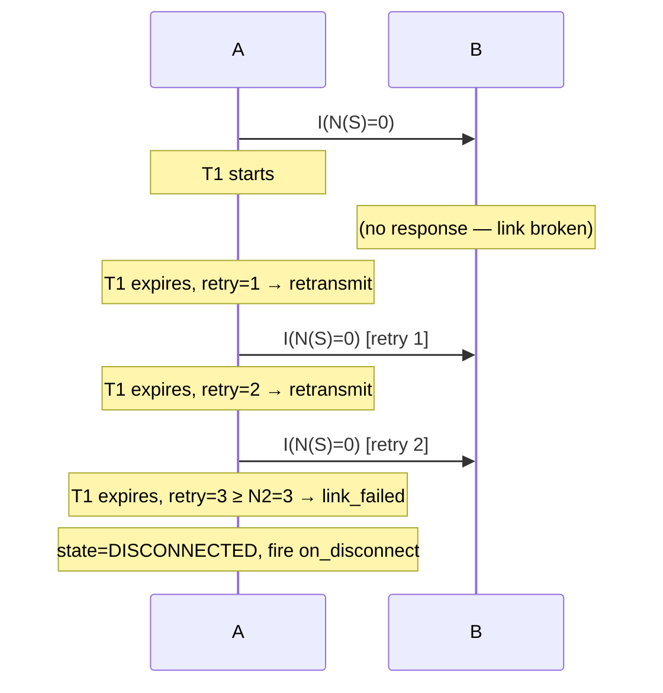

# KISSBBS — AX.25 / KISS Library (C++11, Linux + macOS)

[](https://github.com/solariun/KISSBBS/actions/workflows/ci.yml)

A self-contained C++11 library implementing the AX.25 amateur-radio link-layer
protocol over KISS-mode TNCs.  Includes a full-featured BBS example with remote
shell access, an interactive KISS terminal, and a comprehensive GoogleTest suite.

---

## Table of Contents

1. [Background — AX.25 and KISS](#1-background--ax25-and-kiss)
2. [Architecture Overview](#2-architecture-overview)
3. [Object Relationship Diagram](#3-object-relationship-diagram)
4. [UML Class Diagram](#4-uml-class-diagram)
5. [AX.25 State Machine](#5-ax25-state-machine)
6. [Connection Sequence Diagram](#6-connection-sequence-diagram)
7. [Building](#7-building)
8. [API Reference](#8-api-reference)
9. [Usage Examples](#9-usage-examples)
10. [Running Tests](#10-running-tests)
11. [BBS Example](#11-bbs-example)

---

## 1. Background — AX.25 and KISS

### AX.25

AX.25 is the link-layer protocol used in amateur (ham) radio packet networks.
Think of it as a stripped-down Ethernet designed for half-duplex radio channels.

**Addresses** — Every station has a *callsign* (up to 6 characters, e.g. `W1AW`)
plus a 0–15 *SSID* suffix, written `W1AW-7`.  On the wire each address occupies
exactly 7 bytes: the 6 callsign characters shifted left by one bit, followed by
a flag byte carrying the SSID and housekeeping bits.

**Frame types**

| Type | Purpose |
|------|---------|
| UI (Unnumbered Information) | Connectionless datagram — used for APRS beacons |
| SABM | Set Asynchronous Balanced Mode — opens a connection |
| UA | Unnumbered Acknowledgement — accepts SABM or DISC |
| DM | Disconnected Mode — rejects SABM |
| DISC | Disconnect — closes a connection |
| I-frame | Information frame — carries sequenced data |
| RR | Receive Ready — acknowledges I-frames, resumes suspended flow |
| REJ | Reject — requests retransmission from a given sequence number |

**Connected mode** (what `Connection` implements) uses a sliding window
(Go-Back-N, mod-8) with three timers:

* **T1** — Retransmit timer.  Started when an I-frame is sent.  If T1 expires
  before an ACK arrives the frame is retransmitted.  After *N2* retries the link
  is declared failed.
* **T2** — Delayed-ACK timer.  Not used in the send path here.
* **T3** — Keep-alive / inactivity timer.  If no data is exchanged within T3 the
  station sends an RR poll to verify the link is still alive.

### KISS

KISS ("Keep It Simple, Stupid") is a thin serial framing protocol that lets a
computer talk to a TNC (Terminal Node Controller — the radio modem).

The computer sends and receives raw AX.25 frames wrapped in a simple envelope:

```
FEND  CMD  DATA...  FEND
```

Special byte values are escaped inside DATA so they cannot be confused with
envelope markers:

| Raw byte | On wire |
|----------|---------|
| `0xC0` (FEND) | `0xDB 0xDC` |
| `0xDB` (FESC) | `0xDB 0xDD` |

The TNC handles everything physical: radio timing, flag bytes, and FCS
checksums.  The library never sees or generates those.

### APRS

APRS (Automatic Packet Reporting System) is built on top of AX.25 UI frames
with PID `0xF0`, sent to the destination callsign `APRS`.  The library lets you
send position reports and person-to-person messages and receive/route incoming
ones.

---

## 2. Architecture Overview

```
Your Application
       │
       ▼
   ┌────────┐
   │ Router │  Manages connections; routes incoming frames; exposes on_ui
   └────────┘
       │
       ▼
   ┌────────┐
   │  Kiss  │  Serial port + KISS framing layer
   └────────┘
       │
       ▼
   ┌────────┐
   │ Serial │  POSIX termios (non-blocking, cross-platform)
   └────────┘
       │
    (wire)
       │
      TNC  ──── Radio ──── Remote station
```

The layer stack is **intentionally thin**: each layer does exactly one job and
calls the layer above via a `std::function` callback, making the stack easy to
test (swap the serial layer with an in-memory hook) and easy to adapt (plug in a
different physical layer without touching the rest).

---

## 3. Object Relationship Diagram

```
                              ┌─────────────────────────────────────────┐
                              │              ax25lib.hpp/cpp             │
                              └─────────────────────────────────────────┘

  ┌──────────────────────────────────────────────────────────────────────────┐
  │  Node<T>  (template)                                                     │
  │  ─────────────────                                                       │
  │  + next : T*                                                             │
  │  + prev : T*                                                             │
  └──────────────────────────────────────────────────────────────────────────┘
          ▲ inherits
          │
  ┌───────────────────────────────────────────────────────────────────────┐
  │  Connection  extends Node<Connection>                                  │
  │  ─────────────────────────────────────────────────────────────────────│
  │  Callbacks: on_connect, on_disconnect, on_data                         │
  │  State: DISCONNECTED / CONNECTING / CONNECTED / DISCONNECTING          │
  │  AX.25 vars: vs_, vr_, va_, retry_                                     │
  │  Timers: T1 (retransmit), T3 (keep-alive)                              │
  │  Queues: send_buf_, unacked_                                            │
  │  ─────────────────────────────────────────────────────────────────────│
  │  + send(data)                                                           │
  │  + disconnect()                                                         │
  │  + tick(now_ms)                                                         │
  └───────────────────────────────────────────────────────────────────────┘
          │ lives in
          ▼
  ┌───────────────────────────────────────────────────────────────────────┐
  │  List<Connection>  (intrusive doubly-linked list)                      │
  │  ─────────────────────────────────────────────────────────────────────│
  │  head_, tail_, size_                                                    │
  │  + push_back(item)  remove(item)  snapshot()  begin()  end()           │
  └───────────────────────────────────────────────────────────────────────┘
          │ owned by
          ▼
  ┌───────────────────────────────────────────────────────────────────────┐
  │  Router                                                                │
  │  ─────────────────────────────────────────────────────────────────────│
  │  + connect(remote) → Connection*                                       │
  │  + listen(on_accept)                                                   │
  │  + send_ui(dest, pid, data)                                            │
  │  + send_aprs(info)                                                     │
  │  + poll()                                                              │
  │  Callbacks: on_ui (all UI frames), on_monitor (all frames)             │
  └───────────────────────────────────────────────────────────────────────┘
          │ holds reference to
          ▼
  ┌───────────────────────────────────────────────────────────────────────┐
  │  Kiss                                                                  │
  │  ─────────────────────────────────────────────────────────────────────│
  │  + open(device, baud)                                                  │
  │  + send_frame(ax25_bytes)                                              │
  │  + poll()  — reads serial, fires on_frame for each complete AX.25 frame│
  │  Hooks: on_send_hook (test/simulation), test_inject(payload)           │
  └───────────────────────────────────────────────────────────────────────┘
          │ owns
          ▼
  ┌───────────────────────────────────────────────────────────────────────┐
  │  Serial                                                                │
  │  ─────────────────────────────────────────────────────────────────────│
  │  + open(dev, baud)   close()                                           │
  │  + read(buf, len)    write(buf, len)                                   │
  │  fd_ : int           (non-blocking POSIX file descriptor)              │
  └───────────────────────────────────────────────────────────────────────┘

  Supporting types (used by the layers above)

  ┌──────────────┐   ┌───────────────────────────────────┐
  │  Addr        │   │  Frame                             │
  │  ────────────│   │  ─────────────────────────────────│
  │  call[7]     │   │  dest, src : Addr                  │
  │  ssid : int  │   │  digis : vector<Addr>              │
  │  make(str)   │   │  ctrl, pid : uint8_t               │
  │  encode()    │   │  info : vector<uint8_t>            │
  │  decode()    │   │  type() → IFrame/UI/SABM/...       │
  │  str()       │   │  encode() / decode()               │
  └──────────────┘   └───────────────────────────────────┘

  ┌────────────────────────────────────────────────────────────┐
  │  kiss namespace                                             │
  │  ──────────────────────────────────────────────────────────│
  │  Constants: FEND, FESC, TFEND, TFESC                        │
  │  encode(payload) → KISS-wrapped bytes                       │
  │  Decoder::feed(buf, len) → vector<kiss::Frame>              │
  └────────────────────────────────────────────────────────────┘

  ┌────────────────────────────────────────────────────────────┐
  │  Config                                                     │
  │  ──────────────────────────────────────────────────────────│
  │  mycall, digis, mtu, window, t1_ms, t3_ms, n2, …           │
  └────────────────────────────────────────────────────────────┘
```

---

## 4. UML Class Diagram



---

## 5. AX.25 State Machine



---

## 6. Connection Sequence Diagram

### Successful connect + data exchange + disconnect



### T1 retransmit and link failure



---

## 7. Building

### Prerequisites

| Platform | Compiler | Extra deps |
|----------|----------|------------|
| macOS    | Xcode CLT (`xcode-select --install`) | — |
| Linux    | `g++` ≥ 7 | `sudo apt-get install build-essential` |

For the test suite you also need GoogleTest:

```bash
# macOS
brew install googletest

# Ubuntu / Debian
sudo apt-get install libgtest-dev

# Fedora
sudo dnf install gtest-devel
```

### Build targets

```bash
make          # build bbs and ax25kiss binaries
make test     # compile and run all 43 unit tests
make clean    # remove all build artefacts
```

To cross-compile or choose a different compiler:

```bash
CXX=clang++ make
```

---

## 8. API Reference

### `ax25::Addr`

```cpp
// Parse a callsign string (case-insensitive, optional -SSID)
Addr a = Addr::make("W1AW-7");

// Encode to 7 AX.25 wire bytes
std::vector<uint8_t> raw = a.encode(/*last_addr=*/false);

// Decode from 7 raw bytes
Addr b = Addr::decode(raw.data());

// Human-readable string
std::string s = a.str();   // → "W1AW-7"
```

### `ax25::Config`

```cpp
Config cfg;
cfg.mycall  = Addr::make("W1AW");
cfg.mtu     = 128;   // max info bytes per I-frame
cfg.window  = 3;     // max outstanding unacked I-frames (1–7)
cfg.t1_ms   = 3000;  // retransmit timer ms
cfg.t3_ms   = 60000; // keep-alive inactivity timer ms
cfg.n2      = 10;    // max retries before link fail
```

### `ax25::Kiss`

```cpp
Kiss kiss;
kiss.open("/dev/ttyUSB0", 9600);

// Register callback — fires for every complete AX.25 payload received
kiss.set_on_frame([](std::vector<uint8_t> frame) { /* ... */ });

// Send an AX.25 payload
kiss.send_frame(ax25_bytes);

// Drive the I/O loop from your event loop
kiss.poll();   // non-blocking read; fires callback for each frame
```

### `ax25::Router`

```cpp
// Kiss must be open before constructing Router
Router router(kiss, cfg);

// Accept incoming connections
router.listen([](Connection* conn) {
    conn->on_connect    = [&]{ /* set up UI for this user */ };
    conn->on_disconnect = [&]{ delete conn; };
    conn->on_data = [&](const uint8_t* d, size_t n) {
        /* process data */
    };
});

// Initiate an outgoing connection
Connection* conn = router.connect(Addr::make("N0CALL"));
// on_connect fires synchronously if peer responds instantly

// Send a connectionless UI frame
router.send_ui(Addr::make("N0CALL"), 0xF0, "hello");

// Send an APRS frame (UI, PID=0xF0, dest=APRS)
router.send_aprs("!5130.00N/00000.00E>Test beacon");

// Monitor all UI / APRS traffic
router.on_ui = [](const Frame& f) { /* inspect */ };

// Monitor every decoded frame (for logging)
router.on_monitor = [](const Frame& f) { /* log */ };

// Call from your main loop
router.poll();
```

### `ax25::Connection`

```cpp
// Set callbacks before the connection becomes active (inside on_accept or right after connect())
conn->on_connect    = []{ /* link established */ };
conn->on_disconnect = []{ /* link lost */ };
conn->on_data = [](const uint8_t* d, size_t n) { /* n bytes arrived */ };

// Send data (chunked automatically to MTU)
conn->send("Hello world");                          // string overload
conn->send(ptr, len);                               // raw bytes

// Close the link gracefully
conn->disconnect();

// State query
if (conn->connected()) { /* ... */ }
Connection::State s = conn->state();

// Addresses
Addr local  = conn->local();
Addr remote = conn->remote();

// Timer tick — call from your event/poll loop
conn->tick(ax25::now_ms());
```

> **Ownership**: `Connection` objects are allocated on the heap by `Router`.
> The caller owns them and must `delete` them when done.  Deleting a Connection
> automatically removes it from the Router's internal list.

---

## 9. Usage Examples

### Minimal receiver — print every received frame

```cpp
#include "ax25lib.hpp"
#include <iostream>

int main() {
    ax25::Config cfg;
    cfg.mycall = ax25::Addr::make("W1AW");

    ax25::Kiss kiss;
    if (!kiss.open("/dev/ttyUSB0", 9600)) {
        std::cerr << "cannot open serial port\n";
        return 1;
    }

    ax25::Router router(kiss, cfg);
    router.on_monitor = [](const ax25::Frame& f) {
        std::cout << f.format() << "\n";
    };

    for (;;) router.poll();
}
```

### Outgoing connection + data

```cpp
ax25::Config cfg;
cfg.mycall = ax25::Addr::make("W1AW");

ax25::Kiss kiss;
kiss.open("/dev/ttyUSB0", 9600);
ax25::Router router(kiss, cfg);

auto* conn = router.connect(ax25::Addr::make("N0CALL"));
conn->on_connect = [&]{
    conn->send("Hello via AX.25!\r\n");
};
conn->on_data = [](const uint8_t* d, std::size_t n) {
    std::cout.write(reinterpret_cast<const char*>(d), n);
};
conn->on_disconnect = [&]{
    std::cout << "disconnected\n";
    delete conn;
};

for (;;) router.poll();
```

### BBS — accept multiple connections

```cpp
ax25::Config cfg;
cfg.mycall = ax25::Addr::make("W1BBS");

ax25::Kiss kiss;
kiss.open("/dev/ttyUSB0", 9600);
ax25::Router router(kiss, cfg);

router.listen([&](ax25::Connection* conn) {
    conn->on_connect = [conn]{
        conn->send("Welcome to the BBS!\r\nType H for help.\r\n");
    };
    conn->on_data = [conn](const uint8_t* d, std::size_t n) {
        std::string line(reinterpret_cast<const char*>(d), n);
        if (line == "B\r" || line == "Q\r") {
            conn->send("73 de W1BBS\r\n");
            conn->disconnect();
        } else {
            conn->send("Echo: " + line);
        }
    };
    conn->on_disconnect = [conn]{ delete conn; };
});

for (;;) router.poll();
```

### Unit testing without a serial port

The library ships test hooks that make it possible to write deterministic unit
tests with no hardware:

```cpp
#include "ax25lib.hpp"

// Wire two Kiss objects together in memory
ax25::Kiss kiss_a, kiss_b;

kiss_a.on_send_hook = [&](const std::vector<uint8_t>& frame) {
    kiss_b.test_inject(frame);   // deliver A's outgoing frame to B
    return true;
};
kiss_b.on_send_hook = [&](const std::vector<uint8_t>& frame) {
    kiss_a.test_inject(frame);
    return true;
};

ax25::Router router_a(kiss_a, make_cfg("W1AW"));
ax25::Router router_b(kiss_b, make_cfg("N0CALL"));

// Now router_a and router_b can exchange frames in memory — no radio needed.
```

See `test_ax25lib.cpp` for the full `VirtualWire` helper that handles re-entrancy
safely, and all 43 tests.

---

## 10. Running Tests

```bash
make test
```

Expected output:

```
[==========] Running 43 tests from 8 test suites.
...
[  PASSED  ] 43 tests.
```

### Test suites

| Suite | Count | What is tested |
|-------|-------|----------------|
| `IntrusiveList` | 7 | Node/List push, remove (head/tail/middle), auto-insert pattern, snapshot |
| `Addr` | 8 | `make()`, encode/decode round-trips, SSID handling, equality |
| `KissEncode` | 4 | FEND wrapping, command byte, FEND/FESC byte-stuffing |
| `KissDecode` | 5 | Simple frame, byte-stuff round-trip, split byte-by-byte, multi-frame stream, empty frame skip |
| `AX25Frame` | 10 | UI/SABM/UA/DISC/DM/RR/I-frame type detection, N(S)/N(R) encoding, digipeaters, too-short guard |
| `RouterConnection` | 6 | Full connect+disconnect, data transfer, bidirectional data, large data chunked, DM rejection, address assignment |
| `RouterUI` | 2 | UI send/receive, APRS broadcast (fires on_ui regardless of dest) |
| `Timers` | 1 | T1 retransmit leading to link failure after N2 retries |

---

## 11. BBS Example

`bbs.cpp` is a feature-complete BBS that demonstrates the library in production use.

### Start the BBS

```bash
make
./bbs /dev/ttyUSB0 9600 -c W1BBS -n "My BBS" -B 600
```

Full option list:

```
Usage: bbs <device> <baud> -c <mycall> [options]

AX.25 options:
  -c <CALL>      My callsign (required)
  -d <CALL>...   Digipeater path
  -m <bytes>     MTU (default 128)
  -w <n>         Window size 1-7 (default 3)
  -t <ms>        T1 retransmit ms (default 3000)
  -T <ms>        T3 keep-alive ms (default 60000)
  -r <n>         Max retries N2 (default 10)

BBS options:
  -n <name>      BBS name shown in welcome banner
  -u <text>      Beacon/UNPROTO text
  -B <secs>      Beacon interval seconds (default 0 = off)

One-shot modes (no interactive BBS):
  --ui <DEST> <text>    Send a single UI frame and exit
  --aprs <text>         Send a single APRS frame and exit
```

### BBS commands (once connected)

| Command | Description |
|---------|-------------|
| `H` or `?` | Help |
| `I` | Station info |
| `M` | Send a message to another connected user |
| `UI <DEST> <text>` | Send an AX.25 UI frame |
| `POS <lat> <lon> [sym] [comment]` | Transmit APRS position |
| `AMSG <CALL> <msg>` | Send an APRS message to any callsign |
| `SH` | Open a remote shell (PTY bridge) |
| `BYE` or `Q` | Disconnect |

All connected users see incoming UI frames and APRS traffic in real time.
Incoming APRS messages addressed to a connected user are routed to their session.

---

## Intrusive Container — Design Notes

The `Node<T>` / `List<T>` pattern is borrowed from the Linux kernel and embedded
systems.  Unlike `std::list` which heap-allocates a wrapper node for each
element, the list linkage (`next`/`prev` pointers) lives **inside** the object
itself by inheritance:

```cpp
class Connection : public Node<Connection> { ... };
```

Advantages:
* **Zero extra allocation** — no separate list-node object.
* **O(1) remove** — an object can remove itself from the list without a search,
  because it knows its own `prev` pointer.
* **Auto-deregister on destroy** — `Connection::~Connection()` calls
  `list_.remove(this)`, so the caller never has to manually unlink.

```cpp
// Connection constructor — auto-inserts into the supplied list
Connection::Connection(Router* r, List<Connection>& lst, ...)
    : router_(r), list_(lst), ...
{
    lst.push_back(this);   // ← O(1), no allocation
}

// Connection destructor — auto-removes
Connection::~Connection() {
    list_.remove(this);    // ← O(1), no search
}
```

The trade-off is that an object can only belong to **one** list at a time, which
is fine here since a Connection belongs to exactly one Router.
