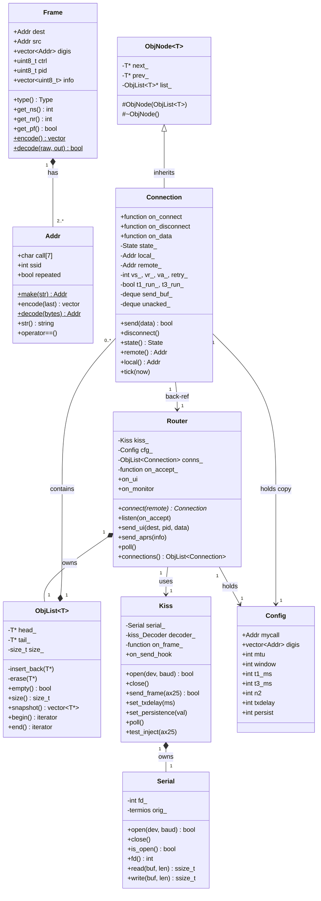
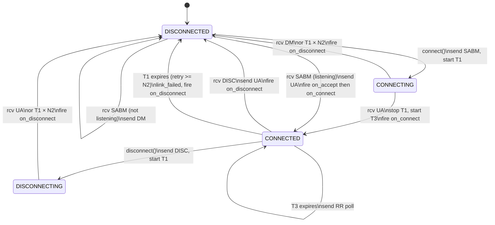
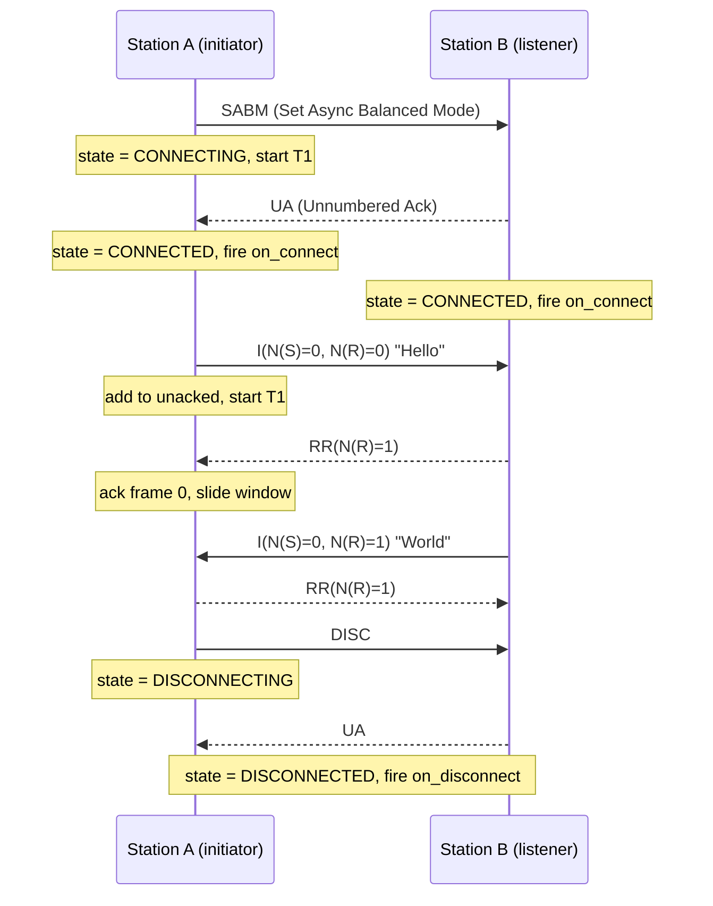
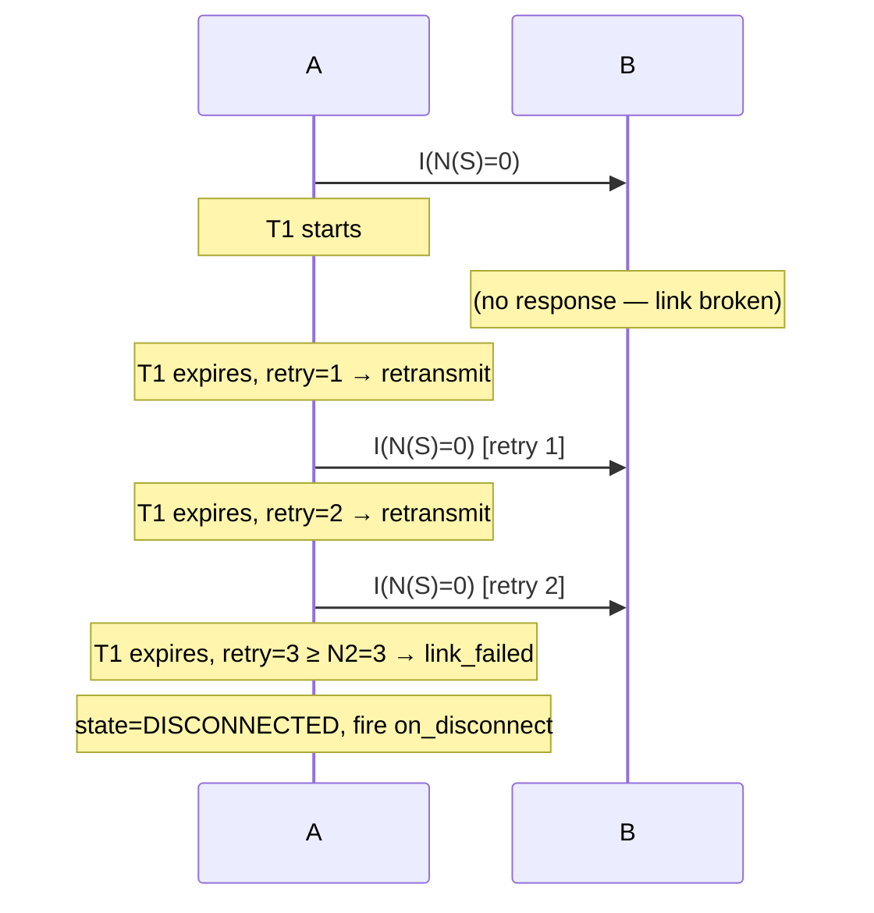

# KISSBBS — AX.25 / KISS Library (C++11, Linux + macOS)

[](https://github.com/solariun/KISSBBS/actions/workflows/ci.yml)

A self-contained C++11 library implementing the AX.25 amateur-radio link-layer
protocol over KISS-mode TNCs.  Includes a full-featured BBS with INI config,
a QBASIC-style scripting engine (functions, structs, DO/LOOP, SELECT CASE, SQLite · TCP · HTTP),
a complete TNC terminal client (`ax25client`), remote shell access, an
interactive KISS terminal, and a 92-test GoogleTest suite.

---

## Table of Contents

1. [Background — AX.25 and KISS](#1-background--ax25-and-kiss)
2. [Architecture Overview](#2-architecture-overview)
3. [Object Relationship Diagram](#3-object-relationship-diagram)
4. [UML Class Diagram](#4-uml-class-diagram)
5. [AX.25 State Machine](#5-ax25-state-machine)
6. [Connection Sequence Diagram](#6-connection-sequence-diagram)
7. [Building](#7-building)
8. [API Reference](#8-api-reference)
9. [Usage Examples](#9-usage-examples)
10. [Running Tests](#10-running-tests)
11. [BBS Example](#11-bbs-example)
12. [INI Configuration](#12-ini-configuration)
13. [BASIC Scripting](#13-basic-scripting)
14. [APRS Helpers (ax25::aprs)](#14-aprs-helpers-ax25aprs)
15. [ax25client — TNC Terminal Client](#15-ax25client--tnc-terminal-client)

---

## 1. Background — AX.25 and KISS

### AX.25

AX.25 is the link-layer protocol used in amateur (ham) radio packet networks.
Think of it as a stripped-down Ethernet designed for half-duplex radio channels.

**Addresses** — Every station has a *callsign* (up to 6 characters, e.g. `W1AW`)
plus a 0–15 *SSID* suffix, written `W1AW-7`.  On the wire each address occupies
exactly 7 bytes: the 6 callsign characters shifted left by one bit, followed by
a flag byte carrying the SSID and housekeeping bits.

**Frame types**

| Type | Purpose |
|------|---------|
| UI (Unnumbered Information) | Connectionless datagram — used for APRS beacons |
| SABM | Set Asynchronous Balanced Mode — opens a connection |
| UA | Unnumbered Acknowledgement — accepts SABM or DISC |
| DM | Disconnected Mode — rejects SABM |
| DISC | Disconnect — closes a connection |
| I-frame | Information frame — carries sequenced data |
| RR | Receive Ready — acknowledges I-frames, resumes suspended flow |
| REJ | Reject — requests retransmission from a given sequence number |

**Connected mode** (what `Connection` implements) uses a sliding window
(Go-Back-N, mod-8) with three timers:

* **T1** — Retransmit timer.  Started when an I-frame is sent.  If T1 expires
  before an ACK arrives the frame is retransmitted.  After *N2* retries the link
  is declared failed.
* **T2** — Delayed-ACK timer.  Not used in the send path here.
* **T3** — Keep-alive / inactivity timer.  If no data is exchanged within T3 the
  station sends an RR poll to verify the link is still alive.

### KISS

KISS ("Keep It Simple, Stupid") is a thin serial framing protocol that lets a
computer talk to a TNC (Terminal Node Controller — the radio modem).

The computer sends and receives raw AX.25 frames wrapped in a simple envelope:

```
FEND  CMD  DATA...  FEND
```

Special byte values are escaped inside DATA so they cannot be confused with
envelope markers:

| Raw byte | On wire |
|----------|---------|
| `0xC0` (FEND) | `0xDB 0xDC` |
| `0xDB` (FESC) | `0xDB 0xDD` |

The TNC handles everything physical: radio timing, flag bytes, and FCS
checksums.  The library never sees or generates those.

### APRS

APRS (Automatic Packet Reporting System) is built on top of AX.25 UI frames
with PID `0xF0`, sent to the destination callsign `APRS`.  The library lets you
send position reports and person-to-person messages and receive/route incoming
ones.

---

## 2. Architecture Overview

```
Your Application
       │
       ▼
   ┌────────┐
   │ Router │  Manages connections; routes incoming frames; exposes on_ui
   └────────┘
       │
       ▼
   ┌────────┐
   │  Kiss  │  Serial port + KISS framing layer
   └────────┘
       │
       ▼
   ┌────────┐
   │ Serial │  POSIX termios (non-blocking, cross-platform)
   └────────┘
       │
    (wire)
       │
      TNC  ──── Radio ──── Remote station
```

The layer stack is **intentionally thin**: each layer does exactly one job and
calls the layer above via a `std::function` callback, making the stack easy to
test (swap the serial layer with an in-memory hook) and easy to adapt (plug in a
different physical layer without touching the rest).

---

## 3. Object Relationship Diagram

```
                              ┌─────────────────────────────────────────┐
                              │              ax25lib.hpp/cpp             │
                              └─────────────────────────────────────────┘

  ┌──────────────────────────────────────────────────────────────────────────┐
  │  ObjNode<T>  (template)  — self-managing intrusive node                  │
  │  ─────────────────────────────────────────────────────────────────────── │
  │  # ObjNode(ObjList<T>&)   ← protected; auto-inserts on construction      │
  │  # ~ObjNode()              ← protected; auto-removes on destruction       │
  │  - next_ : T*                                                             │
  │  - prev_ : T*                                                             │
  │  - list_ : ObjList<T>*                                                    │
  └──────────────────────────────────────────────────────────────────────────┘
          ▲ inherits
          │
  ┌───────────────────────────────────────────────────────────────────────┐
  │  Connection  extends ObjNode<Connection>                               │
  │  ─────────────────────────────────────────────────────────────────────│
  │  Callbacks: on_connect, on_disconnect, on_data                         │
  │  State: DISCONNECTED / CONNECTING / CONNECTED / DISCONNECTING          │
  │  AX.25 vars: vs_, vr_, va_, retry_                                     │
  │  Timers: T1 (retransmit), T3 (keep-alive)                              │
  │  Queues: send_buf_, unacked_                                            │
  │  ─────────────────────────────────────────────────────────────────────│
  │  + send(data)                                                           │
  │  + disconnect()                                                         │
  │  + tick(now_ms)                                                         │
  └───────────────────────────────────────────────────────────────────────┘
          │ lives in (inserted/removed automatically via ObjNode ctor/dtor)
          ▼
  ┌───────────────────────────────────────────────────────────────────────┐
  │  ObjList<Connection>  (intrusive doubly-linked list)                   │
  │  ─────────────────────────────────────────────────────────────────────│
  │  - head_, tail_, size_   (private)                                      │
  │  - insert_back(item)     (called by ObjNode ctor — not public)          │
  │  - erase(item)           (called by ObjNode dtor — not public)          │
  │  + empty()  size()  begin()  end()  snapshot()                          │
  └───────────────────────────────────────────────────────────────────────┘
          │ owned by
          ▼
  ┌───────────────────────────────────────────────────────────────────────┐
  │  Router                                                                │
  │  ─────────────────────────────────────────────────────────────────────│
  │  + connect(remote) → Connection*                                       │
  │  + listen(on_accept)                                                   │
  │  + send_ui(dest, pid, data)                                            │
  │  + send_aprs(info)                                                     │
  │  + poll()                                                              │
  │  Callbacks: on_ui (all UI frames), on_monitor (all frames)             │
  └───────────────────────────────────────────────────────────────────────┘
          │ holds reference to
          ▼
  ┌───────────────────────────────────────────────────────────────────────┐
  │  Kiss                                                                  │
  │  ─────────────────────────────────────────────────────────────────────│
  │  + open(device, baud)                                                  │
  │  + send_frame(ax25_bytes)                                              │
  │  + poll()  — reads serial, fires on_frame for each complete AX.25 frame│
  │  Hooks: on_send_hook (test/simulation), test_inject(payload)           │
  └───────────────────────────────────────────────────────────────────────┘
          │ owns
          ▼
  ┌───────────────────────────────────────────────────────────────────────┐
  │  Serial                                                                │
  │  ─────────────────────────────────────────────────────────────────────│
  │  + open(dev, baud)   close()                                           │
  │  + read(buf, len)    write(buf, len)                                   │
  │  fd_ : int           (non-blocking POSIX file descriptor)              │
  └───────────────────────────────────────────────────────────────────────┘

  Supporting types (used by the layers above)

  ┌──────────────┐   ┌───────────────────────────────────┐
  │  Addr        │   │  Frame                             │
  │  ────────────│   │  ─────────────────────────────────│
  │  call[7]     │   │  dest, src : Addr                  │
  │  ssid : int  │   │  digis : vector<Addr>              │
  │  make(str)   │   │  ctrl, pid : uint8_t               │
  │  encode()    │   │  info : vector<uint8_t>            │
  │  decode()    │   │  type() → IFrame/UI/SABM/...       │
  │  str()       │   │  encode() / decode()               │
  └──────────────┘   └───────────────────────────────────┘

  ┌────────────────────────────────────────────────────────────┐
  │  kiss namespace                                             │
  │  ──────────────────────────────────────────────────────────│
  │  Constants: FEND, FESC, TFEND, TFESC                        │
  │  encode(payload) → KISS-wrapped bytes                       │
  │  Decoder::feed(buf, len) → vector<kiss::Frame>              │
  └────────────────────────────────────────────────────────────┘

  ┌────────────────────────────────────────────────────────────┐
  │  Config                                                     │
  │  ──────────────────────────────────────────────────────────│
  │  mycall, digis, mtu, window, t1_ms, t3_ms, n2, …           │
  └────────────────────────────────────────────────────────────┘
```

---

## 4. UML Class Diagram



---

## 5. AX.25 State Machine



---

## 6. Connection Sequence Diagram

### Successful connect + data exchange + disconnect



### T1 retransmit and link failure



---

## 7. Building

### Prerequisites

| Platform | Compiler | Required | Optional |
|----------|----------|----------|----------|
| macOS    | Xcode CLT (`xcode-select --install`) | — | `brew install sqlite` |
| Linux    | `g++` ≥ 7 | `build-essential` | `libsqlite3-dev` |

**SQLite3** — needed for the `DBOPEN/DBEXEC/DBQUERY` BASIC commands.
The Makefile auto-detects it via `pkg-config`; everything else compiles without it.

```bash
# macOS
brew install googletest sqlite

# Ubuntu / Debian
sudo apt-get install libgtest-dev libsqlite3-dev

# Fedora
sudo dnf install gtest-devel sqlite-devel
```

### Build targets

```bash
make            # build bbs, ax25kiss, and ax25client
make test       # compile and run all 69 unit tests
make clean      # remove all build artefacts
```

To cross-compile or choose a different compiler:

```bash
CXX=clang++ make
```

---

## 8. API Reference

### `ax25::Addr`

```cpp
// Parse a callsign string (case-insensitive, optional -SSID)
Addr a = Addr::make("W1AW-7");

// Encode to 7 AX.25 wire bytes
std::vector<uint8_t> raw = a.encode(/*last_addr=*/false);

// Decode from 7 raw bytes
Addr b = Addr::decode(raw.data());

// Human-readable string
std::string s = a.str();   // → "W1AW-7"
```

### `ax25::Config`

```cpp
Config cfg;
cfg.mycall  = Addr::make("W1AW");
cfg.mtu     = 128;   // max info bytes per I-frame
cfg.window  = 3;     // max outstanding unacked I-frames (1–7)
cfg.t1_ms   = 3000;  // retransmit timer ms
cfg.t3_ms   = 60000; // keep-alive inactivity timer ms
cfg.n2      = 10;    // max retries before link fail
```

### `ax25::Kiss`

```cpp
Kiss kiss;
kiss.open("/dev/ttyUSB0", 9600);

// Register callback — fires for every complete AX.25 payload received
kiss.set_on_frame([](std::vector<uint8_t> frame) { /* ... */ });

// Send an AX.25 payload
kiss.send_frame(ax25_bytes);

// Drive the I/O loop from your event loop
kiss.poll();   // non-blocking read; fires callback for each frame
```

### `ax25::Router`

```cpp
// Kiss must be open before constructing Router
Router router(kiss, cfg);

// Accept incoming connections
router.listen([](Connection* conn) {
    conn->on_connect    = [&]{ /* set up UI for this user */ };
    conn->on_disconnect = [&]{ delete conn; };
    conn->on_data = [&](const uint8_t* d, size_t n) {
        /* process data */
    };
});

// Initiate an outgoing connection
Connection* conn = router.connect(Addr::make("N0CALL"));
// on_connect fires synchronously if peer responds instantly

// Send a connectionless UI frame
router.send_ui(Addr::make("N0CALL"), 0xF0, "hello");

// Send an APRS frame (UI, PID=0xF0, dest=APRS)
router.send_aprs("!5130.00N/00000.00E>Test beacon");

// Monitor all UI / APRS traffic
router.on_ui = [](const Frame& f) { /* inspect */ };

// Monitor every decoded frame (for logging)
router.on_monitor = [](const Frame& f) { /* log */ };

// Call from your main loop
router.poll();
```

### `ax25::Connection`

```cpp
// Set callbacks before the connection becomes active (inside on_accept or right after connect())
conn->on_connect    = []{ /* link established */ };
conn->on_disconnect = []{ /* link lost */ };
conn->on_data = [](const uint8_t* d, size_t n) { /* n bytes arrived */ };

// Send data (chunked automatically to MTU)
conn->send("Hello world");                          // string overload
conn->send(ptr, len);                               // raw bytes

// Close the link gracefully
conn->disconnect();

// State query
if (conn->connected()) { /* ... */ }
Connection::State s = conn->state();

// Addresses
Addr local  = conn->local();
Addr remote = conn->remote();

// Timer tick — call from your event/poll loop
conn->tick(ax25::now_ms());
```

> **Ownership**: `Connection` objects are allocated on the heap by `Router`.
> The caller owns them and must `delete` them when done.  Deleting a Connection
> automatically removes it from the Router's internal list.

---

## 9. Usage Examples

### Minimal receiver — print every received frame

```cpp
#include "ax25lib.hpp"
#include <iostream>

int main() {
    ax25::Config cfg;
    cfg.mycall = ax25::Addr::make("W1AW");

    ax25::Kiss kiss;
    if (!kiss.open("/dev/ttyUSB0", 9600)) {
        std::cerr << "cannot open serial port\n";
        return 1;
    }

    ax25::Router router(kiss, cfg);
    router.on_monitor = [](const ax25::Frame& f) {
        std::cout << f.format() << "\n";
    };

    for (;;) router.poll();
}
```

### Outgoing connection + data

```cpp
ax25::Config cfg;
cfg.mycall = ax25::Addr::make("W1AW");

ax25::Kiss kiss;
kiss.open("/dev/ttyUSB0", 9600);
ax25::Router router(kiss, cfg);

auto* conn = router.connect(ax25::Addr::make("N0CALL"));
conn->on_connect = [&]{
    conn->send("Hello via AX.25!\r\n");
};
conn->on_data = [](const uint8_t* d, std::size_t n) {
    std::cout.write(reinterpret_cast<const char*>(d), n);
};
conn->on_disconnect = [&]{
    std::cout << "disconnected\n";
    delete conn;
};

for (;;) router.poll();
```

### BBS — accept multiple connections

```cpp
ax25::Config cfg;
cfg.mycall = ax25::Addr::make("W1BBS");

ax25::Kiss kiss;
kiss.open("/dev/ttyUSB0", 9600);
ax25::Router router(kiss, cfg);

router.listen([&](ax25::Connection* conn) {
    conn->on_connect = [conn]{
        conn->send("Welcome to the BBS!\r\nType H for help.\r\n");
    };
    conn->on_data = [conn](const uint8_t* d, std::size_t n) {
        std::string line(reinterpret_cast<const char*>(d), n);
        if (line == "B\r" || line == "Q\r") {
            conn->send("73 de W1BBS\r\n");
            conn->disconnect();
        } else {
            conn->send("Echo: " + line);
        }
    };
    conn->on_disconnect = [conn]{ delete conn; };
});

for (;;) router.poll();
```

### Unit testing without a serial port

The library ships test hooks that make it possible to write deterministic unit
tests with no hardware:

```cpp
#include "ax25lib.hpp"

// Wire two Kiss objects together in memory
ax25::Kiss kiss_a, kiss_b;

kiss_a.on_send_hook = [&](const std::vector<uint8_t>& frame) {
    kiss_b.test_inject(frame);   // deliver A's outgoing frame to B
    return true;
};
kiss_b.on_send_hook = [&](const std::vector<uint8_t>& frame) {
    kiss_a.test_inject(frame);
    return true;
};

ax25::Router router_a(kiss_a, make_cfg("W1AW"));
ax25::Router router_b(kiss_b, make_cfg("N0CALL"));

// Now router_a and router_b can exchange frames in memory — no radio needed.
```

See `test_ax25lib.cpp` for the full `VirtualWire` helper that handles re-entrancy
safely, and all 43 tests.

---

## 10. Running Tests

```bash
make test
```

Expected output:

```
[==========] Running 117 tests from 13 test suites.
...
[  PASSED  ] 117 tests.
```

### Test suites

| Suite | Count | What is tested |
|-------|-------|----------------|
| `ObjList` | 8 | Auto-insert on construction, auto-remove on destruction (scope + `delete`), iteration, snapshot |
| `Addr` | 8 | `make()`, encode/decode round-trips, SSID handling, equality |
| `KissEncode` | 4 | FEND wrapping, command byte, FEND/FESC byte-stuffing |
| `KissDecode` | 5 | Simple frame, byte-stuff round-trip, split byte-by-byte, multi-frame stream, empty frame skip |
| `AX25Frame` | 10 | UI/SABM/UA/DISC/DM/RR/I-frame type detection, N(S)/N(R) encoding, digipeaters, too-short guard |
| `RouterConnection` | 6 | Full connect+disconnect, data transfer, bidirectional data, large data chunked, DM rejection, address assignment |
| `RouterUI` | 2 | UI send/receive, APRS broadcast (fires on_ui regardless of dest) |
| `Timers` | 1 | T1 retransmit leading to link failure after N2 retries |
| `IniConfig` | 4 | Load file, missing file, inline comments, bool/double getters |
| `BasicInterp` | 17 | PRINT, arithmetic, string concat, IF/THEN/ELSE multi-stmt, FOR/NEXT, WHILE/WEND, GOSUB/RETURN, string functions, EXEC, EXEC timeout, SEND_APRS, SEND_UI, math |
| `QBasic` | 23 | Labels+GOTO, CONST, block IF/ELSEIF/ELSE/END IF, DO/LOOP WHILE, DO WHILE, DO/LOOP UNTIL, EXIT DO, EXIT FOR, SELECT CASE (simple/ELSE/range/IS), SUB (CALL+implicit), FUNCTION (numeric+string), nested function calls, EXIT SUB, TYPE/DIM, no-line-numbers, GOSUB to label |
| `QBasicExt` | 25 | FOR IN MATCH (basic/numbers/no-matches/EXIT FOR), REMATCH, REFIND$, REALL$ (default+custom sep), RESUB$, RESUBALL$, REGROUP$, RECOUNT, MAP (set/get/has/del/keys/size/clear), QUEUE (push/pop/peek/size/empty/clear/pop-empty/DO WHILE loop) |
| `TokenizeArgs` | 4 | Plain args, double-quoted args, single-quoted args, empty input |

---

## 11. BBS Example

`bbs.cpp` is a full-featured BBS that demonstrates the library in production use.
Configuration can be supplied via command-line flags **or** a `bbs.ini` file.

### Quick start — command line

```bash
make
./bbs -c W1BBS-1 -b 9600 -n "My BBS" -B 600 /dev/ttyUSB0
```

### Quick start — INI file

```bash
cp bbs.ini my_station.ini
# edit callsign, device, etc.
./bbs -C my_station.ini
```

### Full option reference

```
AX.25 / KISS parameters:
  -c <CALL[-N]>   My callsign (required)
  -b <baud>       Baud rate (default: 9600)
  -p <path>       Digipeater path, comma-separated (e.g. WIDE1-1,WIDE2-1)
  -m <bytes>      I-frame MTU (default: 128)
  -w <1-7>        Window size (default: 3)
  -t <ms>         T1 retransmit timer (default: 3000)
  -k <ms>         T3 keep-alive timer (default: 60000)
  -T <units>      KISS TX delay ×10 ms (default: 30)
  -s <0-255>      KISS persistence (default: 63)

BBS options:
  -n <name>       BBS name (default: AX25BBS)
  -u <text>       APRS beacon info string
  -B <secs>       Beacon interval seconds (0 = off)
  -C <file>       Load configuration from INI file

One-shot modes:
  --ui <DEST> <text>    Send one UI frame and exit
  --aprs <text>         Send one APRS frame and exit
```

### Session commands (once connected via AX.25)

| Command | Description |
|---------|-------------|
| `H` / `?` | Help — lists built-ins and `[commands]` entries |
| `U` | List connected users |
| `M <CALL> <msg>` | Send in-BBS message to a connected user |
| `UI <DEST> <text>` | Send a raw UI frame over the air |
| `POS <lat> <lon> [sym] [comment]` | Transmit APRS position (decimal degrees) |
| `AMSG <CALL> <msg>` | Send an APRS message to any callsign |
| `I` | BBS and station info |
| `B` | Send APRS beacon immediately |
| `W` | Show who is logged in + system uptime (`w` command) |
| `PS` | List running processes (`ps aux`) |
| `DIR` | Directory listing of current directory (`ls -la`) |
| `SHELL` | Interactive shell with piped stdin/stdout; stderr → `/tmp/bbs_cmd.log` |
| `SH` | Open a PTY-bridged shell (escape `~.` to exit) |
| `BYE` / `Q` | Disconnect |
| _any [args]_ | Dispatched via `[commands]` section of `bbs.ini` |

Quoted arguments are fully supported: `CMD ARG1 "two words" ARG3`.

All connected users see incoming UI and APRS traffic in real time.
Incoming APRS messages addressed to a connected user are automatically routed to their session.

### `[commands]` section

The `[commands]` INI section maps command names to either a `.bas` script or an
external shell command line.  Arguments typed by the user are appended
(single/double-quoted arguments supported).

```ini
[commands]
; Scripts run under the QBASIC-style interpreter.
; stdin/stdout are wired to the AX.25 session.
welcome = welcome.bas      ; called automatically on connect
email   = email.bas        ; BBS email system

; External commands: stdin/stdout piped to session; stderr → /tmp/bbs_cmd.log
shell   = /bin/bash        ; interactive shell
w       = w                ; who/uptime  (default)
ps      = ps aux           ; process list (default)
dir     = ls -la           ; directory   (default)
weather = curl -s "wttr.in/?format=3"
```

`welcome` is the only reserved name — it is run automatically when a user
connects instead of the built-in banner.  All other names are invoked by the
user typing the command at the `Email>` (or BBS) prompt.

---

## Intrusive Container — Design Notes

`ObjNode<T>` / `ObjList<T>` is an intrusive doubly-linked container inspired by
the Linux kernel's `list_head`.  Unlike `std::list`, which heap-allocates a
wrapper node for each element, the linkage (`next_`/`prev_` pointers) lives
**inside** the object itself — no extra allocation needed.

### Self-managing lifetime

The key improvement over a plain `Node<T>` base class is that **`ObjNode<T>`
owns the insert/remove responsibility** so developers never call `push_back` or
`remove` explicitly:

```cpp
// T must inherit ObjNode<T>.
// The constructor takes the list — insertion is automatic.
struct MySession : ObjNode<MySession> {
    std::string call;
    MySession(ObjList<MySession>& list, std::string c)
        : ObjNode<MySession>(list),   // ← inserts into list immediately
          call(std::move(c)) {}
    // destructor: ObjNode<MySession>::~ObjNode() fires automatically
    //             → removes from list with O(1), no search
};

ObjList<MySession> sessions;
{
    MySession a(sessions, "W1AW");
    MySession b(sessions, "N0CALL");
    assert(sessions.size() == 2);
}   // a and b destroyed → auto-removed
assert(sessions.empty());

// Heap allocation: delete triggers auto-remove too
auto* s = new MySession(sessions, "PY2XXX");
assert(sessions.size() == 1);
delete s;          // ← safe: auto-removed from list before memory is freed
assert(sessions.empty());
```

### API restrictions

* **Default constructor is `= delete`** — every `ObjNode<T>` must bind to an
  `ObjList<T>` at construction time.
* **Copy and move are `= delete`** — nodes are identity-based, not value-based.
* `ObjList<T>::insert_back` and `erase` are **private**, only callable by
  `ObjNode<T>` (friend).  User code never calls them.
* An object can belong to **one** list at a time (same trade-off as all
  intrusive containers).

### Advantages

| Property | Benefit |
|----------|---------|
| Zero extra allocation | No wrapper `list_node` struct on the heap |
| O(1) insert / remove | Pointer surgery only; no search |
| Safety by construction | Can't forget to insert; can't double-free the link |
| RAII-friendly | Scope exit or `delete` → automatic deregistration |

---

## 12. INI Configuration

`bbs.ini` is an optional configuration file that sets all BBS parameters.
Command-line flags always take precedence over file values.

### File format

```ini
; Lines starting with ; or # are comments
[section]
key = value   ; inline comments also work
```

### Full reference

```ini
[kiss]
device = /dev/ttyUSB0     ; serial port (or /dev/tty.usbserial-* on macOS)
baud   = 9600             ; baud rate: 1200 / 9600 / 38400 / 115200

[ax25]
callsign    = W1BBS-1     ; your station callsign (required)
mtu         = 128         ; max bytes per I-frame
window      = 3           ; sliding window size (1–7)
t1_ms       = 3000        ; retransmit timer (ms)
t3_ms       = 60000       ; keep-alive timer (ms)
n2          = 10          ; max retries before link failure
txdelay     = 30          ; KISS TX delay (×10 ms)
persist     = 63          ; KISS persistence byte (0–255)
; digipeaters = WIDE1-1,WIDE2-1   ; optional digi path

[bbs]
name             = MyBBS
beacon           = !2330.00S/04636.00W>MyBBS AX.25 BBS
beacon_interval  = 600          ; seconds, 0 = off
welcome_script   = welcome.bas  ; optional BASIC script run on each connect

[basic]
script_dir = .
database   = bbs.db       ; SQLite database file for BASIC scripts
```

### Using `IniConfig` in your own code

```cpp
#include "ini.hpp"

IniConfig cfg;
if (!cfg.load("bbs.ini")) {
    std::cerr << "config file not found, using defaults\n";
}

std::string call   = cfg.get("ax25", "callsign", "N0CALL");
int         baud   = cfg.get_int("kiss", "baud", 9600);
bool        beacon = cfg.get_bool("bbs", "beacon_enabled", false);
double      lat    = cfg.get_double("bbs", "lat", 0.0);

// Check existence before reading optional keys
if (cfg.has("bbs", "welcome_script")) {
    std::string script = cfg.get("bbs", "welcome_script");
}

// Iterate all keys in a section
for (auto& kv : cfg.section("ax25")) {
    std::cout << kv.first << " = " << kv.second << "\n";
}
```

---

## 13. BASIC Scripting

The BBS ships a **QBASIC-style interpreter** (`basic.hpp` / `basic.cpp`) that lets
you write BBS welcome screens, menus, and automated services without recompiling.
The dialect supports named procedures (`FUNCTION` / `SUB`), user-defined types
(`TYPE`), block control structures (`DO/LOOP`, `SELECT CASE`, block `IF/END IF`),
labels, `CONST`, `DIM`, and all legacy line-numbered code — fully backward-compatible.

### How it fits in

```
bbs.ini → welcome_script = welcome.bas
              ↓
          Basic interp;
          interp.on_send = [&](auto s){ conn->send(s); };   // PRINT/SEND → AX.25
          interp.on_recv = [&](int ms){ return conn_readline(); };
          interp.set_str("callsign$", caller);               // pre-filled vars
          interp.load_file("welcome.bas");
          interp.run();
```

### Language quick reference

#### Variables and types

```basic
' String variable (suffix $)
name$ = "W1AW"

' Numeric variable (double, optional % suffix)
count  = 42
score% = 100

' Declare with DIM (optional, initialises to 0/"")
DIM msg$ AS STRING
DIM n    AS INTEGER

' Named constant
CONST MAX_MSG = 100
CONST GREETING$ = "Hello"
```

#### User-defined types (struct)

```basic
TYPE Point
  X AS DOUBLE
  Y AS DOUBLE
END TYPE

DIM P AS Point
P.X = 10.5
P.Y = 20.0
PRINT STR$(P.X) + "," + STR$(P.Y)
```

#### Procedures — SUB and FUNCTION

Procedures are the cornerstone of well-structured QBASIC code. They let you break a
program into named, reusable building blocks that are easy to read, test, and maintain.

**SUB** — performs an action, does not return a value.

```basic
' ── Declaration ──────────────────────────────────────────────────────────────
SUB ShowBanner(title$)
  PRINT "╔══════════════════╗"
  PRINT "║ " + title$ + " ║"
  PRINT "╚══════════════════╝"
END SUB

' ── Calling a SUB (two equivalent forms) ──────────────────────────────────────
CALL ShowBanner("My BBS")   ' explicit CALL keyword (always safe)
ShowBanner "My BBS"         ' implicit bare-name call (no parentheses)
```

Rules for SUB:
- Parameters are **local variables**; changes inside the SUB do not affect the caller.
- `EXIT SUB` returns immediately from anywhere inside the body.
- A SUB cannot appear inside the `CALL` of another expression — it has no value.

---

**FUNCTION** — computes a value that the caller can use in an expression.

The return value is set by assigning to the **function's own name**.  When the
function ends (or hits `EXIT FUNCTION`) that value is returned to the caller.

```basic
' ── Numeric-returning FUNCTION ────────────────────────────────────────────────
FUNCTION Square(n)
  Square = n * n       ' assign to function name = set return value
END FUNCTION

PRINT STR$(Square(5))  ' prints 25
x = Square(3) + 1      ' use in any expression

' ── String-returning FUNCTION (name ends with $) ──────────────────────────────
FUNCTION Greet$(call$)
  Greet$ = "Hello, " + call$   ' string return
END FUNCTION

PRINT Greet$("W1AW")           ' prints: Hello, W1AW
msg$ = Greet$("KD9ABC")        ' assign result to a variable
```

Rules for FUNCTION:
- The function **name** acts as the return-value variable inside the body.
  Assign to it to set what gets returned.
- If you never assign to the name, the function returns `0` (numeric) or `""` (string).
- Functions can call other functions freely.
- `EXIT FUNCTION` exits early; the current value of the name-variable is returned.
- FUNCTIONs can be used anywhere an expression is valid (PRINT, IF, assignment, etc.).

---

**Variable scope**

```basic
CONST VERSION$ = "1.0"     ' global constant — visible everywhere

DIM total AS INTEGER        ' global variable — visible to main code + GOSUBs
total = 0

SUB AddScore(n)
  DIM local_n AS INTEGER    ' local — only exists inside this SUB
  local_n = n * 2
  total = total + local_n   ' reads/writes the GLOBAL total
END SUB

CALL AddScore(5)
PRINT STR$(total)           ' prints 10
```

Key rules:
- Variables declared with **DIM inside a procedure** are **local** — they disappear when the procedure returns.
- Variables used without DIM inside a procedure, if they already exist in the **global scope**, resolve to the global. If they don't exist globally, a new local is created.
- **CONST** is always global; it is collected in a first-pass before execution starts.
- Parameters are always local. Passing a variable by name does **not** give the procedure a reference — it receives a **copy**.

---

**Procedures and definitions placement**

Procedure bodies can appear anywhere in the file — before or after the main code.
The interpreter does a first pass to collect all `SUB`/`FUNCTION` definitions, so
order does not matter.

```basic
' ── Main code at top — fine even though procedures are defined below ──────────
CALL PrintVersion
PRINT "Result: " + STR$(Add(3, 4))
END

' ── Definitions below main ────────────────────────────────────────────────────
SUB PrintVersion
  PRINT "KISSBBS v1.0"
END SUB

FUNCTION Add(a, b)
  Add = a + b
END FUNCTION
```

> **Best practice:** put the main executable code at the top and all procedure
> definitions after `END`. This mirrors how QBASIC programs are typically written
> and makes the entry point obvious at a glance.

#### Block IF / ELSEIF / ELSE / END IF

```basic
IF score > 90 THEN
  PRINT "Excellent"
ELSEIF score > 70 THEN
  PRINT "Good"
ELSE
  PRINT "Keep trying"
END IF

' Single-line IF still works:
IF x > 5 THEN PRINT "big" ELSE PRINT "small"
```

#### FOR / NEXT / EXIT FOR — numeric iterator

```basic
FOR i = 1 TO 10 STEP 2
  IF i = 7 THEN EXIT FOR
  PRINT STR$(i)
NEXT i
```

#### FOR var$ IN src$ MATCH pattern$ — regex match iterator

Iterates over every non-overlapping regex match of `pattern$` inside `src$`,
assigning each match to `var$` in turn.  No matches → body is skipped entirely.
`EXIT FOR` works normally.  The pattern uses ECMAScript (C++ `<regex>`) syntax.

```basic
' ── Print every word in a sentence ───────────────────────────────────────────
FOR word$ IN "the quick brown fox" MATCH "[a-z]+"
  PRINT word$
NEXT word$

' ── Sum all integers found in a string ───────────────────────────────────────
DIM total AS INTEGER
FOR n$ IN "price: 12, qty: 5, discount: 3" MATCH "[0-9]+"
  total = total + VAL(n$)
NEXT n$
PRINT "Total: " + STR$(total)   ' 20

' ── Parse comma-separated values ─────────────────────────────────────────────
FOR field$ IN "Alice,42,W1AW" MATCH "[^,]+"
  PRINT field$
NEXT field$

' ── Extract callsign-like tokens ─────────────────────────────────────────────
FOR call$ IN raw_packet$ MATCH "[A-Z0-9]{3,6}(-[0-9]{1,2})?"
  PRINT "Found call: " + call$
NEXT call$
```

> **Best practice:** Use `FOR IN MATCH` when you need to iterate over all
> occurrences of a pattern.  For a one-shot first-match check, prefer the
> `REMATCH` / `REFIND$` functions instead.

#### WHILE / WEND

```basic
WHILE x > 0
  x = x - 1
WEND
```

#### DO / LOOP

```basic
' Pre-condition (WHILE or UNTIL)
DO WHILE i < 10
  i = i + 1
LOOP

DO UNTIL i >= 10
  i = i + 1
LOOP

' Post-condition
DO
  i = i + 1
LOOP WHILE i < 10

DO
  i = i + 1
LOOP UNTIL i >= 10

' Infinite with EXIT DO
DO
  RECV cmd$, 60000
  IF cmd$ = "QUIT" THEN EXIT DO
LOOP
```

#### SELECT CASE

```basic
SELECT CASE score
  CASE 90 TO 100
    PRINT "A"
  CASE 80 TO 89
    PRINT "B"
  CASE IS < 60
    PRINT "F"
  CASE ELSE
    PRINT "C/D"
END SELECT

' String matching
SELECT CASE cmd$
  CASE "HELP", "H", "?"
    PRINT "help text"
  CASE "QUIT", "BYE"
    END
  CASE ELSE
    PRINT "Unknown: " + cmd$
END SELECT
```

#### GOTO / GOSUB — line numbers or labels

```basic
GOTO MainMenu         ' jump to label
GOSUB PrintFooter     ' call label as subroutine

MainMenu:
  PRINT "1) Messages"
  INPUT "> ", choice$
  IF choice$ = "Q" THEN GOTO Done
  GOTO MainMenu

PrintFooter:
  PRINT "73 de BBS"
  RETURN

Done:
  END

' Old-style line numbers still work
10 GOTO 40
20 PRINT "skipped"
40 PRINT "here"
```

#### Comments

```basic
' This is a comment
REM This is also a comment
PRINT "hello"  ' inline comment
```

#### I/O — AX.25 session

```basic
PRINT "What is your name?"     ' sends to AX.25 connection
INPUT "> ", name$              ' prompt + wait for a line
SEND "Hello " + name$ + "!"   ' alias for PRINT
RECV reply$, 15000             ' receive with 15-second timeout
```

#### APRS / UI — transmit over the air

```basic
SEND_APRS "!1234.00N/00567.00W>Hello from BASIC"
SEND_UI "APRS", "de W1BBS: status update"
```

`SEND_APRS info$` — transmits an APRS UI frame via the router's callsign.
`SEND_UI dest$, text$` — transmits a raw UI frame to the given destination (PID `0xF0`).

#### System — run external commands

```basic
EXEC "date", result$                  ' default 10 s timeout
EXEC "ls /tmp", listing$, 5000        ' 5 s timeout
EXEC "df -h", out$, 3000, 1           ' last arg = 1 → capture stderr too
PRINT out$
' Process is killed with SIGKILL on timeout; result$ gets "[TIMEOUT]"
```

#### Database — SQLite3

```basic
DBOPEN "bbs.db"
DBEXEC "CREATE TABLE IF NOT EXISTS msgs (id INTEGER PRIMARY KEY, txt TEXT)"
DBEXEC "INSERT INTO msgs (txt) VALUES ('hello')"
DBQUERY "SELECT COUNT(*) FROM msgs", count$          ' first column, first row
PRINT "Total messages: " + count$
DBFETCHALL "SELECT id, txt FROM msgs", all$          ' tab-cols, newline-rows
DBFETCHALL "SELECT id, txt FROM msgs", all$, "|", "~"  ' custom separators
DBCLOSE
```

#### Network — raw TCP sockets

```basic
SOCKOPEN "towncrier.aprs.net", 10152, sock%
IF sock% < 0 THEN
    PRINT "connect failed"
    END
END IF
SOCKSEND sock%, "user N0CALL pass -1 vers KISSBBS 1.0\r\n"
SOCKRECV sock%, line$, 5000      ' 5 s timeout
PRINT line$
SOCKCLOSE sock%
```

#### Web — HTTP GET

```basic
HTTPGET "http://wttr.in/?format=3", weather$
PRINT weather$
```

> **Note:** Only plain HTTP is supported (no TLS).  For HTTPS use a local
> proxy or the EXEC command with `curl`.

#### Regex — pattern matching and substitution

All functions use ECMAScript regex syntax (C++ `<regex>`).  Wrap patterns in
double quotes; backslashes need doubling: `"\\d+"` matches one or more digits.

| Function | Returns | Description |
|---|---|---|
| `REMATCH(pat$, str$)` | `1` / `0` | `1` if `pat$` matches anywhere in `str$` |
| `REFIND$(pat$, str$)` | string | First full match, or `""` if none |
| `REALL$(pat$, str$ [,sep$])` | string | All matches joined by `sep$` (default `","`) |
| `RESUB$(pat$, repl$, str$)` | string | Replace **first** match with `repl$` |
| `RESUBALL$(pat$, repl$, str$)` | string | Replace **all** matches with `repl$` |
| `REGROUP$(pat$, str$, n)` | string | Return capture group `n` (0=whole, 1=first…) |
| `RECOUNT(pat$, str$)` | number | Count of non-overlapping matches |

Replacement strings (`repl$`) support ECMAScript back-references: `$1` inserts
the first capture group, `$2` the second, `$&` the whole match, etc.

```basic
' ── Test for a match ─────────────────────────────────────────────────────────
IF REMATCH("^[A-Z]{1,2}[0-9][A-Z]{1,3}$", call$) THEN
  PRINT call$ + " looks like a valid callsign"
END IF

' ── Extract first number from a string ───────────────────────────────────────
num$ = REFIND$("[0-9]+", "temp: 23 C")   ' "23"

' ── Get all comma-separated tokens ───────────────────────────────────────────
all$ = REALL$("[^,]+", "Alice,Bob,Carol")  ' "Alice,Bob,Carol" (default sep)
all$ = REALL$("[^,]+", "Alice,Bob,Carol", "|")  ' "Alice|Bob|Carol"

' ── Sanitise user input ───────────────────────────────────────────────────────
safe$ = RESUBALL$("[^A-Za-z0-9 ]", "", user_input$)   ' strip non-alphanumeric

' ── Extract a capture group ──────────────────────────────────────────────────
' Pattern: KEY=VALUE  →  group 1 = key, group 2 = value
key$  = REGROUP$("([A-Z]+)=([0-9]+)", "POWER=100", 1)   ' "POWER"
val$  = REGROUP$("([A-Z]+)=([0-9]+)", "POWER=100", 2)   ' "100"

' ── Reformat a date ──────────────────────────────────────────────────────────
iso$  = RESUB$("([0-9]{2})/([0-9]{2})/([0-9]{4})", "$3-$2-$1", "25/12/2025")
' iso$ = "2025-12-25"
```

> **Best practice:** Always validate user-supplied input before inserting it
> into SQL queries.  Use `RESUBALL$` to strip or escape dangerous characters,
> or use parameterised SQL strings built from safe substrings.

#### MAP — named associative arrays

A MAP is an unordered dictionary mapping string keys to any value (string or
number).  MAPs are identified by a string name — you can have as many as you
need.  Keys are sorted alphabetically by the underlying `std::map`.

| Statement / Function | Description |
|---|---|
| `MAP_SET name$, key$, value` | Create or overwrite an entry |
| `MAP_GET name$, key$, var` | Read entry into `var` (`""` / `0` if missing) |
| `MAP_DEL name$, key$` | Remove one entry |
| `MAP_KEYS name$, var$` | Comma-separated list of all keys → `var$` |
| `MAP_CLEAR name$` | Delete all entries in the named map |
| `MAP_HAS(name$, key$)` | Returns `1` if key exists, `0` otherwise |
| `MAP_SIZE(name$)` | Returns number of entries |

```basic
' ── Store and retrieve ────────────────────────────────────────────────────────
MAP_SET "cfg", "host", "aprs.example.net"
MAP_SET "cfg", "port", "14580"
MAP_GET "cfg", "host", host$
MAP_GET "cfg", "port", port$
PRINT "Connecting to " + host$ + ":" + port$

' ── Presence check ───────────────────────────────────────────────────────────
IF MAP_HAS("cfg", "password") = 0 THEN
  PRINT "No password configured — anonymous login"
END IF

' ── Iterate over all keys ─────────────────────────────────────────────────────
MAP_KEYS "cfg", keys$
FOR key$ IN keys$ MATCH "[^,]+"
  MAP_GET "cfg", key$, v$
  PRINT key$ + " = " + v$
NEXT key$

' ── Count and clean up ────────────────────────────────────────────────────────
PRINT "Config entries: " + STR$(MAP_SIZE("cfg"))
MAP_CLEAR "cfg"
```

> **Best practice:** Use a descriptive map name that encodes its purpose, e.g.
> `"headers"`, `"env"`, `"cache"`.  Because maps live for the lifetime of the
> interpreter instance, call `MAP_CLEAR` when you are done to free memory.

#### QUEUE — named FIFO queues

A QUEUE is a first-in / first-out list of values, identified by a string name.
Useful for buffering lines received from a socket, scheduling jobs, or any
producer–consumer pattern.

| Statement / Function | Description |
|---|---|
| `QUEUE_PUSH name$, value` | Enqueue `value` at the back |
| `QUEUE_POP  name$, var` | Dequeue the front item into `var` (`""`/`0` if empty) |
| `QUEUE_PEEK name$, var` | Read the front item **without** removing it |
| `QUEUE_CLEAR name$` | Discard all items |
| `QUEUE_SIZE(name$)` | Number of items currently in the queue |
| `QUEUE_EMPTY(name$)` | Returns `1` if empty, `0` otherwise |

```basic
' ── Producer / consumer ───────────────────────────────────────────────────────
' Producer: buffer incoming commands
QUEUE_PUSH "cmds", "HELP"
QUEUE_PUSH "cmds", "LIST"
QUEUE_PUSH "cmds", "QUIT"

' Consumer: process in order
DO WHILE QUEUE_EMPTY("cmds") = 0
  QUEUE_POP "cmds", cmd$
  SELECT CASE UPPER$(cmd$)
    CASE "HELP"  : CALL ShowHelp
    CASE "LIST"  : CALL ListMessages
    CASE "QUIT"  : EXIT DO
    CASE ELSE    : PRINT "Unknown: " + cmd$
  END SELECT
LOOP

' ── Peek without consuming ───────────────────────────────────────────────────
QUEUE_PEEK "cmds", next$
PRINT "Next up: " + next$   ' item is still in the queue

' ── Bounded buffer (keep at most 10 items) ───────────────────────────────────
SUB Enqueue(q$, item$)
  DO WHILE QUEUE_SIZE(q$) >= 10
    QUEUE_POP q$, discarded$    ' drop oldest
  LOOP
  QUEUE_PUSH q$, item$
END SUB
```

> **Best practice:** Always check `QUEUE_EMPTY` before `QUEUE_POP` if you need
> to distinguish an empty-queue case from a value that happens to be `""`.
> Use `QUEUE_CLEAR` when finished to release memory.

#### String functions

| Function | Returns | Example |
|---|---|---|
| `LEN(s$)` | length | `LEN("hi")` → `2` |
| `LEFT$(s$, n)` | first n chars | `LEFT$("ABCDE", 3)` → `"ABC"` |
| `RIGHT$(s$, n)` | last n chars | `RIGHT$("ABCDE", 2)` → `"DE"` |
| `MID$(s$, pos, len)` | substring (1-based) | `MID$("ABCDE", 2, 3)` → `"BCD"` |
| `UPPER$(s$)` | uppercase | `UPPER$("hello")` → `"HELLO"` |
| `LOWER$(s$)` | lowercase | `LOWER$("HI")` → `"hi"` |
| `TRIM$(s$)` | strip whitespace | `TRIM$("  x  ")` → `"x"` |
| `STR$(n)` | number→string | `STR$(42)` → `"42"` |
| `VAL(s$)` | string→number | `VAL("3.14")` → `3.14` |
| `INSTR(s$, f$)` | position (1-based, 0=not found) | `INSTR("HELLO", "LL")` → `3` |
| `CHR$(n)` | character from ASCII code | `CHR$(65)` → `"A"` |
| `ASC(s$)` | ASCII code of first char | `ASC("A")` → `65` |

#### Math functions

`INT(x)` · `ABS(x)` · `SQR(x)` · `RND([n])` · `LOG(x)` · `EXP(x)`
`SIN(x)` · `COS(x)` · `TAN(x)` · `SGN(x)` · `MAX(a,b)` · `MIN(a,b)`

### Pre-defined variables

The BBS sets these before running your script:

| Variable | Content |
|---|---|
| `callsign$` | Remote station callsign (e.g. `"W1AW-7"`) |
| `bbs_name$` | BBS name from config or `-n` flag |
| `db_path$` | SQLite database path from `[basic] database` |
| `arg0$` | Command name that triggered the script |
| `arg1$`, `arg2$`, … | Additional arguments typed by the user |
| `argc` | Total argument count (includes `arg0$`) |

Scripts can receive user-supplied arguments.  Example: if `bbs.ini` has
`[commands] hello = hello.bas` and the user types `HELLO W1AW greetings`,
then `arg0$ = "HELLO"`, `arg1$ = "W1AW"`, `arg2$ = "greetings"`, `argc = 3`.

### Complete BBS script example (QBASIC style)

```basic
' ── Welcome banner ────────────────────────────────────────────────────
PRINT "*** " + bbs_name$ + " AX.25 BBS ***"
PRINT "Welcome " + callsign$ + "!"
PRINT ""

' ── Fetch weather ─────────────────────────────────────────────────────
HTTPGET "http://wttr.in/?format=3", wx$
IF wx$ <> "" THEN PRINT "Weather: " + wx$
PRINT ""

' ── Message count ─────────────────────────────────────────────────────
DBOPEN db_path$
DBEXEC "CREATE TABLE IF NOT EXISTS msgs (id INTEGER PRIMARY KEY, call TEXT, txt TEXT)"
DBQUERY "SELECT COUNT(*) FROM msgs", cnt$
PRINT "Messages in database: " + cnt$
DBCLOSE
PRINT ""

' ── Interactive menu ──────────────────────────────────────────────────
DO
  PRINT "Commands: H=Help  BYE=Quit"
  INPUT "> ", cmd$
  cmd$ = UPPER$(TRIM$(cmd$))

  SELECT CASE cmd$
    CASE "H", "HELP", "?"
      CALL ShowHelp
    CASE "BYE", "QUIT"
      PRINT "73 de " + bbs_name$
      EXIT DO
    CASE ELSE
      PRINT "Unknown command: " + cmd$
  END SELECT
LOOP

END

' ── Subroutines ───────────────────────────────────────────────────────
SUB ShowHelp
  PRINT "H    This help"
  PRINT "BYE  Disconnect"
END SUB
```

### BBS Email system (`email.bas`)

`email.bas` is a ready-to-use SQLite-backed BBS email script.  Add it to
`bbs.ini` under `[commands]` and users can send/receive messages over AX.25:

```ini
[commands]
email = email.bas
```

User session example:

```
=== My BBS Email System ===
User: W1AW-7
Messages for W1AW-7: 3 total, 1 unread
 ID  N  FROM         DATE              SUBJECT
----+--+------------+-----------------+---------------------
  3  *  KD9ABC       2026-03-10 14:22  73 from the field
  2     W1BBS        2026-03-09 09:10  Re: Test message
  1     N0CALL       2026-03-08 17:00  Welcome!

Email commands:
  LIST               List your messages
  READ <id>          Read a message
  COMPOSE <to> <subj>  Write a new message
  REPLY <id>         Reply to a message
  DELETE <id>        Delete a message
  QUIT / BYE / Q     Exit email

Email> READ 3
--- Message #3 ---
From   : KD9ABC
Date   : 2026-03-10 14:22:11
Subject: 73 from the field
---
Hi there!  Hope all is well.  73 de KD9ABC
---

Email> COMPOSE W5XYZ ARDF this weekend?
Composing to W5XYZ / Subject: ARDF this weekend?
Enter body (. alone to send, CANCEL to abort):
> Let me know if you're joining us Saturday.
> .
Message sent to W5XYZ.

Email> REPLY 3
Composing to KD9ABC / Subject: Re: 73 from the field
Enter body (. alone to send, CANCEL to abort):
> Thanks!  73 de W1AW
> .
Message sent to KD9ABC.

Email> QUIT
Goodbye from BBS Email!  73 de My BBS
```

### Best practices

#### Code organisation

```basic
' ── 1. CONST and TYPE declarations first ──────────────────────────────────────
CONST MAX_RETRIES = 3
CONST TIMEOUT_MS  = 30000

TYPE Station
  Call$ AS STRING
  Grid$ AS STRING
END TYPE

' ── 2. Main program ───────────────────────────────────────────────────────────
CALL Main
END

' ── 3. All SUB / FUNCTION definitions after END ───────────────────────────────
SUB Main
  DIM s AS Station
  s.Call$ = callsign$
  PRINT "Hello " + s.Call$
END SUB
```

#### Guard clauses over deep nesting

```basic
' ✗ Avoid: triangle of doom
SUB ProcessCmd(cmd$)
  IF cmd$ <> "" THEN
    IF REMATCH("^[A-Z]", cmd$) THEN
      IF MAP_HAS("handlers", cmd$) THEN
        ' … actual work
      END IF
    END IF
  END IF
END SUB

' ✓ Better: exit early with guards
SUB ProcessCmd(cmd$)
  IF cmd$ = ""                       THEN EXIT SUB
  IF REMATCH("^[A-Z]", cmd$) = 0    THEN EXIT SUB
  IF MAP_HAS("handlers", cmd$) = 0  THEN EXIT SUB
  ' … actual work
END SUB
```

#### DIM all local variables

```basic
SUB ParseLine(line$)
  ' Declare every local before use — prevents accidental globals
  DIM parts$  AS STRING
  DIM key$    AS STRING
  DIM value$  AS STRING
  DIM eqpos   AS INTEGER

  eqpos = INSTR(line$, "=")
  IF eqpos = 0 THEN EXIT SUB
  key$   = TRIM$(LEFT$(line$, eqpos - 1))
  value$ = TRIM$(MID$(line$, eqpos + 1))
  MAP_SET "env", UPPER$(key$), value$
END SUB
```

#### Use regex for input validation

```basic
' Validate AX.25 callsign before use in SQL or packet transmission
FUNCTION ValidCall$(call$)
  IF REMATCH("^[A-Z0-9]{3,6}(-[0-9]{1,2})?$", UPPER$(call$)) THEN
    ValidCall$ = UPPER$(call$)
  ELSE
    ValidCall$ = ""
  END IF
END FUNCTION

DIM clean$ AS STRING
clean$ = ValidCall$(user_input$)
IF clean$ = "" THEN
  PRINT "Invalid callsign."
  EXIT SUB
END IF
' safe to use clean$ in SQL / packet now
```

#### Named collections for state management

```basic
' Use MAPs for runtime configuration; QUEUEs for work items
SUB LoadConfig
  MAP_SET "cfg", "port",    "14580"
  MAP_SET "cfg", "host",    "rotate.aprs2.net"
  MAP_SET "cfg", "retries", STR$(MAX_RETRIES)
END SUB

SUB EnqueueWork(item$)
  ' Enforce a maximum queue depth to prevent unbounded growth
  DO WHILE QUEUE_SIZE("jobs") >= 20
    QUEUE_POP "jobs", dropped$
    PRINT "WARN: dropped " + dropped$
  LOOP
  QUEUE_PUSH "jobs", item$
END SUB
```

### Embedding `Basic` in your own application

```cpp
#include "basic.hpp"

Basic interp;

// Wire I/O to your transport
interp.on_send = [&](const std::string& s) {
    conn->send(s);                         // send to AX.25 connection
};
interp.on_recv = [&](int timeout_ms) -> std::string {
    return read_line_with_timeout(timeout_ms);  // blocking read with timeout
};
interp.on_log = [](const std::string& msg) {
    std::cerr << "[BASIC] " << msg << "\n";
};

// Optional: APRS/UI transmit callbacks (used by SEND_APRS / SEND_UI)
interp.on_send_aprs = [&](const std::string& info) {
    router.send_aprs(info);
};
interp.on_send_ui = [&](const std::string& dest, const std::string& text) {
    router.send_ui(ax25::Addr::make(dest), 0xF0, text);
};

// Pre-fill variables
interp.set_str("callsign$", remote_call);
interp.set_num("channel",   1.0);

// Load and run
if (interp.load_file("menu.bas")) {
    bool ok = interp.run();
    if (!ok) std::cerr << "BASIC runtime error\n";
}

// Or load from a string literal (useful for unit tests)
interp.load_string(
    "PRINT \"Hello \" + callsign$\n"
    "END\n"
);
interp.run();
```

---

## 14. APRS Helpers (`ax25::aprs`)

All APRS formatting utilities live in the `ax25::aprs` sub-namespace, making
them available to any code that includes `ax25lib.hpp` — not just the BBS.

```cpp
#include "ax25lib.hpp"
using namespace ax25;

// ── Build a position report ───────────────────────────────────────────
// lat/lon: decimal degrees (negative = S / W)
// sym:     single APRS symbol character  (default '>' = car)
std::string pos = aprs::make_pos(-23.55, -46.63, '-', "W1AW Home");
// → "!2333.00S/04637.80W-W1AW Home"

router.send_aprs(pos);

// ── Build an APRS message ─────────────────────────────────────────────
// Addressee is auto-padded to 9 chars; sequence number auto-increments.
std::string msg = aprs::make_msg("PY2XXX-7", "Hello from W1AW!");
// → ":PY2XXX-7 :Hello from W1AW!{001}"

router.send_aprs(msg);

// ── Parse an incoming APRS message ───────────────────────────────────
router.on_ui = [](const Frame& f) {
    std::string info(f.info.begin(), f.info.end());
    aprs::Msg m;
    if (aprs::parse_msg(info, m)) {
        std::cout << "APRS MSG to=" << m.to
                  << " text=" << m.text
                  << " seq=" << m.seq << "\n";
    } else if (aprs::is_pos(info)) {
        std::cout << "APRS POS from " << f.src.str()
                  << ": " << aprs::info_str(f) << "\n";
    }
};

// ── Extract printable text from any frame ─────────────────────────────
// Replaces non-printable bytes with '.'
std::string readable = aprs::info_str(frame);
```

### APRS symbol cheat-sheet (common values)

| Symbol char | Meaning |
|---|---|
| `>` | Car / mobile |
| `-` | House |
| `K` | School |
| `k` | Truck |
| `u` | Truck 18-wheeler |
| `/` | Phone |
| `[` | Human / jogger |
| `Y` | Yacht / sailboat |
| `'` | Aircraft |
| `#` | Digipeater |
| `&` | Gateway |

Full table: [APRS Symbol Reference](http://www.aprs.org/symbols.html)

---

## 15. ax25client — TNC Terminal Client

`ax25client` is a professional interactive TNC terminal that demonstrates the
full `ax25lib` API.  It ships three operating modes selectable at runtime and
requires no code changes to switch between connected ARQ sessions, passive
monitoring, or connectionless UI frames.

### Build

```bash
make ax25client
# or as part of the full build:
make
```

### Modes

| Mode | Flag | Description |
|------|------|-------------|
| `connect` | `-m connect` | AX.25 connected session with Go-Back-N ARQ (default when `-r` is given) |
| `monitor` | `-m monitor` | Passive receive-only — decodes and prints every AX.25 frame, no TX |
| `unproto` | `-m unproto` | Connectionless UI frames — type a line, it goes out over the air |

### Quick start

```bash
# Monitor everything on the channel
ax25client -c W1AW -m monitor /dev/ttyUSB0

# Connect to a BBS
ax25client -c W1AW -r W1BBS-1 /dev/ttyUSB0

# Connect via digipeater path
ax25client -c W1AW -r N0CALL -p WIDE1-1,WIDE2-1 /dev/ttyUSB0

# Wait for ANY incoming connection (passive)
ax25client -c W1AW -r ANY /dev/ttyUSB0

# Send UI frames (unproto) with monitor on
ax25client -c W1AW -m unproto -d CQ -M /dev/ttyUSB0

# APRS monitoring (UI frames are printed regardless of destination)
ax25client -c W1AW -m monitor -b 1200 /dev/ttyUSB0
```

### Full option reference

```
ax25client [OPTIONS] <serial_device>

Options:
  -c CALL       My callsign (required)
  -r REMOTE     Remote station (connect mode; use ANY to accept inbound)
  -m MODE       Operating mode: connect | monitor | unproto  (default: connect)
  -d DEST       Destination for unproto UI frames (default: CQ)
  -b BAUD       Baud rate (default: 9600)
  -p PATH       Digipeater path, comma-separated (e.g. WIDE1-1,WIDE2-1)
  -M            Enable frame monitor in connect/unproto mode
  -w WIN        Window size 1-7 (default: 3)
  -t T1_MS      T1 retransmit timer ms (default: 3000)
  -k T3_MS      T3 keep-alive timer ms (default: 60000)
  -n N2         Max retry count (default: 10)
  --mtu BYTES   I-frame MTU bytes (default: 128)
  --txdelay MS  KISS TX delay ms (default: 300)
  --pid HEX     PID for UI frames (default: F0)
  -h            Show help
```

### Tilde-escape commands (connect mode)

Tilde escapes are processed only when `~` is the very first character of a line:

| Escape | Action |
|--------|--------|
| `~.` | Disconnect and exit |
| `~s` | Show connection status and traffic statistics |
| `~m` | Toggle frame monitor on/off |
| `~r` | Redraw current line (useful after unsolicited data scrolled the screen) |
| `~?` | Show tilde-escape help |

### Session transcript example

```
ax25client  W1AW  /dev/ttyUSB0 @9600 baud
Connecting to W1BBS-1 from W1AW...

*** Connected to W1BBS-1 ***

< Welcome to ExampleBBS!
< Commands: H=Help  BYE=Quit

> H
< H    This help
< BYE  Disconnect

~s

=== Status ===
  Local  : W1AW
  Remote : W1BBS-1
  Device : /dev/ttyUSB0  @9600 baud
  State  : CONNECTED
  Frames RX : 3  (87 data bytes)
  Frames TX : 2  (3 data bytes)
  Window    : 3  MTU=128  T1=3000ms  T3=60000ms

> BYE
< 73 de ExampleBBS

*** Disconnected ***

Session summary:
  TX: 3 frames / 6 bytes
  RX: 5 frames / 145 bytes
```

### Monitor mode output

```
[14:32:01] >> W1AW>APRS,WIDE1-1 [UI] PID=0xF0 | !4130.00N/07000.00W>Test beacon
[14:32:05] >> N0CALL>W1BBS [SABM]
[14:32:05] >> W1BBS>N0CALL [UA]
[14:32:06] >> N0CALL>W1BBS [I] Ns=0 Nr=0 PID=0xF0 | Hello!
[14:32:06] >> W1BBS>N0CALL [RR] Nr=1
```
