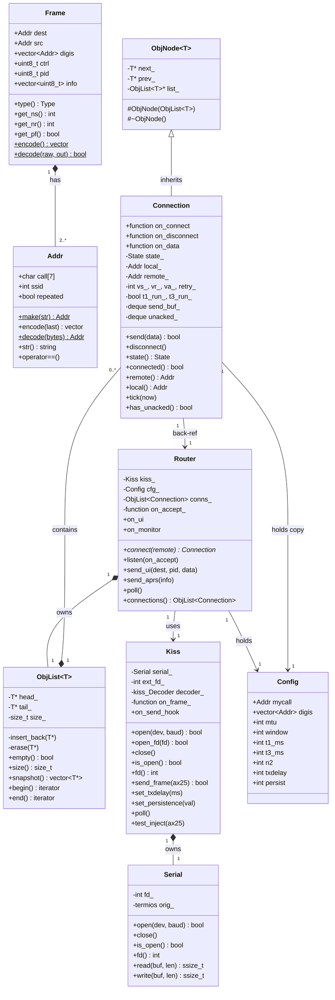
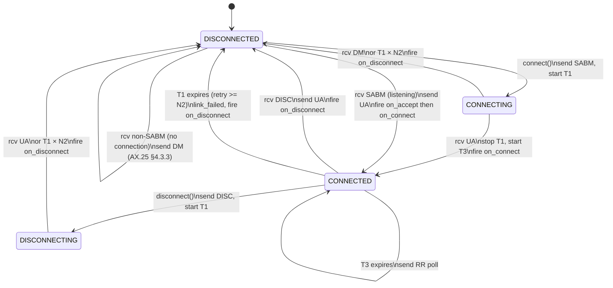
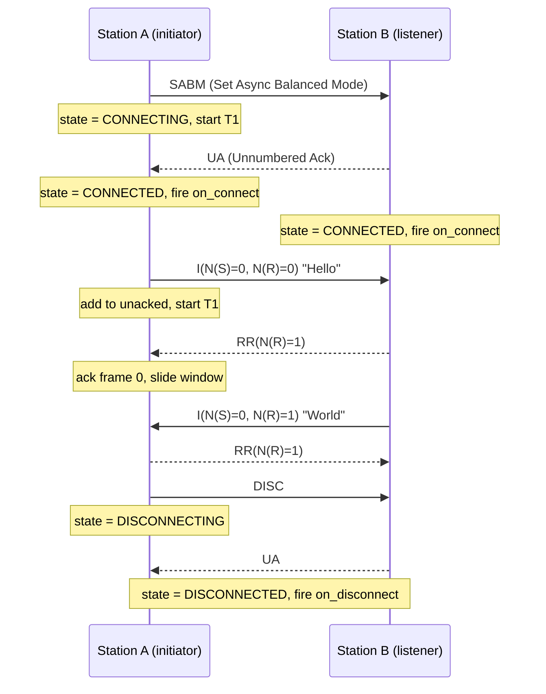
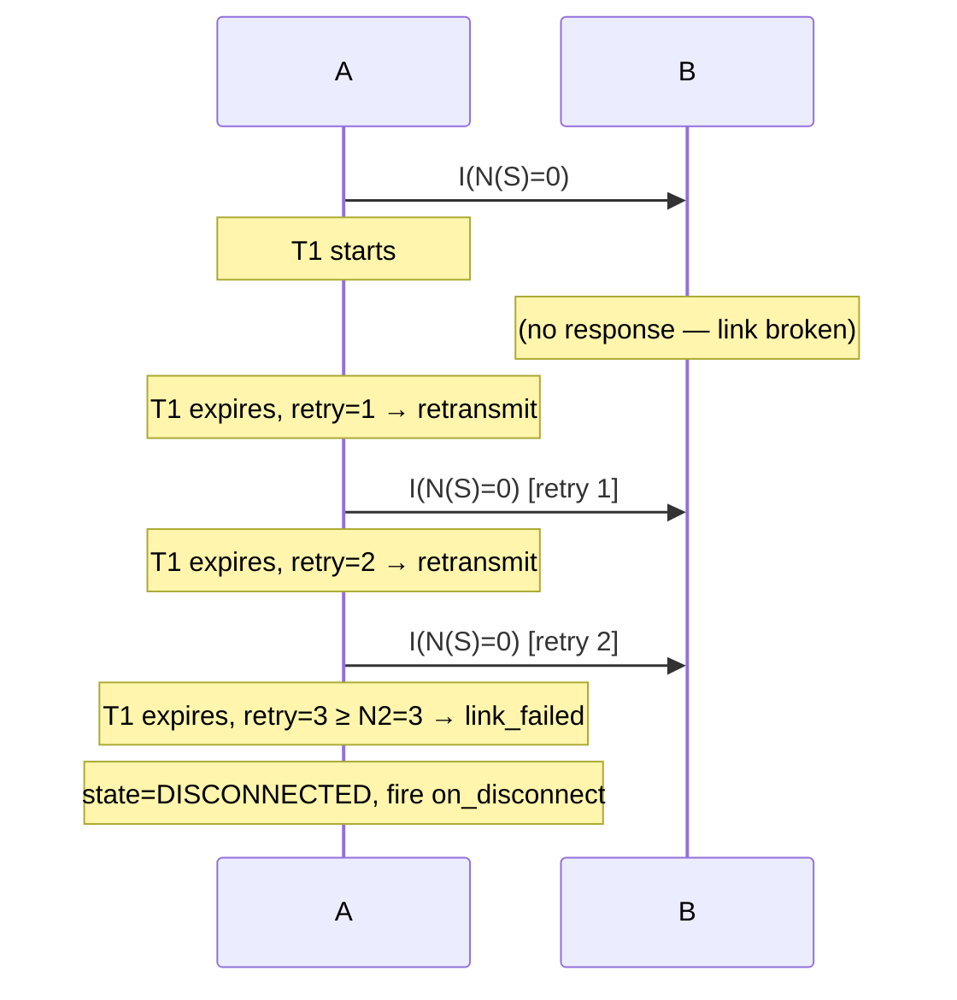
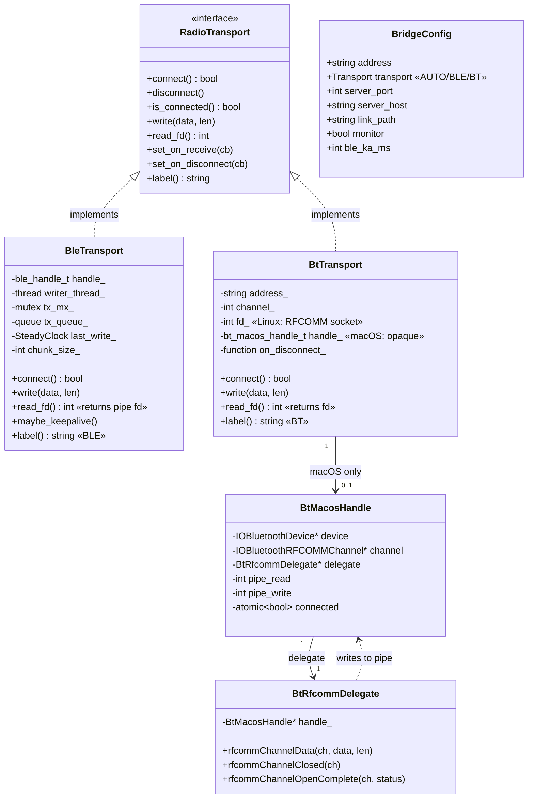
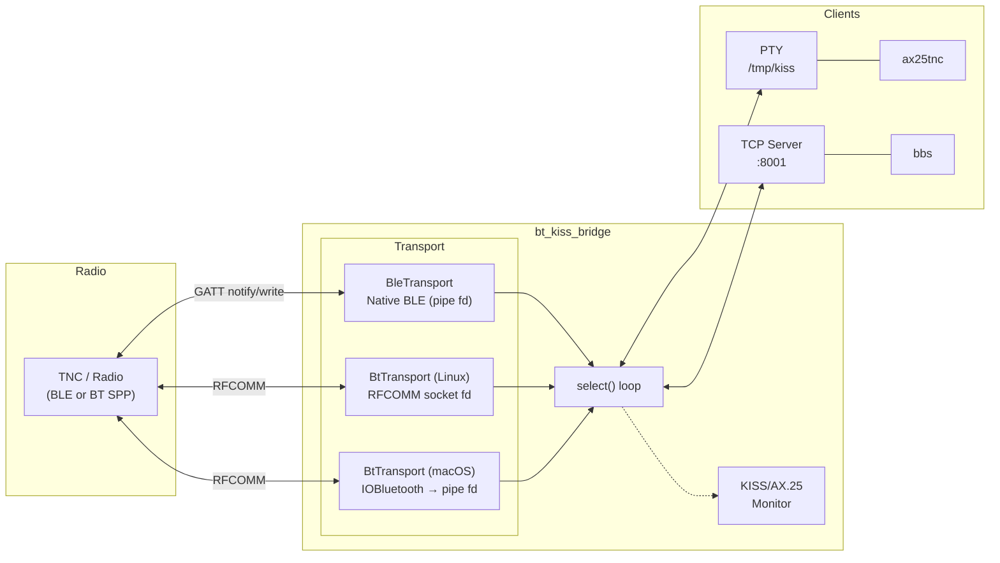

# KISSBBS — AX.25 / KISS Library (C++11, Linux + macOS)

[](https://github.com/solariun/KISSBBS/actions/workflows/ci.yml)

A self-contained C++11 library implementing the AX.25 amateur-radio link-layer
protocol over KISS-mode TNCs.  Includes a full-featured BBS with INI config,
a QBASIC-style scripting engine (functions, structs, DO/LOOP, SELECT CASE, SQLite · TCP · HTTP),
a complete TNC terminal client (`ax25tnc`), an offline BASIC debugger (`basic_tool`),
a PTY-based TNC simulator (`ax25sim`) for hardware-free testing,
remote shell access, an interactive KISS terminal, and a comprehensive GoogleTest suite.

---

## Quick Start

```bash
# 1. Clone the repository
git clone https://github.com/solariun/KISSBBS
cd KISSBBS

# 2. Install build dependencies
#    macOS
brew install googletest sqlite
#    Ubuntu / Debian
sudo apt-get install libgtest-dev libsqlite3-dev libdbus-1-dev libbluetooth-dev pkg-config

# 3. Build everything + run tests
make          # builds: bbs  ax25kiss  ax25tnc  basic_tool  bt_kiss_bridge  ax25sim
make test     # runs the GoogleTest suite — all must pass
```

---

## Linux BBS Installation — One-Command Setup

KISSBBS provides a complete automated installer that turns any Linux box
(Raspberry Pi, Pi Zero, Ubuntu, Debian) into a fully operational AX.25 BBS
station.  Fully compatible with **Raspberry Pi** (all models including
**Pi Zero / Pi Zero W**) — perfect for building a portable, low-power packet
radio station.

### Why KISSBBS?

- **`bt_kiss_bridge`** — Use inexpensive Bluetooth radios (BLE or Classic BT) as
  packet modems.  No expensive dedicated TNC hardware required; a handheld radio
  like the Vero VR-N7600 or Kenwood TH-D75 connected via Bluetooth becomes your
  station modem.  The bridge creates a virtual KISS PTY so every AX.25 tool on
  Linux (kissattach, linpac, our BBS) can use it transparently.
- **`bbs`** — A native multi-connection AX.25 BBS with INI config, scriptable
  via BASIC, SQLite database, APRS beacons, and per-connection state machines.
  *Currently we also install **linpac** (a popular AX.25 terminal) as an
  alternative; in future releases linpac will be replaced entirely by our BBS.*
- **`ax25tnc`** — A standalone TNC terminal that can connect to remote stations
  or accept incoming connections, working as a simple peer-to-peer link with
  other HAMs.  Great for testing and casual QSOs.
- **`ax25sim`** — A PTY-based TNC simulator that creates a virtual serial port
  at `/tmp/kiss_sim`.  Develop and test BBS scripts, protocol tuning, and
  connection handling entirely on your workstation — no TNC, no radio, no
  Bluetooth adapter.  Catch bugs before they hit the air.
  See [§2 Development Workflow](#2-development-workflow--best-practices) and
  [§21 ax25sim](#21-ax25sim--ax25-tnc-simulator).
- **`basic_tool`** — Offline BASIC interpreter and REPL debugger.  Write and
  test BBS scripts without connecting to anything — line-by-line trace,
  variable overrides, and interactive inspection.  The fastest way to iterate
  on script logic.
  See [§20 basic_tool](#20-basic_tool--offline-basic-interpreter--repl-debugger).
- **BASIC scripting** — Both `bbs` and `ax25tnc` can run BASIC scripts to
  automate welcome messages, menus, mail handling, and more.
  See [§15 BASIC Scripting](#15-basic-scripting) for the full language reference.

### Running the installer

```bash
# 1. Clone the repository
git clone https://github.com/solariun/KISSBBS
cd KISSBBS

# 2. Edit the configuration section at the top of the script
#    (callsign, SSID, BLE device MAC, etc.)
nano resources/install_linux_bbs.sh

# 3. Run the installer as root
sudo bash resources/install_linux_bbs.sh
```

The installer will:
1. Install all system packages (build tools, AX.25 stack, Bluetooth, linpac)
2. Build and install all KISSBBS binaries
3. Configure the AX.25 port in `/etc/ax25/axports`
4. Generate `bbs.ini` with your station settings
5. Create four **systemd services** (all **disabled** by default):

| Service | Description |
|---------|-------------|
| `kissbbs-ble-bridge` | BLE/BT KISS bridge — connects your Bluetooth radio |
| `kissbbs-kissattach` | Attaches the KISS PTY to the AX.25 kernel stack |
| `kissbbs-bbs`        | The KISSBBS BBS server |
| `kissbbs-linpac`     | Linpac AX.25 terminal (daemon mode) |

### Enabling services

All services are created **disabled** so you can review and test before going
live.  Enable them in order:

```bash
# 1. Start the BLE bridge (if using Bluetooth radio)
sudo systemctl enable --now kissbbs-ble-bridge

# 2. Attach KISS to the AX.25 stack
sudo systemctl enable --now kissbbs-kissattach

# 3. Start the BBS (or linpac, or both)
sudo systemctl enable --now kissbbs-bbs
sudo systemctl enable --now kissbbs-linpac   # optional — linpac terminal

# View logs
journalctl -u kissbbs-ble-bridge -f
journalctl -u kissbbs-bbs -f
```

> **Tip:** `ax25tnc` is also installed and can be used standalone for direct
> peer-to-peer connections with other HAMs — no BBS needed.  Both `bbs` and
> `ax25tnc` support BASIC scripting for automated interactions.
> See [§15 BASIC Scripting](#15-basic-scripting).

---

## Table of Contents

0. [Quick Start](#quick-start)
1. [Linux BBS Installation](#linux-bbs-installation--one-command-setup)
2. [Development Workflow & Best Practices](#2-development-workflow--best-practices)
3. [Background — AX.25 and KISS](#3-background--ax25-and-kiss)
4. [Architecture Overview](#4-architecture-overview)
5. [Object Relationship Diagram](#5-object-relationship-diagram)
6. [UML Class Diagram](#6-uml-class-diagram)
7. [AX.25 State Machine](#7-ax25-state-machine)
8. [Connection Sequence Diagram](#8-connection-sequence-diagram)
9. [Building](#9-building)
10. [API Reference](#10-api-reference)
11. [Usage Examples](#11-usage-examples)
12. [Running Tests](#12-running-tests)
13. [BBS Example](#13-bbs-example)
14. [INI Configuration](#14-ini-configuration)
15. [BASIC Scripting](#15-basic-scripting)
16. [APRS Helpers (ax25::aprs)](#16-aprs-helpers-ax25aprs)
17. [ax25tnc — TNC Terminal Client](#17-ax25tnc--tnc-terminal-client)
18. [ble_kiss_monitor.py — BLE KISS Scanner & AX.25 Monitor](#18-ble_kiss_monitorpy--ble-kiss-scanner--ax25-monitor)
19. [bt_kiss_bridge — Bluetooth KISS Bridge (BLE + Classic BT)](#19-bt_kiss_bridge--bluetooth-kiss-bridge-ble--classic-bt)
20. [basic_tool — Offline BASIC Interpreter / REPL Debugger](#20-basic_tool--offline-basic-interpreter--repl-debugger)
21. [ax25sim — AX.25 TNC Simulator](#21-ax25sim--ax25-tnc-simulator)

---

## 2. Development Workflow & Best Practices

This section describes how to use `ax25sim` and `basic_tool` together for an
efficient development and testing workflow — no radio hardware required.

### Why use the simulator?

- **No hardware needed** — Test connections, protocol behavior, and scripts
  without a TNC, radio, or Bluetooth adapter.
- **Instant feedback** — PTY connections are local; no RF propagation delay,
  no channel contention, no interference.
- **Reproducible** — Every test runs in the same conditions.  No weather,
  QRM, or fading to confuse debugging.
- **Safe** — No accidental transmissions on air while developing.
- **Full protocol fidelity** — The simulator uses the same `Kiss`, `Router`,
  and `Connection` classes as the real tools.  If it works on the simulator,
  it will work on real hardware.

### Recommended workflow

#### 1. Develop scripts offline with `basic_tool`

Use `basic_tool` to write and debug BASIC scripts before deploying them to the
BBS or TNC:

```bash
# Edit your script
vim my_menu.bas

# Test it standalone (stdin/stdout for I/O)
basic_tool my_menu.bas

# Debug with line trace
basic_tool --trace my_menu.bas

# Override variables to simulate different stations
basic_tool -v callsign\$=W1ABC -v bbs_name\$=TestBBS my_menu.bas

# Drop into REPL after running to inspect state
basic_tool --repl my_menu.bas
```

**Advantages of `basic_tool`:**
- Catches syntax errors and logic bugs before connecting to anything
- `--trace` shows exactly which lines execute and in what order
- Variables can be overridden to test edge cases
- REPL mode lets you inspect and modify state interactively
- SQLite, HTTP, and socket operations work normally

#### 2. Test with the simulator

Once your script works in `basic_tool`, test it with real AX.25 framing:

```bash
# Terminal 1: start the simulator
./ax25sim -c MYBBS -s .

# Terminal 2: connect with ax25tnc
./ax25tnc -c TESTER -r MYBBS /tmp/kiss_sim
```

Now you have a full AX.25 connection.  Data flows through KISS framing,
windowed I-frames, and the connection state machine — exactly as it would
over the air.

Run scripts in the simulator:

```text
# In the ax25sim terminal:
//b my_menu           # regex match — finds my_menu.bas
//b sim_chat          # start the chat simulation
//b                   # list all available scripts
```

#### 3. Test the BBS

Start the full BBS server against the simulator:

```bash
# Terminal 1: simulator acts as the "radio"
./ax25sim -c RADIO

# Terminal 2: BBS connects to the simulator's PTY
./bbs -c MYBBS /tmp/kiss_sim

# Terminal 3: a client connects through the same PTY (or a second simulator)
./ax25tnc -c VISITOR -r MYBBS /tmp/kiss_sim
```

#### 4. Tune parameters

Use the simulator to test protocol edge cases:

```bash
# Start with restrictive parameters
./ax25sim -c W1SIM -w 1 --mtu 64 -t 1000
```

```text
# In the simulator console
//b sim_stress

# Adjust on the fly
//win 7
//mtu 256
//t1 5000
//b sim_stress
```

Compare throughput with different window sizes and MTU values.

#### 5. Monitor and debug

The simulator provides real-time visibility into protocol activity:

```text
//mon on              # show all frames (on by default)
//hex on              # show hex dump of frame contents
//s                   # show connection stats (frames TX/RX, bytes, retries)
```

Frame monitor shows every SABM, UA, I-frame, RR, and DISC — invaluable for
debugging connection issues.

### Tips

- **Start simple**: test scripts with `basic_tool` first, then promote to
  `ax25sim`, then to real hardware.
- **Use `--trace`**: when a script misbehaves, `basic_tool --trace` shows
  every line executed.  Pipe stderr to a file for post-mortem analysis.
- **Override variables**: use `-v` flags in `basic_tool` to simulate different
  callers, BBS names, or conditions without editing the script.
- **Watch frame flow**: `//mon on` in `ax25sim` shows the AX.25 handshake
  (SABM→UA→I-frames→DISC) in real time.
- **Stress test early**: run `sim_stress.bas` to verify your windowing and
  flow control before going on-air.
- **Keep the PTY path consistent**: the default `/tmp/kiss_sim` works for
  most setups.  If running multiple simulators, use `-l /tmp/kiss_sim2`.
- **Test both directions**: use `//c <call>` to test outgoing connections and
  let other tools connect to you for incoming connections.
- **Automate with shell scripts**: chain `basic_tool` runs in a test script
  to validate all your `.bas` files in one go:
  ```bash
  for f in *.bas; do
      echo "--- Testing $f ---"
      basic_tool "$f" < /dev/null || echo "FAILED: $f"
  done
  ```

See [§20 basic_tool](#20-basic_tool--offline-basic-interpreter--repl-debugger)
and [§21 ax25sim](#21-ax25sim--ax25-tnc-simulator) for full reference
documentation on these tools.

---

## 3. Background — AX.25 and KISS

### AX.25

AX.25 is the link-layer protocol used in amateur (ham) radio packet networks.
Think of it as a stripped-down Ethernet designed for half-duplex radio channels.

**Addresses** — Every station has a *callsign* (up to 6 characters, e.g. `W1AW`)
plus a 0–15 *SSID* suffix, written `W1AW-7`.  On the wire each address occupies
exactly 7 bytes: the 6 callsign characters shifted left by one bit, followed by
a flag byte carrying the SSID and housekeeping bits.

**Frame types**

| Type | Purpose |
|------|---------|
| UI (Unnumbered Information) | Connectionless datagram — used for APRS beacons |
| SABM | Set Asynchronous Balanced Mode — opens a connection |
| UA | Unnumbered Acknowledgement — accepts SABM or DISC |
| DM | Disconnected Mode — rejects SABM |
| DISC | Disconnect — closes a connection |
| I-frame | Information frame — carries sequenced data |
| RR | Receive Ready — acknowledges I-frames, resumes suspended flow |
| REJ | Reject — requests retransmission from a given sequence number |

**Connected mode** (what `Connection` implements) uses a sliding window
(Go-Back-N, mod-8) with two timers:

* **T1** — Retransmit timer.  Dynamically computed:
  `max(t1_ms, window × mtu × 40000 / baud)`.  This ensures T1 is long enough
  for the full window to transit slow links (BLE, 1200 baud, etc.).  Default
  minimum is 15 000 ms.  If T1 expires before an ACK arrives the frame is
  retransmitted with P=1 to poll the remote.  After *N2* retries the link is
  declared failed.
* **T3** — Keep-alive / inactivity timer.  If no data is exchanged within T3 the
  station sends an RR poll (P=1) to verify the link is still alive.

**P/F poll tracking** — The library tracks outstanding P=1 polls internally.
When the window fills, the last I-frame is sent with P=1 to solicit an RR
response from the remote.  Incoming RR/RNR with F=1 are matched against
outstanding polls so the library never echoes back a spurious RR.  Applications
never need to manage polling — it is fully transparent.

**TX pacing** — Outgoing frames are spaced by TXDELAY (default 400 ms) to give
half-duplex radios time for TX/RX turnaround.  After receiving a frame, the
router also enforces a turnaround delay before responding.

### KISS

KISS ("Keep It Simple, Stupid") is a thin serial framing protocol that lets a
computer talk to a TNC (Terminal Node Controller — the radio modem).

The computer sends and receives raw AX.25 frames wrapped in a simple envelope:

```
FEND  CMD  DATA...  FEND
```

Special byte values are escaped inside DATA so they cannot be confused with
envelope markers:

| Raw byte | On wire |
|----------|---------|
| `0xC0` (FEND) | `0xDB 0xDC` |
| `0xDB` (FESC) | `0xDB 0xDD` |

The TNC handles everything physical: radio timing, flag bytes, and FCS
checksums.  The library never sees or generates those.

### APRS

APRS (Automatic Packet Reporting System) is built on top of AX.25 UI frames
with PID `0xF0`, sent to the destination callsign `APRS`.  The library lets you
send position reports and person-to-person messages and receive/route incoming
ones.

---

## 4. Architecture Overview

```
Your Application
       │
       ▼
   ┌────────┐
   │ Router │  Manages connections; routes incoming frames; exposes on_ui
   └────────┘
       │
       ▼
   ┌────────┐
   │  Kiss  │  Transport-agnostic KISS framing layer
   └────────┘
       │  open(dev, baud)  ← serial port (Serial / termios)
       │  open_fd(fd)      ← any POSIX fd: TCP socket, PTY, pipe
       │
    (wire / socket / PTY)
       │
      TNC  ──── Radio ──── Remote station
```

The layer stack is **intentionally thin**: each layer does exactly one job and
calls the layer above via a `std::function` callback, making the stack easy to
test (swap the serial layer with an in-memory hook) and easy to adapt (plug in a
different physical layer without touching the rest).

---

## 5. Object Relationship Diagram

```
                              ┌─────────────────────────────────────────┐
                              │              ax25lib.hpp/cpp             │
                              └─────────────────────────────────────────┘

  ┌──────────────────────────────────────────────────────────────────────────┐
  │  ObjNode<T>  (template)  — self-managing intrusive node                  │
  │  ─────────────────────────────────────────────────────────────────────── │
  │  # ObjNode(ObjList<T>&)   ← protected; auto-inserts on construction      │
  │  # ~ObjNode()              ← protected; auto-removes on destruction       │
  │  - next_ : T*                                                             │
  │  - prev_ : T*                                                             │
  │  - list_ : ObjList<T>*                                                    │
  └──────────────────────────────────────────────────────────────────────────┘
          ▲ inherits
          │
  ┌───────────────────────────────────────────────────────────────────────┐
  │  Connection  extends ObjNode<Connection>                               │
  │  ─────────────────────────────────────────────────────────────────────│
  │  Callbacks: on_connect, on_disconnect, on_data                         │
  │  State: DISCONNECTED / CONNECTING / CONNECTED / DISCONNECTING          │
  │  AX.25 vars: vs_, vr_, va_, retry_                                     │
  │  Timers: T1 (retransmit), T3 (keep-alive)                              │
  │  Queues: send_buf_, unacked_                                            │
  │  ─────────────────────────────────────────────────────────────────────│
  │  + send(data)                                                           │
  │  + disconnect()                                                         │
  │  + tick(now_ms)                                                         │
  │  + has_unacked() → bool   (true if unacked_ or send_buf_ non-empty)    │
  └───────────────────────────────────────────────────────────────────────┘
          │ lives in (inserted/removed automatically via ObjNode ctor/dtor)
          ▼
  ┌───────────────────────────────────────────────────────────────────────┐
  │  ObjList<Connection>  (intrusive doubly-linked list)                   │
  │  ─────────────────────────────────────────────────────────────────────│
  │  - head_, tail_, size_   (private)                                      │
  │  - insert_back(item)     (called by ObjNode ctor — not public)          │
  │  - erase(item)           (called by ObjNode dtor — not public)          │
  │  + empty()  size()  begin()  end()  snapshot()                          │
  └───────────────────────────────────────────────────────────────────────┘
          │ owned by
          ▼
  ┌───────────────────────────────────────────────────────────────────────┐
  │  Router                                                                │
  │  ─────────────────────────────────────────────────────────────────────│
  │  + connect(remote) → Connection*                                       │
  │  + listen(on_accept)                                                   │
  │  + send_ui(dest, pid, data)                                            │
  │  + send_aprs(info)                                                     │
  │  + poll()                                                              │
  │  Callbacks: on_ui (all UI frames), on_monitor (all frames)             │
  └───────────────────────────────────────────────────────────────────────┘
          │ holds reference to
          ▼
  ┌───────────────────────────────────────────────────────────────────────┐
  │  Kiss                                                                  │
  │  ─────────────────────────────────────────────────────────────────────│
  │  + open(device, baud)   ← serial port                                  │
  │  + open_fd(fd)          ← any POSIX fd (TCP socket, PTY, pipe…)        │
  │  + fd() → int           ← active file descriptor                       │
  │  + is_open() → bool                                                     │
  │  + send_frame(ax25_bytes)                                              │
  │  + poll()  — reads fd, fires on_frame for each complete AX.25 frame    │
  │  Hooks: on_send_hook (test/simulation), test_inject(payload)           │
  └───────────────────────────────────────────────────────────────────────┘
          │ owns
          ▼
  ┌───────────────────────────────────────────────────────────────────────┐
  │  Serial                                                                │
  │  ─────────────────────────────────────────────────────────────────────│
  │  + open(dev, baud)   close()                                           │
  │  + read(buf, len)    write(buf, len)                                   │
  │  fd_ : int           (non-blocking POSIX file descriptor)              │
  └───────────────────────────────────────────────────────────────────────┘

  Supporting types (used by the layers above)

  ┌──────────────┐   ┌───────────────────────────────────┐
  │  Addr        │   │  Frame                             │
  │  ────────────│   │  ─────────────────────────────────│
  │  call[7]     │   │  dest, src : Addr                  │
  │  ssid : int  │   │  digis : vector<Addr>              │
  │  make(str)   │   │  ctrl, pid : uint8_t               │
  │  encode()    │   │  info : vector<uint8_t>            │
  │  decode()    │   │  type() → IFrame/UI/SABM/...       │
  │  str()       │   │  encode() / decode()               │
  └──────────────┘   └───────────────────────────────────┘

  ┌────────────────────────────────────────────────────────────┐
  │  kiss namespace                                             │
  │  ──────────────────────────────────────────────────────────│
  │  Constants: FEND, FESC, TFEND, TFESC                        │
  │  encode(payload) → KISS-wrapped bytes                       │
  │  Decoder::feed(buf, len) → vector<kiss::Frame>              │
  └────────────────────────────────────────────────────────────┘

  ┌────────────────────────────────────────────────────────────┐
  │  Config                                                     │
  │  ──────────────────────────────────────────────────────────│
  │  mycall, digis, mtu, window, t1_ms, t3_ms, n2, …           │
  └────────────────────────────────────────────────────────────┘
```

---

## 6. UML Class Diagram



---

## 7. AX.25 State Machine



---

## 8. Connection Sequence Diagram

### Successful connect + data exchange + disconnect



### T1 retransmit and link failure



---

## 9. Building

### Prerequisites

| Platform | Compiler | Required | Optional |
|----------|----------|----------|----------|
| macOS    | Xcode CLT (`xcode-select --install`) | — | `brew install sqlite` |
| Linux    | `g++` ≥ 7 | `build-essential` | `libsqlite3-dev libdbus-1-dev libbluetooth-dev` |

**SQLite3** — needed for the `DBOPEN/DBEXEC/DBQUERY` BASIC commands.
The Makefile auto-detects it via `pkg-config`; everything else compiles without it.

```bash
# macOS
brew install googletest sqlite

# Ubuntu / Debian
sudo apt-get install libgtest-dev libsqlite3-dev libdbus-1-dev libbluetooth-dev

# Fedora
sudo dnf install gtest-devel sqlite-devel dbus-devel bluez-libs-devel
```

### Build targets

```bash
make                  # build bbs, ax25kiss, ax25tnc, basic_tool, and bt_kiss_bridge
make test             # compile and run all unit tests
make clean            # remove all build artefacts
make bt_kiss_bridge   # build only the Bluetooth KISS bridge (BLE + Classic BT)
```

To cross-compile or choose a different compiler:

```bash
CXX=clang++ make
```

---

## 10. API Reference

### `ax25::Addr`

```cpp
// Parse a callsign string (case-insensitive, optional -SSID)
Addr a = Addr::make("W1AW-7");

// Encode to 7 AX.25 wire bytes
std::vector<uint8_t> raw = a.encode(/*last_addr=*/false);

// Decode from 7 raw bytes
Addr b = Addr::decode(raw.data());

// Human-readable string
std::string s = a.str();   // → "W1AW-7"
```

### `ax25::Config`

```cpp
Config cfg;
cfg.mycall  = Addr::make("W1AW");
cfg.mtu     = 128;     // max info bytes per I-frame
cfg.window  = 3;       // max outstanding unacked I-frames (1–7)
cfg.t1_ms   = 15000;   // retransmit timer min ms (dynamic: see compute_t1())
cfg.t3_ms   = 60000;   // keep-alive inactivity timer ms
cfg.n2      = 10;      // max retries before link fail
cfg.baud    = 9600;    // link speed — used by compute_t1()
cfg.txdelay = 40;      // KISS TX delay (×10 ms, default 400 ms)
cfg.persist = 63;      // KISS persistence (0–255)
```

### `ax25::Kiss`

`Kiss` is **transport-agnostic**: it can operate over a serial port, a TCP
socket, a PTY master, or any other POSIX file descriptor.

```cpp
Kiss kiss;

// ── Option A: serial port ─────────────────────────────────────────────
kiss.open("/dev/ttyUSB0", 9600);

// ── Option B: any pre-opened POSIX fd (TCP socket, PTY, pipe…) ───────
int tcp_fd = /* socket() + connect() */;
kiss.open_fd(tcp_fd);   // sets O_NONBLOCK; Kiss owns the fd from here

// Query the active fd regardless of how it was opened
int fd = kiss.fd();

// Is the transport open?
if (kiss.is_open()) { /* ... */ }

// Register callback — fires for every complete AX.25 payload received
kiss.set_on_frame([](std::vector<uint8_t> frame) { /* ... */ });

// Send an AX.25 payload
kiss.send_frame(ax25_bytes);

// Drive the I/O loop from your event loop
kiss.poll();   // non-blocking read; fires callback for each frame
```

### `ax25::Router`

```cpp
// Kiss must be open before constructing Router
Router router(kiss, cfg);

// Accept incoming connections
router.listen([](Connection* conn) {
    conn->on_connect    = [&]{ /* set up UI for this user */ };
    conn->on_disconnect = [&]{ delete conn; };
    conn->on_data = [&](const uint8_t* d, size_t n) {
        /* process data */
    };
});

// Initiate an outgoing connection
Connection* conn = router.connect(Addr::make("N0CALL"));
// on_connect fires synchronously if peer responds instantly

// Send a connectionless UI frame
router.send_ui(Addr::make("N0CALL"), 0xF0, "hello");

// Send an APRS frame (UI, PID=0xF0, dest=APRS)
router.send_aprs("!5130.00N/00000.00E>Test beacon");

// Monitor all UI / APRS traffic
router.on_ui = [](const Frame& f) { /* inspect */ };

// Monitor every decoded frame (for logging)
router.on_monitor = [](const Frame& f) { /* log */ };

// Call from your main loop
router.poll();
```

### `ax25::Connection`

```cpp
// Set callbacks before the connection becomes active (inside on_accept or right after connect())
conn->on_connect    = []{ /* link established */ };
conn->on_disconnect = []{ /* link lost */ };
conn->on_data = [](const uint8_t* d, size_t n) { /* n bytes arrived */ };

// Send data (chunked automatically to MTU)
conn->send("Hello world");                          // string overload
conn->send(ptr, len);                               // raw bytes

// Close the link gracefully
conn->disconnect();

// State query
if (conn->connected()) { /* ... */ }
Connection::State s = conn->state();

// Pending-frame guard — true when unacked_ or send_buf_ is non-empty.
// Use this before injecting application-level keep-alive traffic so you
// do not add new I-frames while the window is already stuck (REJ recovery).
if (!conn->has_unacked()) {
    conn->send("\r");   // safe: window is idle
}

// Addresses
Addr local  = conn->local();
Addr remote = conn->remote();

// Timer tick — call from your event/poll loop
conn->tick(ax25::now_ms());
```

> **Ownership**: `Connection` objects are allocated on the heap by `Router`.
> The caller owns them and must `delete` them when done.  Deleting a Connection
> automatically removes it from the Router's internal list.

---

## 11. Usage Examples

### Minimal receiver — print every received frame

```cpp
#include "ax25lib.hpp"
#include <iostream>

int main() {
    ax25::Config cfg;
    cfg.mycall = ax25::Addr::make("W1AW");

    ax25::Kiss kiss;
    if (!kiss.open("/dev/ttyUSB0", 9600)) {
        std::cerr << "cannot open serial port\n";
        return 1;
    }

    ax25::Router router(kiss, cfg);
    router.on_monitor = [](const ax25::Frame& f) {
        std::cout << f.format() << "\n";
    };

    for (;;) router.poll();
}
```

### Outgoing connection + data

```cpp
ax25::Config cfg;
cfg.mycall = ax25::Addr::make("W1AW");

ax25::Kiss kiss;
kiss.open("/dev/ttyUSB0", 9600);
ax25::Router router(kiss, cfg);

auto* conn = router.connect(ax25::Addr::make("N0CALL"));
conn->on_connect = [&]{
    conn->send("Hello via AX.25!\r\n");
};
conn->on_data = [](const uint8_t* d, std::size_t n) {
    std::cout.write(reinterpret_cast<const char*>(d), n);
};
conn->on_disconnect = [&]{
    std::cout << "disconnected\n";
    delete conn;
};

for (;;) router.poll();
```

### BBS — accept multiple connections

```cpp
ax25::Config cfg;
cfg.mycall = ax25::Addr::make("W1BBS");

ax25::Kiss kiss;
kiss.open("/dev/ttyUSB0", 9600);
ax25::Router router(kiss, cfg);

router.listen([&](ax25::Connection* conn) {
    conn->on_connect = [conn]{
        conn->send("Welcome to the BBS!\r\nType H for help.\r\n");
    };
    conn->on_data = [conn](const uint8_t* d, std::size_t n) {
        std::string line(reinterpret_cast<const char*>(d), n);
        if (line == "B\r" || line == "Q\r") {
            conn->send("73 de W1BBS\r\n");
            conn->disconnect();
        } else {
            conn->send("Echo: " + line);
        }
    };
    conn->on_disconnect = [conn]{ delete conn; };
});

for (;;) router.poll();
```

### Unit testing without a serial port

The library ships test hooks that make it possible to write deterministic unit
tests with no hardware:

```cpp
#include "ax25lib.hpp"

// Wire two Kiss objects together in memory
ax25::Kiss kiss_a, kiss_b;

kiss_a.on_send_hook = [&](const std::vector<uint8_t>& frame) {
    kiss_b.test_inject(frame);   // deliver A's outgoing frame to B
    return true;
};
kiss_b.on_send_hook = [&](const std::vector<uint8_t>& frame) {
    kiss_a.test_inject(frame);
    return true;
};

ax25::Router router_a(kiss_a, make_cfg("W1AW"));
ax25::Router router_b(kiss_b, make_cfg("N0CALL"));

// Now router_a and router_b can exchange frames in memory — no radio needed.
```

See `test_ax25lib.cpp` for the full `VirtualWire` helper that handles re-entrancy
safely, and all 43 tests.

---

## 12. Running Tests

```bash
make test
```

Expected output:

```
[==========] Running 131 tests from 14 test suites.
...
[  PASSED  ] 131 tests.
```

### Test suites

| Suite | Count | What is tested |
|-------|-------|----------------|
| `ObjList` | 8 | Auto-insert on construction, auto-remove on destruction (scope + `delete`), iteration, snapshot |
| `Addr` | 8 | `make()`, encode/decode round-trips, SSID handling, equality |
| `KissEncode` | 4 | FEND wrapping, command byte, FEND/FESC byte-stuffing |
| `KissDecode` | 5 | Simple frame, byte-stuff round-trip, split byte-by-byte, multi-frame stream, empty frame skip |
| `AX25Frame` | 10 | UI/SABM/UA/DISC/DM/RR/I-frame type detection, N(S)/N(R) encoding, digipeaters, too-short guard |
| `RouterConnection` | 7 | Full connect+disconnect, data transfer, bidirectional data, large data chunked, DM rejection, address assignment, **DM for orphan non-SABM frames** |
| `RouterUI` | 2 | UI send/receive, APRS broadcast (fires on_ui regardless of dest) |
| `Timers` | 1 | T1 retransmit leading to link failure after N2 retries |
| `IniConfig` | 4 | Load file, missing file, inline comments, bool/double getters |
| `BasicInterp` | 17 | PRINT, arithmetic, string concat, IF/THEN/ELSE multi-stmt, FOR/NEXT, WHILE/WEND, GOSUB/RETURN, string functions, EXEC, EXEC timeout, SEND_APRS, SEND_UI, math |
| `QBasic` | 23 | Labels+GOTO, CONST, block IF/ELSEIF/ELSE/END IF, DO/LOOP WHILE, DO WHILE, DO/LOOP UNTIL, EXIT DO, EXIT FOR, SELECT CASE (simple/ELSE/range/IS), SUB (CALL+implicit), FUNCTION (numeric+string), nested function calls, EXIT SUB, TYPE/DIM, no-line-numbers, GOSUB to label |
| `QBasicExt` | 35 | FOR IN MATCH (basic/numbers/no-matches/EXIT FOR), REMATCH, REFIND$, REALL$ (default+custom sep), RESUB$, RESUBALL$, REGROUP$, RECOUNT, MAP (set/get/has/del/keys/size/clear), QUEUE (push/pop/peek/size/empty/clear/pop-empty/DO WHILE loop), ARRAY (DIM/read/write/numeric/auto-declare/assoc-key/size/FOR IN order/empty/function-return) |
| `TokenizeArgs` | 4 | Plain args, double-quoted args, single-quoted args, empty input |
| `LineTerminator` | 3 | Data delivery unchanged for CR-only (`\r`), LF-only (`\n`), and CRLF (`\r\n`) — confirms ax25lib passes bytes verbatim |

---

## 13. BBS Example

`bbs.cpp` is a full-featured BBS that demonstrates the library in production use.
Configuration can be supplied via command-line flags **or** a `bbs.ini` file.

### Quick start — command line

```bash
make
./bbs -c W1BBS-1 -b 9600 -n "My BBS" -B 600 /dev/ttyUSB0
```

### Quick start — INI file

```bash
cp bbs.ini my_station.ini
# edit callsign, device, etc.
./bbs -C my_station.ini
```

### Full option reference

```
AX.25 / KISS parameters:
  -c <CALL[-N]>   My callsign (required)
  -b <baud>       Baud rate (default: 9600)
  -p <path>       Digipeater path, comma-separated (e.g. WIDE1-1,WIDE2-1)
  -m <bytes>      I-frame MTU (default: 128)
  -w <1-7>        Window size (default: 3)
  -t <ms>         T1 retransmit timer (default: 3000)
  -k <ms>         T3 keep-alive timer (default: 60000)
  -T <units>      KISS TX delay ×10 ms (default: 30)
  -s <0-255>      KISS persistence (default: 63)

BBS options:
  -n <name>       BBS name (default: AX25BBS)
  -u <text>       APRS beacon info string
  -B <secs>       Beacon interval seconds (0 = off)
  -C <file>       Load configuration from INI file

One-shot modes:
  --ui <DEST> <text>    Send one UI frame and exit
  --aprs <text>         Send one APRS frame and exit
```

### Session commands (once connected via AX.25)

| Command | Description |
|---------|-------------|
| `H` / `?` | Help — lists built-ins and `[commands]` entries |
| `U` | List connected users |
| `M <CALL> <msg>` | Send in-BBS message to a connected user |
| `UI <DEST> <text>` | Send a raw UI frame over the air |
| `POS <lat> <lon> [sym] [comment]` | Transmit APRS position (decimal degrees) |
| `AMSG <CALL> <msg>` | Send an APRS message to any callsign |
| `I` | BBS and station info |
| `B` | Send APRS beacon immediately |
| `W` | Show who is logged in + system uptime (`w` command) |
| `PS` | List running processes (`ps aux`) |
| `DIR` | Directory listing of current directory (`ls -la`) |
| `SHELL` | Interactive shell with piped stdin/stdout; stderr → `/tmp/bbs_cmd.log` |
| `SH` | Open a PTY-bridged shell (escape `~.` to exit) |
| `BYE` / `Q` | Disconnect |
| _any [args]_ | Dispatched via `[commands]` section of `bbs.ini` |

Quoted arguments are fully supported: `CMD ARG1 "two words" ARG3`.

All connected users see incoming UI and APRS traffic in real time.
Incoming APRS messages addressed to a connected user are automatically routed to their session.

### `[commands]` section

The `[commands]` INI section maps command names to either a `.bas` script or an
external shell command line.  Arguments typed by the user are appended
(single/double-quoted arguments supported).

```ini
[commands]
; Scripts run under the QBASIC-style interpreter.
; stdin/stdout are wired to the AX.25 session.
welcome = welcome.bas      ; called automatically on connect
email   = email.bas        ; BBS email system

; External commands: stdin/stdout piped to session; stderr → /tmp/bbs_cmd.log
shell   = /bin/bash        ; interactive shell
w       = w                ; who/uptime  (default)
ps      = ps aux           ; process list (default)
dir     = ls -la           ; directory   (default)
weather = curl -s "wttr.in/?format=3"
```

`welcome` is the only reserved name — it is run automatically when a user
connects instead of the built-in banner.  All other names are invoked by the
user typing the command at the `Email>` (or BBS) prompt.

---

## Intrusive Container — Design Notes

`ObjNode<T>` / `ObjList<T>` is an intrusive doubly-linked container inspired by
the Linux kernel's `list_head`.  Unlike `std::list`, which heap-allocates a
wrapper node for each element, the linkage (`next_`/`prev_` pointers) lives
**inside** the object itself — no extra allocation needed.

### Self-managing lifetime

The key improvement over a plain `Node<T>` base class is that **`ObjNode<T>`
owns the insert/remove responsibility** so developers never call `push_back` or
`remove` explicitly:

```cpp
// T must inherit ObjNode<T>.
// The constructor takes the list — insertion is automatic.
struct MySession : ObjNode<MySession> {
    std::string call;
    MySession(ObjList<MySession>& list, std::string c)
        : ObjNode<MySession>(list),   // ← inserts into list immediately
          call(std::move(c)) {}
    // destructor: ObjNode<MySession>::~ObjNode() fires automatically
    //             → removes from list with O(1), no search
};

ObjList<MySession> sessions;
{
    MySession a(sessions, "W1AW");
    MySession b(sessions, "N0CALL");
    assert(sessions.size() == 2);
}   // a and b destroyed → auto-removed
assert(sessions.empty());

// Heap allocation: delete triggers auto-remove too
auto* s = new MySession(sessions, "PY2XXX");
assert(sessions.size() == 1);
delete s;          // ← safe: auto-removed from list before memory is freed
assert(sessions.empty());
```

### API restrictions

* **Default constructor is `= delete`** — every `ObjNode<T>` must bind to an
  `ObjList<T>` at construction time.
* **Copy and move are `= delete`** — nodes are identity-based, not value-based.
* `ObjList<T>::insert_back` and `erase` are **private**, only callable by
  `ObjNode<T>` (friend).  User code never calls them.
* An object can belong to **one** list at a time (same trade-off as all
  intrusive containers).

### Advantages

| Property | Benefit |
|----------|---------|
| Zero extra allocation | No wrapper `list_node` struct on the heap |
| O(1) insert / remove | Pointer surgery only; no search |
| Safety by construction | Can't forget to insert; can't double-free the link |
| RAII-friendly | Scope exit or `delete` → automatic deregistration |

---

## 14. INI Configuration

`bbs.ini` is an optional configuration file that sets all BBS parameters.
Command-line flags always take precedence over file values.

### File format

```ini
; Lines starting with ; or # are comments
[section]
key = value   ; inline comments also work
```

### Full reference

```ini
[kiss]
device = /dev/ttyUSB0     ; serial port (or /dev/tty.usbserial-* on macOS)
baud   = 9600             ; baud rate: 1200 / 9600 / 38400 / 115200

[ax25]
callsign    = W1BBS-1     ; your station callsign (required)
mtu         = 128         ; max bytes per I-frame
window      = 3           ; sliding window size (1–7)
t1_ms       = 15000       ; retransmit timer min ms (auto-scaled by baud)
t3_ms       = 60000       ; keep-alive timer (ms)
n2          = 10          ; max retries before link failure
txdelay     = 40          ; KISS TX delay (×10 ms, default 400 ms)
persist     = 63          ; KISS persistence byte (0–255)
; digipeaters = WIDE1-1,WIDE2-1   ; optional digi path

[bbs]
name             = MyBBS
beacon           = !2330.00S/04636.00W>MyBBS AX.25 BBS
beacon_interval  = 600          ; seconds, 0 = off
welcome_script   = welcome.bas  ; optional BASIC script run on each connect

[basic]
script_dir = .
database   = bbs.db       ; SQLite database file for BASIC scripts
```

### Using `IniConfig` in your own code

```cpp
#include "ini.hpp"

IniConfig cfg;
if (!cfg.load("bbs.ini")) {
    std::cerr << "config file not found, using defaults\n";
}

std::string call   = cfg.get("ax25", "callsign", "N0CALL");
int         baud   = cfg.get_int("kiss", "baud", 9600);
bool        beacon = cfg.get_bool("bbs", "beacon_enabled", false);
double      lat    = cfg.get_double("bbs", "lat", 0.0);

// Check existence before reading optional keys
if (cfg.has("bbs", "welcome_script")) {
    std::string script = cfg.get("bbs", "welcome_script");
}

// Iterate all keys in a section
for (auto& kv : cfg.section("ax25")) {
    std::cout << kv.first << " = " << kv.second << "\n";
}
```

---

## 15. BASIC Scripting

The BBS ships a **QBASIC-style interpreter** (`basic.hpp` / `basic.cpp`) that lets
you write BBS welcome screens, menus, and automated services without recompiling.
The dialect supports named procedures (`FUNCTION` / `SUB`), user-defined types
(`TYPE`), block control structures (`DO/LOOP`, `SELECT CASE`, block `IF/END IF`),
labels, `CONST`, `DIM`, and all legacy line-numbered code — fully backward-compatible.

### How it fits in

```
bbs.ini → welcome_script = welcome.bas
              ↓
          Basic interp;
          interp.on_send = [&](auto s){ conn->send(s); };   // PRINT/SEND → AX.25
          interp.on_recv = [&](int ms){ return conn_readline(); };
          interp.set_str("callsign$", caller);               // pre-filled vars
          interp.load_file("welcome.bas");
          interp.run();
```

> **Offline testing:** Use [`basic_tool`](#20-basic_tool--offline-basic-interpreter--repl-debugger)
> to run and debug `.bas` scripts from the command line without a TNC or BLE connection.
> ```bash
> basic_tool --trace -v callsign\$=W1ABC -v bbs_name\$=MyBBS welcome.bas
> ```

### Host-side MAP and QUEUE pre-population

In addition to scalar variables (`set_str` / `set_num`), the host application
can inject **MAP** entries and **QUEUE** elements before calling `run()`.
This lets C++ code pass structured data — configuration tables, message queues,
lookup tables — that BASIC scripts consume with `MAP_GET`, `QUEUE_POP`, etc.

> **Important:** call all `map_set` / `queue_push` methods **after**
> `load_file()` or `load_string()`, because both functions call `clear()`
> internally which wipes `maps_` and `queues_`.

#### API reference

```cpp
// ── MAP ──────────────────────────────────────────────────────────────────
// Inject a string or numeric entry into a named MAP.
// map_name and key are stored as-is (string literals, not BASIC identifiers,
// so no uppercasing is needed).
void map_set(const std::string& map_name, const std::string& key,
             const std::string& val);   // string value
void map_set(const std::string& map_name, const std::string& key,
             double val);               // numeric value
void map_clear(const std::string& map_name);  // remove all entries from map

// ── QUEUE ─────────────────────────────────────────────────────────────────
// Push one element onto the back of a named FIFO QUEUE.
void queue_push(const std::string& queue_name, const std::string& val);
void queue_push(const std::string& queue_name, double val);
void queue_clear(const std::string& queue_name); // remove all elements
```

#### Example: inject a configuration MAP

```cpp
Basic interp;
interp.on_send = [](const std::string& s){ std::cout << s; };
interp.load_file("service.bas");

// Inject config table — scripts read with MAP_GET "config", "key", var$
interp.map_set("config", "host",    "db.example.com");
interp.map_set("config", "port",    5432.0);
interp.map_set("config", "db_name", "bbs");

interp.run();
```

```basic
' service.bas
MAP_GET "config", "host", host$
MAP_GET "config", "port", port$
PRINT "Connecting to " + host$ + ":" + port$
```

#### Example: inject a message QUEUE

```cpp
interp.load_file("worker.bas");

// Pre-load jobs — worker pops them one by one
interp.queue_push("jobs", "compile");
interp.queue_push("jobs", "link");
interp.queue_push("jobs", "test");

interp.run();
```

```basic
' worker.bas
DO WHILE QUEUE_SIZE("jobs") > 0
    QUEUE_POP "jobs", job$
    PRINT "Running: " + job$
LOOP
```

#### Multiple maps and queues

A single `Basic` instance can hold any number of named MAPs and QUEUEs.
Names are arbitrary strings — they are not BASIC identifiers, so any
characters are valid:

```cpp
interp.map_set("user:profile",  "callsign", "W1ABC");
interp.map_set("user:profile",  "grid",     "FN42");
interp.map_set("system:limits", "max_msgs", 100.0);
interp.queue_push("rx:frames",  raw_frame_hex);
```

### INCLUDE — file inclusion

The `INCLUDE` directive merges another `.bas` file into the current program at
load time.  This is a preprocessor-style directive — the included code becomes
part of `program_` before `first_pass()` runs, so `SUB`/`FUNCTION`/`TYPE`/`CONST`
definitions from included files are available to the main script.

```basic
' main.bas
INCLUDE "helpers.bas"
INCLUDE "lib/utils.bas"

Greet "World"
PRINT "Result: " + STR$(Add(2, 3))
END
```

```basic
' helpers.bas
SUB Greet(name$)
    PRINT "Hello, " + name$ + "!"
END SUB

FUNCTION Add(a, b)
    Add = a + b
END FUNCTION
```

**Features:**
- Case-insensitive (`INCLUDE`, `Include`, `include` all work)
- Circular includes are silently skipped (each file is included at most once)
- Depth limit of 16 to prevent runaway recursion
- Included files can themselves `INCLUDE` other files

**C++ API:**

```cpp
Basic interp;
interp.load_file("main.bas");          // clears + loads (handles INCLUDE directives)
interp.include_file("extra_lib.bas");  // merges into existing program (no clear)
interp.include_string("SUB Foo()\nPRINT \"hi\"\nEND SUB\n");  // merge from string
interp.run();
```

> `include_file()` / `include_string()` append to the existing program without
> calling `clear()` — call them after `load_file()` / `load_string()`.

### Language quick reference

#### Variables and types

```basic
' String variable (suffix $)
name$ = "W1AW"

' Numeric variable (double, optional % suffix)
count  = 42
score% = 100

' Declare with DIM (optional, initialises to 0/"")
DIM msg$ AS STRING
DIM n    AS INTEGER

' Named constant
CONST MAX_MSG = 100
CONST GREETING$ = "Hello"
```

#### User-defined types (struct)

```basic
TYPE Point
  X AS DOUBLE
  Y AS DOUBLE
END TYPE

DIM P AS Point
P.X = 10.5
P.Y = 20.0
PRINT STR$(P.X) + "," + STR$(P.Y)
```

#### Procedures — SUB and FUNCTION

Procedures are the cornerstone of well-structured QBASIC code. They let you break a
program into named, reusable building blocks that are easy to read, test, and maintain.

**SUB** — performs an action, does not return a value.

```basic
' ── Declaration ──────────────────────────────────────────────────────────────
SUB ShowBanner(title$)
  PRINT "╔══════════════════╗"
  PRINT "║ " + title$ + " ║"
  PRINT "╚══════════════════╝"
END SUB

' ── Calling a SUB (two equivalent forms) ──────────────────────────────────────
CALL ShowBanner("My BBS")   ' explicit CALL keyword (always safe)
ShowBanner "My BBS"         ' implicit bare-name call (no parentheses)
```

Rules for SUB:
- Parameters are **local variables**; changes inside the SUB do not affect the caller.
- `EXIT SUB` returns immediately from anywhere inside the body.
- A SUB cannot appear inside the `CALL` of another expression — it has no value.

---

**FUNCTION** — computes a value that the caller can use in an expression.

The return value is set by assigning to the **function's own name**.  When the
function ends (or hits `EXIT FUNCTION`) that value is returned to the caller.

```basic
' ── Numeric-returning FUNCTION ────────────────────────────────────────────────
FUNCTION Square(n)
  Square = n * n       ' assign to function name = set return value
END FUNCTION

PRINT STR$(Square(5))  ' prints 25
x = Square(3) + 1      ' use in any expression

' ── String-returning FUNCTION (name ends with $) ──────────────────────────────
FUNCTION Greet$(call$)
  Greet$ = "Hello, " + call$   ' string return
END FUNCTION

PRINT Greet$("W1AW")           ' prints: Hello, W1AW
msg$ = Greet$("KD9ABC")        ' assign result to a variable
```

Rules for FUNCTION:
- The function **name** acts as the return-value variable inside the body.
  Assign to it to set what gets returned.
- If you never assign to the name, the function returns `0` (numeric) or `""` (string).
- Functions can call other functions freely.
- `EXIT FUNCTION` exits early; the current value of the name-variable is returned.
- FUNCTIONs can be used anywhere an expression is valid (PRINT, IF, assignment, etc.).

---

**Variable scope**

```basic
CONST VERSION$ = "1.0"     ' global constant — visible everywhere

DIM total AS INTEGER        ' global variable — visible to main code + GOSUBs
total = 0

SUB AddScore(n)
  DIM local_n AS INTEGER    ' local — only exists inside this SUB
  local_n = n * 2
  total = total + local_n   ' reads/writes the GLOBAL total
END SUB

CALL AddScore(5)
PRINT STR$(total)           ' prints 10
```

Key rules:
- Variables declared with **DIM inside a procedure** are **local** — they disappear when the procedure returns.
- Variables used without DIM inside a procedure, if they already exist in the **global scope**, resolve to the global. If they don't exist globally, a new local is created.
- **CONST** is always global; it is collected in a first-pass before execution starts.
- Parameters are always local. Passing a variable by name does **not** give the procedure a reference — it receives a **copy**.

---

**Procedures and definitions placement**

Procedure bodies can appear anywhere in the file — before or after the main code.
The interpreter does a first pass to collect all `SUB`/`FUNCTION` definitions, so
order does not matter.

```basic
' ── Main code at top — fine even though procedures are defined below ──────────
CALL PrintVersion
PRINT "Result: " + STR$(Add(3, 4))
END

' ── Definitions below main ────────────────────────────────────────────────────
SUB PrintVersion
  PRINT "KISSBBS v1.0"
END SUB

FUNCTION Add(a, b)
  Add = a + b
END FUNCTION
```

> **Best practice:** put the main executable code at the top and all procedure
> definitions after `END`. This mirrors how QBASIC programs are typically written
> and makes the entry point obvious at a glance.

#### Block IF / ELSEIF / ELSE / END IF

```basic
IF score > 90 THEN
  PRINT "Excellent"
ELSEIF score > 70 THEN
  PRINT "Good"
ELSE
  PRINT "Keep trying"
END IF

' Single-line IF still works:
IF x > 5 THEN PRINT "big" ELSE PRINT "small"
```

#### FOR / NEXT / EXIT FOR — numeric iterator

```basic
FOR i = 1 TO 10 STEP 2
  IF i = 7 THEN EXIT FOR
  PRINT STR$(i)
NEXT i
```

#### FOR var$ IN src$ MATCH pattern$ — regex match iterator

Iterates over every non-overlapping regex match of `pattern$` inside `src$`,
assigning each match to `var$` in turn.  No matches → body is skipped entirely.
`EXIT FOR` works normally.  The pattern uses ECMAScript (C++ `<regex>`) syntax.

```basic
' ── Print every word in a sentence ───────────────────────────────────────────
FOR word$ IN "the quick brown fox" MATCH "[a-z]+"
  PRINT word$
NEXT word$

' ── Sum all integers found in a string ───────────────────────────────────────
DIM total AS INTEGER
FOR n$ IN "price: 12, qty: 5, discount: 3" MATCH "[0-9]+"
  total = total + VAL(n$)
NEXT n$
PRINT "Total: " + STR$(total)   ' 20

' ── Parse comma-separated values ─────────────────────────────────────────────
FOR field$ IN "Alice,42,W1AW" MATCH "[^,]+"
  PRINT field$
NEXT field$

' ── Extract callsign-like tokens ─────────────────────────────────────────────
FOR call$ IN raw_packet$ MATCH "[A-Z0-9]{3,6}(-[0-9]{1,2})?"
  PRINT "Found call: " + call$
NEXT call$
```

> **Best practice:** Use `FOR IN MATCH` when you need to iterate over all
> occurrences of a pattern.  For a one-shot first-match check, prefer the
> `REMATCH` / `REFIND$` functions instead.

#### WHILE / WEND

```basic
WHILE x > 0
  x = x - 1
WEND
```

#### DO / LOOP

```basic
' Pre-condition (WHILE or UNTIL)
DO WHILE i < 10
  i = i + 1
LOOP

DO UNTIL i >= 10
  i = i + 1
LOOP

' Post-condition
DO
  i = i + 1
LOOP WHILE i < 10

DO
  i = i + 1
LOOP UNTIL i >= 10

' Infinite with EXIT DO
DO
  RECV cmd$, 60000
  IF cmd$ = "QUIT" THEN EXIT DO
LOOP
```

#### SELECT CASE

```basic
SELECT CASE score
  CASE 90 TO 100
    PRINT "A"
  CASE 80 TO 89
    PRINT "B"
  CASE IS < 60
    PRINT "F"
  CASE ELSE
    PRINT "C/D"
END SELECT

' String matching
SELECT CASE cmd$
  CASE "HELP", "H", "?"
    PRINT "help text"
  CASE "QUIT", "BYE"
    END
  CASE ELSE
    PRINT "Unknown: " + cmd$
END SELECT
```

#### GOTO / GOSUB — line numbers or labels

```basic
GOTO MainMenu         ' jump to label
GOSUB PrintFooter     ' call label as subroutine

MainMenu:
  PRINT "1) Messages"
  INPUT "> ", choice$
  IF choice$ = "Q" THEN GOTO Done
  GOTO MainMenu

PrintFooter:
  PRINT "73 de BBS"
  RETURN

Done:
  END

' Old-style line numbers still work
10 GOTO 40
20 PRINT "skipped"
40 PRINT "here"
```

#### Comments

```basic
' This is a comment
REM This is also a comment
PRINT "hello"  ' inline comment
```

#### I/O — AX.25 session

```basic
PRINT "What is your name?"     ' sends to AX.25 connection
INPUT "> ", name$              ' prompt + wait for a line
SEND "Hello " + name$ + "!"   ' alias for PRINT
RECV reply$, 15000             ' receive with 15-second timeout
```

#### APRS / UI — transmit over the air

```basic
SEND_APRS "!1234.00N/00567.00W>Hello from BASIC"
SEND_UI "APRS", "de W1BBS: status update"
```

`SEND_APRS info$` — transmits an APRS UI frame via the router's callsign.
`SEND_UI dest$, text$` — transmits a raw UI frame to the given destination (PID `0xF0`).

#### System — run external commands

```basic
EXEC "date", result$                  ' default 10 s timeout
EXEC "ls /tmp", listing$, 5000        ' 5 s timeout
EXEC "df -h", out$, 3000, 1           ' last arg = 1 → capture stderr too
PRINT out$
' Process is killed with SIGKILL on timeout; result$ gets "[TIMEOUT]"
```

#### Database — SQLite3

```basic
DBOPEN "bbs.db"
DBEXEC "CREATE TABLE IF NOT EXISTS msgs (id INTEGER PRIMARY KEY, txt TEXT)"
DBEXEC "INSERT INTO msgs (txt) VALUES ('hello')"
DBQUERY "SELECT COUNT(*) FROM msgs", count$          ' first column, first row
PRINT "Total messages: " + count$
DBFETCHALL "SELECT id, txt FROM msgs", all$          ' tab-cols, newline-rows
DBFETCHALL "SELECT id, txt FROM msgs", all$, "|", "~"  ' custom separators
DBCLOSE
```

#### Network — raw TCP sockets

```basic
SOCKOPEN "towncrier.aprs.net", 10152, sock%
IF sock% < 0 THEN
    PRINT "connect failed"
    END
END IF
SOCKSEND sock%, "user N0CALL pass -1 vers KISSBBS 1.0\r\n"
SOCKRECV sock%, line$, 5000      ' 5 s timeout
PRINT line$
SOCKCLOSE sock%
```

#### Web — HTTP GET

```basic
HTTPGET "http://wttr.in/?format=3", weather$
PRINT weather$
```

> **Note:** Only plain HTTP is supported (no TLS).  For HTTPS use a local
> proxy or the EXEC command with `curl`.

#### Regex — pattern matching and substitution

All functions use ECMAScript regex syntax (C++ `<regex>`).  Wrap patterns in
double quotes; backslashes need doubling: `"\\d+"` matches one or more digits.

| Function | Returns | Description |
|---|---|---|
| `REMATCH(pat$, str$)` | `1` / `0` | `1` if `pat$` matches anywhere in `str$` |
| `REFIND$(pat$, str$)` | string | First full match, or `""` if none |
| `REALL$(pat$, str$ [,sep$])` | string | All matches joined by `sep$` (default `","`) |
| `RESUB$(pat$, repl$, str$)` | string | Replace **first** match with `repl$` |
| `RESUBALL$(pat$, repl$, str$)` | string | Replace **all** matches with `repl$` |
| `REGROUP$(pat$, str$, n)` | string | Return capture group `n` (0=whole, 1=first…) |
| `RECOUNT(pat$, str$)` | number | Count of non-overlapping matches |

Replacement strings (`repl$`) support ECMAScript back-references: `$1` inserts
the first capture group, `$2` the second, `$&` the whole match, etc.

```basic
' ── Test for a match ─────────────────────────────────────────────────────────
IF REMATCH("^[A-Z]{1,2}[0-9][A-Z]{1,3}$", call$) THEN
  PRINT call$ + " looks like a valid callsign"
END IF

' ── Extract first number from a string ───────────────────────────────────────
num$ = REFIND$("[0-9]+", "temp: 23 C")   ' "23"

' ── Get all comma-separated tokens ───────────────────────────────────────────
all$ = REALL$("[^,]+", "Alice,Bob,Carol")  ' "Alice,Bob,Carol" (default sep)
all$ = REALL$("[^,]+", "Alice,Bob,Carol", "|")  ' "Alice|Bob|Carol"

' ── Sanitise user input ───────────────────────────────────────────────────────
safe$ = RESUBALL$("[^A-Za-z0-9 ]", "", user_input$)   ' strip non-alphanumeric

' ── Extract a capture group ──────────────────────────────────────────────────
' Pattern: KEY=VALUE  →  group 1 = key, group 2 = value
key$  = REGROUP$("([A-Z]+)=([0-9]+)", "POWER=100", 1)   ' "POWER"
val$  = REGROUP$("([A-Z]+)=([0-9]+)", "POWER=100", 2)   ' "100"

' ── Reformat a date ──────────────────────────────────────────────────────────
iso$  = RESUB$("([0-9]{2})/([0-9]{2})/([0-9]{4})", "$3-$2-$1", "25/12/2025")
' iso$ = "2025-12-25"
```

> **Best practice:** Always validate user-supplied input before inserting it
> into SQL queries.  Use `RESUBALL$` to strip or escape dangerous characters,
> or use parameterised SQL strings built from safe substrings.

#### MAP — named associative arrays

A MAP is an unordered dictionary mapping string keys to any value (string or
number).  MAPs are identified by a string name — you can have as many as you
need.  Keys are sorted alphabetically by the underlying `std::map`.

| Statement / Function | Description |
|---|---|
| `MAP_SET name$, key$, value` | Create or overwrite an entry |
| `MAP_GET name$, key$, var` | Read entry into `var` (`""` / `0` if missing) |
| `MAP_DEL name$, key$` | Remove one entry |
| `MAP_KEYS name$, var$` | Comma-separated list of all keys → `var$` |
| `MAP_CLEAR name$` | Delete all entries in the named map |
| `MAP_HAS(name$, key$)` | Returns `1` if key exists, `0` otherwise |
| `MAP_SIZE(name$)` | Returns number of entries |

```basic
' ── Store and retrieve ────────────────────────────────────────────────────────
MAP_SET "cfg", "host", "aprs.example.net"
MAP_SET "cfg", "port", "14580"
MAP_GET "cfg", "host", host$
MAP_GET "cfg", "port", port$
PRINT "Connecting to " + host$ + ":" + port$

' ── Presence check ───────────────────────────────────────────────────────────
IF MAP_HAS("cfg", "password") = 0 THEN
  PRINT "No password configured — anonymous login"
END IF

' ── Iterate over all keys ─────────────────────────────────────────────────────
MAP_KEYS "cfg", keys$
FOR key$ IN keys$ MATCH "[^,]+"
  MAP_GET "cfg", key$, v$
  PRINT key$ + " = " + v$
NEXT key$

' ── Count and clean up ────────────────────────────────────────────────────────
PRINT "Config entries: " + STR$(MAP_SIZE("cfg"))
MAP_CLEAR "cfg"
```

> **Best practice:** Use a descriptive map name that encodes its purpose, e.g.
> `"headers"`, `"env"`, `"cache"`.  Because maps live for the lifetime of the
> interpreter instance, call `MAP_CLEAR` when you are done to free memory.

#### QUEUE — named FIFO queues

A QUEUE is a first-in / first-out list of values, identified by a string name.
Useful for buffering lines received from a socket, scheduling jobs, or any
producer–consumer pattern.

| Statement / Function | Description |
|---|---|
| `QUEUE_PUSH name$, value` | Enqueue `value` at the back |
| `QUEUE_POP  name$, var` | Dequeue the front item into `var` (`""`/`0` if empty) |
| `QUEUE_PEEK name$, var` | Read the front item **without** removing it |
| `QUEUE_CLEAR name$` | Discard all items |
| `QUEUE_SIZE(name$)` | Number of items currently in the queue |
| `QUEUE_EMPTY(name$)` | Returns `1` if empty, `0` otherwise |

```basic
' ── Producer / consumer ───────────────────────────────────────────────────────
' Producer: buffer incoming commands
QUEUE_PUSH "cmds", "HELP"
QUEUE_PUSH "cmds", "LIST"
QUEUE_PUSH "cmds", "QUIT"

' Consumer: process in order
DO WHILE QUEUE_EMPTY("cmds") = 0
  QUEUE_POP "cmds", cmd$
  SELECT CASE UPPER$(cmd$)
    CASE "HELP"  : CALL ShowHelp
    CASE "LIST"  : CALL ListMessages
    CASE "QUIT"  : EXIT DO
    CASE ELSE    : PRINT "Unknown: " + cmd$
  END SELECT
LOOP

' ── Peek without consuming ───────────────────────────────────────────────────
QUEUE_PEEK "cmds", next$
PRINT "Next up: " + next$   ' item is still in the queue

' ── Bounded buffer (keep at most 10 items) ───────────────────────────────────
SUB Enqueue(q$, item$)
  DO WHILE QUEUE_SIZE(q$) >= 10
    QUEUE_POP q$, discarded$    ' drop oldest
  LOOP
  QUEUE_PUSH q$, item$
END SUB
```

> **Best practice:** Always check `QUEUE_EMPTY` before `QUEUE_POP` if you need
> to distinguish an empty-queue case from a value that happens to be `""`.
> Use `QUEUE_CLEAR` when finished to release memory.

---

### Arrays

Arrays are indexed collections backed by the same `maps_` storage as MAP.
They support both **numeric indices** (classic `arr(0)..arr(n)`) and
**string keys** (associative / dictionary-style access).

#### Declaring and using arrays

```basic
DIM words$(4)           ' string array, 5 slots (0..4) pre-initialised
DIM scores(9)           ' numeric array, 10 slots (0..9)

words$(0) = "alpha"
words$(1) = "beta"
PRINT words$(0)         ' → alpha
PRINT STR$(ARRAY_SIZE("WORDS$"))   ' → 2  (slots 0 and 1 were written over defaults)
```

> **Note:** `DIM arr(n)` pre-creates slots `0..n` so `ARRAY_SIZE` reports `n+1`.
> Array names are always upper-cased internally — pass the name in uppercase to
> `ARRAY_SIZE`.

#### Auto-declaration

Arrays can be written without `DIM`:

```basic
result$(0) = "first"
result$(1) = "second"
```

The array is registered automatically on the first write.

#### Associative (string-keyed) arrays

```basic
DIM lookup$(0)          ' register name; slot "0" is just a placeholder
lookup$("alice") = "admin"
lookup$("bob")   = "user"
PRINT lookup$("alice")  ' → admin
```

#### Iterating with FOR IN

`FOR var IN arrname` iterates all stored values.
Numeric indices are visited in **ascending numeric order**; string keys
are visited in lexicographic order after numeric keys.

```basic
DIM fruit$(2)
fruit$(0) = "apple"
fruit$(1) = "banana"
fruit$(2) = "cherry"

FOR f$ IN FRUIT$
    PRINT f$
NEXT
' Output: apple / banana / cherry
```

#### ARRAY_SIZE

| Function | Returns |
|---|---|
| `ARRAY_SIZE(name$)` | Number of elements currently stored in the named array |

Pass the array name in **uppercase** (the interpreter stores names in uppercase).

#### Functions returning arrays ("connect user array return")

A `FUNCTION` can populate an array named after itself, giving callers a
multi-value return without needing a global variable:

```basic
' Split a space-delimited sentence; returns word count.
' Caller reads words from Split$(0), Split$(1), ...
FUNCTION Split$(sentence$)
    DIM i AS INTEGER
    DIM word$ AS STRING
    DIM c AS INTEGER
    i = 0
    FOR c = 1 TO LEN(sentence$)
        DIM ch$ AS STRING
        ch$ = MID$(sentence$, c, 1)
        IF ch$ = " " THEN
            IF word$ <> "" THEN
                Split$(i) = word$   ' write into the function's array
                i = i + 1
                word$ = ""
            END IF
        ELSE
            word$ = word$ + ch$
        END IF
    NEXT c
    IF word$ <> "" THEN
        Split$(i) = word$
        i = i + 1
    END IF
    Split$ = STR$(i)    ' scalar return = word count
END FUNCTION

DIM n AS INTEGER
n = VAL(Split$("hello world foo"))   ' n = 3
PRINT Split$(0)   ' hello
PRINT Split$(1)   ' world
PRINT Split$(2)   ' foo
```

Because `maps_` is global, the array is accessible after the function returns.
Use `MAP_CLEAR "SPLIT$"` to free its memory when done.

---

#### String functions

| Function | Returns | Example |
|---|---|---|
| `LEN(s$)` | length | `LEN("hi")` → `2` |
| `LEFT$(s$, n)` | first n chars | `LEFT$("ABCDE", 3)` → `"ABC"` |
| `RIGHT$(s$, n)` | last n chars | `RIGHT$("ABCDE", 2)` → `"DE"` |
| `MID$(s$, pos, len)` | substring (1-based) | `MID$("ABCDE", 2, 3)` → `"BCD"` |
| `UPPER$(s$)` | uppercase | `UPPER$("hello")` → `"HELLO"` |
| `LOWER$(s$)` | lowercase | `LOWER$("HI")` → `"hi"` |
| `TRIM$(s$)` | strip whitespace | `TRIM$("  x  ")` → `"x"` |
| `STR$(n)` | number→string | `STR$(42)` → `"42"` |
| `VAL(s$)` | string→number | `VAL("3.14")` → `3.14` |
| `INSTR(s$, f$)` | position (1-based, 0=not found) | `INSTR("HELLO", "LL")` → `3` |
| `CHR$(n)` | character from ASCII code | `CHR$(65)` → `"A"` |
| `ASC(s$)` | ASCII code of first char | `ASC("A")` → `65` |

#### Math functions

`INT(x)` · `ABS(x)` · `SQR(x)` · `RND([n])` · `LOG(x)` · `EXP(x)`
`SIN(x)` · `COS(x)` · `TAN(x)` · `SGN(x)` · `MAX(a,b)` · `MIN(a,b)`

### Pre-defined variables

The BBS sets these before running your script:

| Variable | Content |
|---|---|
| `callsign$` | Remote station callsign (e.g. `"W1AW-7"`) |
| `bbs_name$` | BBS name from config or `-n` flag |
| `db_path$` | SQLite database path from `[basic] database` |
| `arg0$` | Command name that triggered the script |
| `arg1$`, `arg2$`, … | Additional arguments typed by the user |
| `argc` | Total argument count (includes `arg0$`) |

Scripts can receive user-supplied arguments.  Example: if `bbs.ini` has
`[commands] hello = hello.bas` and the user types `HELLO W1AW greetings`,
then `arg0$ = "HELLO"`, `arg1$ = "W1AW"`, `arg2$ = "greetings"`, `argc = 3`.

### Complete BBS script example (QBASIC style)

```basic
' ── Welcome banner ────────────────────────────────────────────────────
PRINT "*** " + bbs_name$ + " AX.25 BBS ***"
PRINT "Welcome " + callsign$ + "!"
PRINT ""

' ── Fetch weather ─────────────────────────────────────────────────────
HTTPGET "http://wttr.in/?format=3", wx$
IF wx$ <> "" THEN PRINT "Weather: " + wx$
PRINT ""

' ── Message count ─────────────────────────────────────────────────────
DBOPEN db_path$
DBEXEC "CREATE TABLE IF NOT EXISTS msgs (id INTEGER PRIMARY KEY, call TEXT, txt TEXT)"
DBQUERY "SELECT COUNT(*) FROM msgs", cnt$
PRINT "Messages in database: " + cnt$
DBCLOSE
PRINT ""

' ── Interactive menu ──────────────────────────────────────────────────
DO
  PRINT "Commands: H=Help  BYE=Quit"
  INPUT "> ", cmd$
  cmd$ = UPPER$(TRIM$(cmd$))

  SELECT CASE cmd$
    CASE "H", "HELP", "?"
      CALL ShowHelp
    CASE "BYE", "QUIT"
      PRINT "73 de " + bbs_name$
      EXIT DO
    CASE ELSE
      PRINT "Unknown command: " + cmd$
  END SELECT
LOOP

END

' ── Subroutines ───────────────────────────────────────────────────────
SUB ShowHelp
  PRINT "H    This help"
  PRINT "BYE  Disconnect"
END SUB
```

### BBS Email system (`email.bas`)

`email.bas` is a ready-to-use SQLite-backed BBS email script.  Add it to
`bbs.ini` under `[commands]` and users can send/receive messages over AX.25:

```ini
[commands]
email = email.bas
```

User session example:

```
=== My BBS Email System ===
User: W1AW-7
Messages for W1AW-7: 3 total, 1 unread
 ID  N  FROM         DATE              SUBJECT
----+--+------------+-----------------+---------------------
  3  *  KD9ABC       2026-03-10 14:22  73 from the field
  2     W1BBS        2026-03-09 09:10  Re: Test message
  1     N0CALL       2026-03-08 17:00  Welcome!

Email commands:
  LIST               List your messages
  READ <id>          Read a message
  COMPOSE <to> <subj>  Write a new message
  REPLY <id>         Reply to a message
  DELETE <id>        Delete a message
  QUIT / BYE / Q     Exit email

Email> READ 3
--- Message #3 ---
From   : KD9ABC
Date   : 2026-03-10 14:22:11
Subject: 73 from the field
---
Hi there!  Hope all is well.  73 de KD9ABC
---

Email> COMPOSE W5XYZ ARDF this weekend?
Composing to W5XYZ / Subject: ARDF this weekend?
Enter body (. alone to send, CANCEL to abort):
> Let me know if you're joining us Saturday.
> .
Message sent to W5XYZ.

Email> REPLY 3
Composing to KD9ABC / Subject: Re: 73 from the field
Enter body (. alone to send, CANCEL to abort):
> Thanks!  73 de W1AW
> .
Message sent to KD9ABC.

Email> QUIT
Goodbye from BBS Email!  73 de My BBS
```

### Best practices

#### Code organisation

```basic
' ── 1. CONST and TYPE declarations first ──────────────────────────────────────
CONST MAX_RETRIES = 3
CONST TIMEOUT_MS  = 30000

TYPE Station
  Call$ AS STRING
  Grid$ AS STRING
END TYPE

' ── 2. Main program ───────────────────────────────────────────────────────────
CALL Main
END

' ── 3. All SUB / FUNCTION definitions after END ───────────────────────────────
SUB Main
  DIM s AS Station
  s.Call$ = callsign$
  PRINT "Hello " + s.Call$
END SUB
```

#### Guard clauses over deep nesting

```basic
' ✗ Avoid: triangle of doom
SUB ProcessCmd(cmd$)
  IF cmd$ <> "" THEN
    IF REMATCH("^[A-Z]", cmd$) THEN
      IF MAP_HAS("handlers", cmd$) THEN
        ' … actual work
      END IF
    END IF
  END IF
END SUB

' ✓ Better: exit early with guards
SUB ProcessCmd(cmd$)
  IF cmd$ = ""                       THEN EXIT SUB
  IF REMATCH("^[A-Z]", cmd$) = 0    THEN EXIT SUB
  IF MAP_HAS("handlers", cmd$) = 0  THEN EXIT SUB
  ' … actual work
END SUB
```

#### DIM all local variables

```basic
SUB ParseLine(line$)
  ' Declare every local before use — prevents accidental globals
  DIM parts$  AS STRING
  DIM key$    AS STRING
  DIM value$  AS STRING
  DIM eqpos   AS INTEGER

  eqpos = INSTR(line$, "=")
  IF eqpos = 0 THEN EXIT SUB
  key$   = TRIM$(LEFT$(line$, eqpos - 1))
  value$ = TRIM$(MID$(line$, eqpos + 1))
  MAP_SET "env", UPPER$(key$), value$
END SUB
```

#### Use regex for input validation

```basic
' Validate AX.25 callsign before use in SQL or packet transmission
FUNCTION ValidCall$(call$)
  IF REMATCH("^[A-Z0-9]{3,6}(-[0-9]{1,2})?$", UPPER$(call$)) THEN
    ValidCall$ = UPPER$(call$)
  ELSE
    ValidCall$ = ""
  END IF
END FUNCTION

DIM clean$ AS STRING
clean$ = ValidCall$(user_input$)
IF clean$ = "" THEN
  PRINT "Invalid callsign."
  EXIT SUB
END IF
' safe to use clean$ in SQL / packet now
```

#### Named collections for state management

```basic
' Use MAPs for runtime configuration; QUEUEs for work items
SUB LoadConfig
  MAP_SET "cfg", "port",    "14580"
  MAP_SET "cfg", "host",    "rotate.aprs2.net"
  MAP_SET "cfg", "retries", STR$(MAX_RETRIES)
END SUB

SUB EnqueueWork(item$)
  ' Enforce a maximum queue depth to prevent unbounded growth
  DO WHILE QUEUE_SIZE("jobs") >= 20
    QUEUE_POP "jobs", dropped$
    PRINT "WARN: dropped " + dropped$
  LOOP
  QUEUE_PUSH "jobs", item$
END SUB
```

### Embedding `Basic` in your own application

```cpp
#include "basic.hpp"

Basic interp;

// Wire I/O to your transport
interp.on_send = [&](const std::string& s) {
    conn->send(s);                         // send to AX.25 connection
};
interp.on_recv = [&](int timeout_ms) -> std::string {
    return read_line_with_timeout(timeout_ms);  // blocking read with timeout
};
interp.on_log = [](const std::string& msg) {
    std::cerr << "[BASIC] " << msg << "\n";
};

// Optional: APRS/UI transmit callbacks (used by SEND_APRS / SEND_UI)
interp.on_send_aprs = [&](const std::string& info) {
    router.send_aprs(info);
};
interp.on_send_ui = [&](const std::string& dest, const std::string& text) {
    router.send_ui(ax25::Addr::make(dest), 0xF0, text);
};

// Pre-fill variables
interp.set_str("callsign$", remote_call);
interp.set_num("channel",   1.0);

// Load and run
if (interp.load_file("menu.bas")) {
    bool ok = interp.run();
    if (!ok) std::cerr << "BASIC runtime error\n";
}

// Or load from a string literal (useful for unit tests)
interp.load_string(
    "PRINT \"Hello \" + callsign$\n"
    "END\n"
);
interp.run();
```

---

## 16. APRS Helpers (`ax25::aprs`)

All APRS formatting utilities live in the `ax25::aprs` sub-namespace, making
them available to any code that includes `ax25lib.hpp` — not just the BBS.

```cpp
#include "ax25lib.hpp"
using namespace ax25;

// ── Build a position report ───────────────────────────────────────────
// lat/lon: decimal degrees (negative = S / W)
// sym:     single APRS symbol character  (default '>' = car)
std::string pos = aprs::make_pos(-23.55, -46.63, '-', "W1AW Home");
// → "!2333.00S/04637.80W-W1AW Home"

router.send_aprs(pos);

// ── Build an APRS message ─────────────────────────────────────────────
// Addressee is auto-padded to 9 chars; sequence number auto-increments.
std::string msg = aprs::make_msg("PY2XXX-7", "Hello from W1AW!");
// → ":PY2XXX-7 :Hello from W1AW!{001}"

router.send_aprs(msg);

// ── Parse an incoming APRS message ───────────────────────────────────
router.on_ui = [](const Frame& f) {
    std::string info(f.info.begin(), f.info.end());
    aprs::Msg m;
    if (aprs::parse_msg(info, m)) {
        std::cout << "APRS MSG to=" << m.to
                  << " text=" << m.text
                  << " seq=" << m.seq << "\n";
    } else if (aprs::is_pos(info)) {
        std::cout << "APRS POS from " << f.src.str()
                  << ": " << aprs::info_str(f) << "\n";
    }
};

// ── Extract printable text from any frame ─────────────────────────────
// Replaces non-printable bytes with '.'
std::string readable = aprs::info_str(frame);
```

### APRS symbol cheat-sheet (common values)

| Symbol char | Meaning |
|---|---|
| `>` | Car / mobile |
| `-` | House |
| `K` | School |
| `k` | Truck |
| `u` | Truck 18-wheeler |
| `/` | Phone |
| `[` | Human / jogger |
| `Y` | Yacht / sailboat |
| `'` | Aircraft |
| `#` | Digipeater |
| `&` | Gateway |

Full table: [APRS Symbol Reference](http://www.aprs.org/symbols.html)

---

## 17. ax25tnc — TNC Terminal Client

`ax25tnc` is an interactive TNC terminal that provides a modern command-line
interface to AX.25 packet radio.  By default it starts in **TNC mode** — an
interactive command prompt where you can set your callsign, connect to remote
stations, monitor the channel, and accept incoming connections, all without
restarting.  It also supports three legacy single-purpose modes (`connect`,
`monitor`, `unproto`) for backward compatibility or scripting.

### Build

```bash
make ax25tnc
# or as part of the full build:
make
```

### Operating modes

| Mode | Flag | Description |
|------|------|-------------|
| **TNC** | *(default)* | Interactive command prompt — connect, disconnect, change callsign, accept incoming connections, all in one session |
| `connect` | `-m connect` | AX.25 connected session with Go-Back-N ARQ (legacy single-shot mode) |
| `monitor` | `-m monitor` | Passive receive-only — decodes and prints every AX.25 frame, no TX |
| `unproto` | `-m unproto` | Connectionless UI frames — type a line, it goes out over the air |

### Quick start

```bash
# Start TNC terminal (default callsign N0CALL, set it inside with MYC)
ax25tnc /dev/ttyUSB0

# Start TNC terminal with your callsign
ax25tnc -c W1AW /dev/ttyUSB0

# Start TNC and auto-connect to a remote station
ax25tnc -c W1AW -r W1BBS-1 /dev/ttyUSB0

# Start TNC via TCP (bt_kiss_bridge --server-port, or any KISS-over-TCP TNC)
ax25tnc -c W1AW localhost:8001

# Legacy: monitor mode
ax25tnc -c W1AW -m monitor /dev/ttyUSB0

# Legacy: unproto mode
ax25tnc -c W1AW -m unproto -d CQ -M /dev/ttyUSB0
```

### TNC command reference

In TNC mode you interact through a command prompt (`[W1AW cmd]>`).  Commands
are case-insensitive and can be abbreviated to the shortest unambiguous prefix:

| Command | Description |
|---------|-------------|
| `C <call>` / `CONNECT <call>` | Connect to a remote station |
| `D` / `DISCONNECT` | Disconnect current session |
| `L` / `LISTEN` | Show listen status (always listening for incoming connections) |
| `MYC <call>` / `MYCALL <call>` | Change local callsign at runtime |
| `MON [ON\|OFF]` / `MONITOR` | Toggle frame monitor on/off |
| `UNPROTO [ON\|OFF]` | Toggle UI frame display |
| `STATUS` / `S` | Show link status and traffic statistics |
| `WIN <n>` | Set window size 1–7 |
| `T1 <ms>` | Set T1 retransmit timer (ms) |
| `T3 <ms>` | Set T3 keep-alive timer (ms) |
| `MTU <bytes>` | Set I-frame MTU |
| `TXDELAY <ms>` | Set KISS TX delay |
| `SCRIPT <file>` | Run BASIC script (must be connected) |
| `HELP` / `H` / `?` | Show command help |
| `QUIT` / `Q` / `BYE` / `EXIT` | Exit the TNC |

### Incoming connections

The TNC always listens for incoming SABM requests addressed to your callsign.
When a remote station connects, the TNC announces the connection and
automatically switches to data mode:

```
*** Incoming connection from W1ABC ***
[data mode — type ~. to disconnect, ~? for help]
```

This enables peer-to-peer communication without a dedicated BBS — any two
stations running `ax25tnc` can connect to each other.

### Data mode and tilde escapes

When connected (either by issuing `C <call>` or by accepting an incoming
connection), the TNC enters **data mode**: everything you type is transmitted
as I-frames.  Tilde escapes are processed when `~` is the first character
of a line:

| Escape | Action |
|--------|--------|
| `~.` / `~d` | Disconnect, return to command mode |
| `~s` | Show connection status and traffic statistics |
| `~x <file>` | Run a BASIC script on the live connection |
| `~~` | Send a literal `~` |
| `~?` | Show tilde-escape help |

### Double Ctrl+C to exit

A single Ctrl+C prints a warning; pressing Ctrl+C again within 5 seconds
disconnects and exits.  `SIGTERM` always exits immediately.  This prevents
accidental disconnection while allowing a quick escape when needed.

### Full option reference

```
ax25tnc [OPTIONS] <device|host:port>

  <device>      Serial device path (e.g. /dev/ttyUSB0)
  <host:port>   TCP address (e.g. localhost:8001 or 192.168.1.5:8001)
                Detected automatically: no leading '/' + numeric port → TCP.
                Baud rate (-b) is ignored for TCP connections.

Options:
  -c CALL       My callsign (default: N0CALL; can be changed at runtime with MYC)
  -r REMOTE     Auto-connect to this station on startup (TNC mode) or remote station (connect mode)
  -m MODE       Operating mode: connect | monitor | unproto  (default: TNC interactive)
  -d DEST       Destination for unproto UI frames (default: CQ)
  -b BAUD       Baud rate for serial (default: 9600; ignored for TCP)
  -p PATH       Digipeater path, comma-separated (e.g. WIDE1-1,WIDE2-1)
  -M            Enable frame monitor in connect/unproto mode
  -w WIN        Window size 1-7 (default: 3)
  -t T1_MS      T1 retransmit timer ms (default: 3000)
  -k T3_MS      T3 keep-alive timer ms (default: 60000)
  -n N2         Max retry count (default: 10)
  --mtu BYTES   I-frame MTU bytes (default: 128)
  --txdelay MS  KISS TX delay ms (default: 300)
  --pid HEX     PID for UI frames (default: F0)
  -s FILE       BASIC script to run after connecting
  --ka SECS     App-level keep-alive: send CR every N seconds while idle (default: 60, 0=off)
  -h            Show help
```

### Line terminator convention

`ax25tnc` sends **CR-only (`\r`)** as the line terminator, which is the
universal packet-radio convention.  Sending `\r\n` caused remote BBS stations
to receive a stray `\n` that corrupted subsequent commands (e.g. `//H` arriving
as `//H<CR><LF>` instead of `//H<CR>`).

`stdin_readline()` also strips any trailing `\r` or `\n` that `std::getline`
may leave when the local terminal sends `\r\n`, so the wire always carries
exactly one `\r` per line.

The BBS (`bbs.cpp`) accepts `\r`, `\n`, or `\r\n` interchangeably — a second
trigger with an empty buffer is silently filtered — making it compatible with
any client regardless of its line-ending convention.

### Self-callsign guard

`ax25tnc` rejects a connect request when the remote callsign matches the
local callsign:

```
$ ax25tnc -c W1AW -r W1AW /dev/ttyUSB0
Error: remote callsign (-r W1AW) cannot be the same as your own callsign (-c W1AW).
       A SABM addressed to yourself will never receive a UA reply.
```

A SABM sent to your own callsign is delivered back to your own Router, which
has no listening connection for it and replies with DM — causing immediate
disconnect.  The guard catches this common mistake before it reaches the wire.

### Application-level keep-alive (`--ka`)

Many packet BBS systems impose their own inactivity timer that is only reset
by received **data** (I-frames carrying application payload).  The AX.25
protocol-level keep-alive (T3 / RR poll) satisfies the radio link but not
the BBS application layer, which may silently disconnect an idle session.

Use `--ka <seconds>` to have `ax25tnc` automatically send a bare CR to the
remote station whenever no data has been transmitted for that many seconds:

```
# Default: keep-alive fires every 60 s (always on out of the box)
ax25tnc -c W1AW -r W1BBS-1 /dev/ttyUSB0

# Override to 30 s, or disable entirely
ax25tnc -c W1AW -r W1BBS-1 --ka 30  /dev/ttyUSB0
ax25tnc -c W1AW -r W1BBS-1 --ka 0   /dev/ttyUSB0
```

When a keep-alive fires, a dimmed `[keep-alive]` annotation is printed on
the local terminal so you can distinguish it from your own typed input.

The `~s` status display reports the configured interval (e.g. `KA=60s`) or
`KA=off` when disabled.  The default is **60 s** (always on).

> **REJ-recovery safety:** The keep-alive is suppressed whenever there are
> unacknowledged or queued frames (`Connection::has_unacked()` returns true).
> This prevents the keep-alive from injecting additional I-frames into an
> already-stuck retransmit window, which was the root cause of sessions
> disconnecting via N2 exhaustion after a burst of REJ frames.

### TNC session transcript example

```
$ ax25tnc -c W1AW /dev/ttyUSB0

KISSBBS TNC — W1AW @ /dev/ttyUSB0 @9600 baud
Type HELP for commands, double Ctrl+C to exit.
Listening on W1AW for incoming connections.

[W1AW cmd]> MYC W1AW-5
Callsign set to W1AW-5

[W1AW-5 cmd]> C W1BBS-1
Connecting to W1BBS-1...

*** Connected to W1BBS-1 ***
[data mode — type ~. to disconnect, ~? for help]

< Welcome to ExampleBBS!
< Commands: H=Help  BYE=Quit

> H
< H    This help
< BYE  Disconnect

~s
=== Status ===
  Local  : W1AW-5
  Remote : W1BBS-1
  State  : CONNECTED
  Frames RX : 3  (87 data bytes)
  Frames TX : 2  (3 data bytes)
  Window    : 3  MTU=128  T1=3000ms  T3=60000ms  KA=60s

> BYE
< 73 de ExampleBBS

~.
*** Disconnected ***

[W1AW-5 cmd]> MON ON
Monitor: ON

[W1AW-5 cmd]> QUIT
73!
```

### Monitor mode output

```
[14:32:01] >> W1AW>APRS,WIDE1-1 [UI] PID=0xF0 | !4130.00N/07000.00W>Test beacon
[14:32:05] >> N0CALL>W1BBS [SABM]
[14:32:05] >> W1BBS>N0CALL [UA]
[14:32:06] >> N0CALL>W1BBS [I] Ns=0 Nr=0 PID=0xF0 | Hello!
[14:32:06] >> W1BBS>N0CALL [RR] Nr=1
```

### BASIC scripting

Pass `-s script.bas` to run a BASIC script automatically after connecting,
or use the `SCRIPT` command / `~x` escape from within a live session:

```bash
# Auto-run after connect
ax25tnc -c W1AW -r W1BBS-1 -s login.bas /dev/ttyUSB0

# From the TNC command prompt (while connected)
[W1AW cmd]> SCRIPT login.bas

# From data mode (while connected)
~x login.bas
```

#### Pre-defined variables

| Variable | Value |
|---|---|
| `remote$` | Remote station callsign |
| `local$` | My callsign |
| `callsign$` | Alias for `remote$` (matches BBS script convention) |

#### I/O wiring

| BASIC statement | Effect |
|---|---|
| `PRINT` / `SEND` | Transmits the string over the AX.25 I-frame channel |
| `INPUT` / `RECV` | Blocks until a complete line arrives from the remote station (or times out) |

#### Example script — BBS login

```basic
' login.bas — automated BBS login and message check
CONST TIMEOUT = 30000   ' 30 second receive timeout

' Wait for the BBS banner
RECV banner$, TIMEOUT
PRINT "Connected to: " + banner$

' Send our callsign to the BBS
SEND remote$ + "\r\n"

RECV prompt$, TIMEOUT
IF INSTR(prompt$, "Email") > 0 THEN
    SEND "EMAIL\r\n"
    RECV listing$, TIMEOUT
    PRINT listing$
END IF

SEND "BYE\r\n"
END
```

#### Best practices for scripts

- Use `RECV var$, timeout_ms` with generous timeouts; packet radio has real
  latency.  Start with `30000` (30 s) and tune down once the protocol is
  confirmed.
- Use `PRINT` (not `SEND`) for diagnostic output you want to see locally but
  not transmitted.  Both are wired to `on_send` in script mode; if you need
  local-only output consider logging to a file with `EXEC "echo … >> log.txt", r$`.
- Check the return value of `RECV` — an empty string means timeout, not
  necessarily a disconnect.
- The script exits cleanly at `END` or when it falls off the bottom;
  `ax25tnc` then returns to command mode (TNC) or disconnects (legacy connect mode).

---

## 18. ble_kiss_monitor.py — BLE KISS Scanner & AX.25 Monitor

`ble_kiss_monitor.py` is a pure-Python companion tool for debugging and
monitoring AX.25/KISS traffic through Bluetooth Low Energy TNCs (Mobilinkd,
WB2OSZ NinoTNC-BT, or any BLE-UART bridge paired with a KISS TNC).

### Requirements

```bash
pip install bleak
```

### Three operating modes

| Mode | Flag | Description |
|------|------|-------------|
| `scan` | `--scan` | Discover nearby BLE devices, show name / address / RSSI / advertised services |
| `inspect` | `--inspect ADDR` | Connect and enumerate every GATT service + characteristic with properties and current values |
| `monitor` | `--device ADDR` | Subscribe to notify characteristic and decode every KISS/AX.25 frame in real time |

### Quick start

```bash
# 1. Find devices
python3 ble_kiss_monitor.py --scan --timeout 15

# 2. Identify service/characteristic UUIDs
python3 ble_kiss_monitor.py --inspect AA:BB:CC:DD:EE:FF

# 3. Monitor AX.25 traffic
python3 ble_kiss_monitor.py \
    --device   AA:BB:CC:DD:EE:FF \
    --service  00000001-ba2a-46c9-ae49-01b0961f68bb \
    --write    00000003-ba2a-46c9-ae49-01b0961f68bb \
    --read     00000002-ba2a-46c9-ae49-01b0961f68bb
```

### Scan output

```
────────────────────────────────────────────────────────────────────
  Name   : Mobilinkd TNC4
  Address: AA:BB:CC:DD:EE:FF
  RSSI   : -61 dBm
  Services advertised:
    00000001-ba2a-46c9-ae49-01b0961f68bb
```

### Inspect output

```
════════════════════════════════════════════════════════════════════
Service : 00000001-ba2a-46c9-ae49-01b0961f68bb
          Unknown

  Characteristic: 00000002-ba2a-46c9-ae49-01b0961f68bb
  Handle        : 0x0003
  Properties    : notify | read
  Description   : Unknown

  Characteristic: 00000003-ba2a-46c9-ae49-01b0961f68bb
  Handle        : 0x0005
  Properties    : write | write-without-response
  Description   : Unknown
```

The tool prints a ready-to-use `--device` / `--service` / `--write` / `--read`
command at the end of inspect output.

### Monitor output

Each BLE notification is decoded through the KISS state machine and then
fully decoded as AX.25:

```
────────────────────────────────────────────────────────────────────
[19:55:23.938]  ← BLE RX   18 bytes  raw: c0008e64aa8e964062...3fc0
  KISS  port=0  type=0(DATA)
  AX25  payload (16b): 8e64aa8e964062...3f
  ┌─ G2UGK-3 → G2UGK-1  [SABM(P)]
  │  ctrl=0x3F  type=SABM
  └─

[19:55:25.120]  ← BLE RX   20 bytes  raw: c0008e64...f063c0
  KISS  port=0  type=0(DATA)
  AX25  payload (18b): ...
  ┌─ G2UGK-1 → G2UGK-3  [I(NS=0,NR=0)] PID=NoL3
  │  ctrl=0x00  type=I
  └─ info (8b): "Hello!\r\n"
```

### Frame types decoded

| Class | Examples |
|-------|---------|
| U-frames | SABM, UA, DM, DISC, FRMR, UI (with P/F flag) |
| I-frames | NS, NR, P/F, PID name, info payload as ASCII |
| S-frames | RR, RNR, REJ, SREJ with NR and P/F |
| KISS commands | DATA, TXDELAY, P, SLOTTIME, TXTAIL, FULLDUPLEX, SETHW, RETURN |

### Common TNC BLE UUIDs

| TNC | Service | Write char | Read/Notify char |
|-----|---------|-----------|-----------------|
| Mobilinkd TNC3/TNC4 | `00000001-ba2a-46c9-ae49-01b0961f68bb` | `00000003-…` | `00000002-…` |
| Nordic UART (generic) | `6e400001-b5a3-f393-e0a9-e50e24dcca9e` | `6e400002-…` | `6e400003-…` |

Use `--inspect` to confirm UUIDs for your specific device.

---

## 19. bt_kiss_bridge — Bluetooth KISS Bridge (BLE + Classic BT)

`bt_kiss_bridge` is a native C++17 Bluetooth KISS bridge supporting both
**BLE** (GATT) and **Classic Bluetooth** (RFCOMM/SPP).  It replaces
`ble_kiss_monitor.py`, offering the same modes with no Python dependency.

| Transport | Library / Framework | Platforms | Use case |
|-----------|-------------------|-----------|----------|
| **BLE** | Native: BlueZ D-Bus (Linux) / CoreBluetooth (macOS) | Linux + macOS | Mobilinkd TNC4, NinoTNC-BT, etc. |
| **Classic BT** | BlueZ RFCOMM / IOBluetooth RFCOMM | Linux + macOS | Kenwood TH-D75, TH-D74, other SPP radios |

### Object Relationship Diagram

```
  ┌──────────────────────────────────────────────────────────────────────────────┐
  │  bt_kiss_bridge.cpp + bt_ble_native.h + bt_rfcomm_macos.h                   │
  └──────────────────────────────────────────────────────────────────────────────┘

  ┌──────────────────────────────────────────────────────────────────────────────┐
  │  RadioTransport  «interface»                                                 │
  │  ──────────────────────────────────────────────────────────────────────────  │
  │  + connect() → bool                                                          │
  │  + disconnect()                                                              │
  │  + is_connected() → bool                                                     │
  │  + write(data, len)                                                          │
  │  + read_fd() → int           (≥0 = fd for select(), all transports)         │
  │  + set_on_disconnect(cb)                                                     │
  │  + label() → "BLE" | "BT"                                                   │
  └──────────────────────────────────────────────────────────────────────────────┘
          ▲ implements                          ▲ implements
          │                                     │
  ┌───────────────────────────────┐   ┌────────────────────────────────────────┐
  │  BleTransport                 │   │  BtTransport                            │
  │  ─────────────────────────── │   │  ────────────────────────────────────── │
  │  ble_handle_t (native API)    │   │  Linux: BlueZ RFCOMM socket (fd_)       │
  │  Async TX queue + writer thd  │   │  macOS: IOBluetooth RFCOMM + pipe() fd  │
  │  Notify → pipe fd (RX)        │   │  Direct TX (::write / writeSync)        │
  │  BLE keep-alive timer         │   │  SDP auto-detect SPP channel (0x1101)   │
  │  read_fd() = pipe read fd     │   │  read_fd() = socket fd / pipe read fd   │
  └───────────────────────────────┘   └────────────────────────────────────────┘
                                              │
                                      ┌───────┴──────────────┐
                                      │                      │
                              ┌──────────────┐    ┌─────────────────────────┐
                              │ Linux (BlueZ) │    │ macOS (IOBluetooth)     │
                              │ ──────────── │    │ ─────────────────────── │
                              │ AF_BLUETOOTH  │    │ bt_rfcomm_macos.mm      │
                              │ BTPROTO_RFCOMM│    │ C-linkage API (extern)  │
                              │ socket fd     │    │ IOBluetoothRFCOMMChannel│
                              │ SDP via BlueZ │    │ delegate → pipe() fd    │
                              └──────────────┘    │ performSDPQuery         │
                                                  └─────────────────────────┘

  ┌──────────────────────────────────────────────────────────────────────────────┐
  │  Bridge Core  (do_bridge)                                                    │
  │  ──────────────────────────────────────────────────────────────────────────  │
  │  PTY pair (/tmp/kiss symlink) ←──── mutual exclusive ────→ TCP server       │
  │  select() loop: PTY + TCP clients + transport.read_fd()                      │
  │  KISS + AX.25 monitor (--monitor)                                            │
  │  Auto-reconnect (up to 10 retries, 5s pause)                                 │
  └──────────────────────────────────────────────────────────────────────────────┘

  ┌──────────────────────────────────────────────────────────────────────────────┐
  │  Discovery                                                                   │
  │  ──────────────────────────────────────────────────────────────────────────  │
  │  do_ble_scan()  → native BLE scan (BlueZ D-Bus / CoreBluetooth)              │
  │  do_bt_scan()   → HCI inquiry (Linux) / IOBluetoothDeviceInquiry (macOS)    │
  │  do_ble_inspect()→ GATT service + characteristic enumeration                 │
  │  do_bt_inspect() → SDP service browsing + RFCOMM channel extraction          │
  │  do_scan(AUTO)   → scans both BLE + BT on Linux and macOS                   │
  └──────────────────────────────────────────────────────────────────────────────┘
```

### UML Class Diagram



### Data Flow Diagram



### Build

```bash
# 1 — install dev headers (once)
#   macOS : no extra deps (CoreBluetooth + IOBluetooth are system frameworks)
#   Ubuntu: sudo apt-get install libdbus-1-dev libbluetooth-dev
#   Fedora: sudo dnf install dbus-devel bluez-libs-devel

# 2 — build everything
make

# Or build only bt_kiss_bridge explicitly:
make bt_kiss_bridge   # compile the bridge (no external deps needed)

# 3 — (optional) install to /usr/local/bin alongside the other tools
sudo make install
```

> On macOS, `bt_rfcomm_macos.mm` is compiled as Objective-C++ and linked
> automatically.  No extra dependencies — IOBluetooth is part of the OS.

### Four operating modes

| Mode | Flag | Description |
|------|------|-------------|
| `scan` | `--scan [--ble\|--bt]` | Discover nearby devices (BLE by RSSI, BT by inquiry) |
| `inspect` | `--inspect ADDR [--ble\|--bt]` | List services: GATT (BLE) or SDP (BT) |
| `bridge` | `--device ADDR --ble ...` | PTY/TCP ↔ BLE GATT TNC |
| `bridge` | `--device ADDR --bt [--channel N]` | PTY/TCP ↔ Classic BT RFCOMM (SPP) |

### Quick start — BLE (Mobilinkd, NinoTNC-BT, etc.)

```bash
# 1. Find BLE devices
./bt_kiss_bridge --scan --ble --timeout 15

# 2. Identify GATT UUIDs
./bt_kiss_bridge --inspect AA:BB:CC:DD:EE:FF --ble

# 3. Start bridge (PTY or TCP)
./bt_kiss_bridge --ble \
    --device   AA:BB:CC:DD:EE:FF \
    --service  00000001-ba2a-46c9-ae49-01b0961f68bb \
    --write    00000003-ba2a-46c9-ae49-01b0961f68bb \
    --read     00000002-ba2a-46c9-ae49-01b0961f68bb

# 4. Connect with ax25tnc
ax25tnc -c W1AW -r W1BBS-1 /dev/pts/3
```

### Quick start — Classic BT (Kenwood TH-D75, TH-D74, etc.)

```bash
# 1. Find Classic BT devices
./bt_kiss_bridge --scan --bt --timeout 15

# 2. Inspect SDP services (auto-detects RFCOMM channel)
./bt_kiss_bridge --inspect 00:11:22:33:44:55 --bt

# 3. Start bridge (channel auto-detected via SDP, or specify --channel N)
./bt_kiss_bridge --bt --device 00:11:22:33:44:55 --monitor

# 4. Connect with ax25tnc (via PTY)
ax25tnc -c PU5GUS -r PU5GUS-1 /tmp/kiss

# Or via TCP multi-client
./bt_kiss_bridge --bt --device 00:11:22:33:44:55 --server-port 8001
ax25tnc -c PU5GUS -r PU5GUS-1 localhost:8001
```

### Options

| Flag | Default | Description |
|------|---------|-------------|
| `--ble` | — | Use BLE (GATT) transport |
| `--bt` | — | Use Classic Bluetooth (RFCOMM/SPP) transport |
| `--channel N` | auto (SDP) | RFCOMM channel number (Classic BT only); 0 or omitted = auto-detect via SDP |
| `--mtu N` | 517 | Cap BLE write chunk to N bytes (actual MTU negotiated by OS) |
| `--write-with-response` | off | Force write-with-response (BLE only, auto-detected by default) |
| `--timeout S` | 10 | Scan / connect timeout in seconds |
| `--ble-ka S` | 5 | BLE keep-alive interval in seconds (sends KISS null frame when idle); 0 = off |
| `--monitor` | off | Print decoded KISS + AX.25 frames in real-time |
| `--link PATH` | `/tmp/kiss` | Symlink path for the PTY slave device |
| `--server-port P` | — | Start a TCP KISS server on port P; enables multi-client bridging |
| `--server-host H` | `0.0.0.0` | Bind the TCP server to a specific host/IP |

### TCP server mode (`--server-port`)

When `--server-port` is given, `bt_kiss_bridge` listens on a TCP port and
acts as a KISS-over-TCP server.  Any number of TCP clients can connect
simultaneously and share the same TNC:

```bash
# Bridge via BLE + TCP server
./bt_kiss_bridge --ble --device AA:BB:CC:DD:EE:FF \
    --service ... --write ... --read ... --server-port 8001

# Bridge via Classic BT + TCP server
./bt_kiss_bridge --bt --device 00:11:22:33:44:55 --server-port 8001

# Connect from any machine on the network:
ax25tnc -c W1AW -r W1BBS-1 192.168.1.50:8001
```

Traffic flow:
- **Radio → TCP clients + PTY**: every received frame is forwarded to the PTY
  master *and* all connected TCP clients simultaneously.
- **TCP client → Radio**: any write from any TCP client is sent to the TNC.
- **PTY → Radio**: the local PTY path continues to work alongside TCP clients.

### BLE keep-alive (`--ble-ka`)

BLE TNCs often have an application-level inactivity timer.  `--ble-ka S`
(default **5 s**) sends a KISS null frame `{0xC0, 0xC0}` to reset the timer.
Classic BT does not need this — RFCOMM handles link maintenance natively.

### Platform-specific notes

| Feature | Linux | macOS |
|---------|-------|-------|
| BLE transport | Native BlueZ D-Bus (`bt_ble_linux.cpp`) | Native CoreBluetooth (`bt_ble_macos.mm`) |
| Classic BT transport | BlueZ RFCOMM socket (`AF_BLUETOOTH`) | IOBluetooth RFCOMM (`bt_rfcomm_macos.mm`) |
| BT scan | HCI inquiry (`hci_inquiry`) | `IOBluetoothDeviceInquiry` |
| BT inspect (SDP) | BlueZ SDP API (`sdp_connect`) | `performSDPQuery` + `services` |
| SPP channel detection | `sdp_service_search_attr_req` (UUID 0x1101) | `hasServiceFromArray:` + `getRFCOMMChannelID:` |
| I/O model (BT) | RFCOMM socket fd → `select()` | Delegate callback → `pipe()` fd → `select()` |
| Build dependency | `libbluetooth-dev` (`-lbluetooth`) | IOBluetooth.framework (built-in) |

### Automatic reconnection

`bt_kiss_bridge` is designed to run as a long-lived background service.  When
the connection drops (TNC power-cycled, out of range, timeout, etc.),
the bridge automatically attempts to reconnect:

- **Up to 10 reconnection attempts** with a 5-second pause between each
- **PTY and TCP server stay alive** across disconnects — clients keep their
  file descriptors open and resume transparently once the link is re-established
- The symlink (e.g. `/tmp/kiss`) remains valid throughout

### Notes

- BLE uses native platform APIs — no external dependencies. Linux uses BlueZ via D-Bus (`libdbus`), macOS uses CoreBluetooth (system framework).
- All transports now provide a real `read_fd()` (pipe fd) for unified `select()` I/O.
- `make install` / `make uninstall` handle both `bt_kiss_bridge` and the `ble_kiss_bridge` backward-compat symlink.
- The TCP server uses a dual-stack IPv6 socket (`IPV6_V6ONLY=0`) with automatic IPv4-only fallback.

---

## 20. basic_tool — Offline BASIC Interpreter / REPL Debugger

`basic_tool` is a standalone CLI that runs and debugs `.bas` BBS scripts offline —
no TNC, no BLE, no radio link required.  It wraps the same `Basic` engine used
by the BBS (`basic.hpp` / `basic.cpp`) and exposes it as either a one-shot
script runner or an interactive QBASIC-style REPL.

### Build

```bash
make basic_tool        # or just: make  (included in the default all target)
```

No extra dependencies beyond what the BBS already needs.

### Two modes

#### Run mode — execute a .bas file

```bash
basic_tool [options] <file.bas>
```

Loads the file and runs it to completion.  `PRINT` / `SEND` goes to stdout;
`INPUT` / `RECV` reads from stdin; errors go to stderr.

```bash
# Plain run (uses built-in default variables — CALLSIGN$=N0CALL, BBS_NAME$=MyBBS, etc.)
basic_tool welcome.bas

# Override specific variables
basic_tool -v callsign\$=W1ABC -v bbs_name\$=TestBBS welcome.bas

# With line-by-line trace to stderr
basic_tool --trace email.bas

# Run then drop into the REPL editor for inspection / tweaking
basic_tool --repl welcome.bas
```

#### REPL mode — interactive QBASIC editor

```bash
basic_tool [options]
```

Starts an interactive session with a stored program editor:

```
BASIC> 10 PRINT "Hello, " + callsign$
BASIC> 20 FOR i = 1 TO 3
BASIC> 30   PRINT "  line " + STR$(i)
BASIC> 40 NEXT i
BASIC> RUN
Hello, W1ABC
  line 1
  line 2
  line 3

--- program ended OK ---
BASIC> LIST
10  PRINT "Hello, " + callsign$
20  FOR i = 1 TO 3
30    PRINT "  line " + STR$(i)
40  NEXT i
BASIC> SAVE /tmp/test.bas
Saved 4 lines to /tmp/test.bas
BASIC> QUIT
73!
```

Lines starting with a number are stored in the editor; all other lines are
executed immediately as one-liners:

```
BASIC> PRINT 6 * 7
42
BASIC> PRINT LEFT$("hello world", 5)
hello
```

### Options

| Flag | Short | Description |
|------|-------|-------------|
| `--trace` | `-t` | Print `>> linenum: source` to stderr before each executed line |
| `--var NAME=VAL` | `-v` | Pre-set a scalar variable (`$` suffix → string; otherwise numeric) |
| `--include FILE` | `-i` | Include a `.bas` file (merged before main script; repeatable) |
| `--map NAME:KEY=VAL` | | Inject a **string** entry into a named MAP |
| `--mapn NAME:KEY=NUM` | | Inject a **numeric** entry into a named MAP |
| `--queue NAME:VAL` | | Push a **string** value onto a named QUEUE |
| `--queuen NAME:NUM` | | Push a **numeric** value onto a named QUEUE |
| `--repl` | `-r` | Open REPL after running a file |
| `--no-color` | | Disable ANSI colour output |
| `--help` | `-h` | Print usage |

### REPL commands

| Command | Description |
|---------|-------------|
| `<linenum> <stmt>` | Add or replace a stored line |
| `<linenum>` | Delete that line (empty body) |
| `RUN` | Execute the stored program |
| `LIST [from[-to]]` | List all stored lines or a range (e.g. `LIST 10-50`) |
| `NEW` | Clear the stored program |
| `LOAD <file>` | Load a `.bas` file into the editor |
| `SAVE <file>` | Save the stored program to a file |
| `INCLUDE <file>` | Merge a `.bas` file into the stored program |
| `HELP` / `?` | Show in-tool command reference |
| `QUIT` / `EXIT` / `BYE` | Exit |

### Default variables

`basic_tool` automatically pre-fills the standard BBS script variables so that
scripts run without requiring `-v` flags for every variable.  These defaults
are applied first; any explicit `-v` flags override them:

| Variable | Default value | Purpose |
|----------|---------------|---------|
| `CALLSIGN$` | `N0CALL` | Logged-in station callsign |
| `LOCAL$` | `N0CALL` | Local station callsign |
| `REMOTE$` | *(empty)* | Remote station callsign |
| `BBS_NAME$` | `MyBBS` | BBS name shown in banners |
| `DB_PATH$` | `bbs.db` | SQLite database path |

This means you can run BBS scripts with zero configuration:

```bash
# Uses all defaults — just works
basic_tool welcome.bas

# Override only what you need
basic_tool -v callsign\$=W1ABC welcome.bas

# Full override (same as before)
basic_tool -v callsign\$=W1ABC -v bbs_name\$=TestBBS -v db_path\$=test.db welcome.bas
```

### Pre-set variables (`--var`)

Use `--var` to set or override any scalar variable before the script runs:

```bash
basic_tool -v callsign\$=W1ABC -v bbs_name\$=TestBBS welcome.bas
```

Variable names are case-insensitive (`callsign$`, `CALLSIGN$`, `Callsign$` are
all equivalent — the interpreter uppercases all identifiers internally).

### Pre-populating MAPs and QUEUEs (`--map`, `--mapn`, `--queue`, `--queuen`)

Use these flags to inject structured data that the script reads with
`MAP_GET` / `MAP_HAS` / `QUEUE_POP` / `QUEUE_SIZE`, etc.
Multiple flags of the same type are cumulative and applied in order.

**Format:**
- `--map  mapname:key=value` — add a **string** entry (`value` as-is)
- `--mapn mapname:key=number` — add a **numeric** entry (parsed as `double`)
- `--queue  queuename:value` — push a **string** onto the FIFO
- `--queuen queuename:number` — push a **numeric** value onto the FIFO

```bash
# Inject a config map + job queue into a script
basic_tool \
  --map  config:host=db.example.com  \
  --mapn config:port=5432            \
  --map  config:db_name=bbs          \
  --queue jobs:compile               \
  --queue jobs:link                  \
  --queue jobs:test                  \
  worker.bas
```

The script can then read the data without any BASIC-side initialisation:

```basic
' worker.bas
MAP_GET "config", "host", h$
MAP_GET "config", "port", p$
PRINT "DB: " + h$ + ":" + p$

DO WHILE QUEUE_SIZE("jobs") > 0
    QUEUE_POP "jobs", job$
    PRINT "Running: " + job$
LOOP
```

### Trace output format

With `--trace`, each executed line is printed to **stderr** in dim cyan before
it runs, while program output goes to **stdout** as normal.  This lets you
redirect them independently:

```bash
# Show only output (suppress trace)
basic_tool --trace welcome.bas 2>/dev/null

# Show only trace (suppress output)
basic_tool --trace welcome.bas 1>/dev/null

# Save both to separate files
basic_tool --trace welcome.bas >output.txt 2>trace.txt
```

Trace format:
```
  >> 1: PRINT "Welcome, " + callsign$
  >> 2: FOR i = 1 TO 3
  >> 3:   PRINT "  item " + STR$(i)
  >> 4: NEXT i
  ...
```

### on_trace callback

The trace hook is exposed as a public callback on `Basic` so host applications
can integrate it directly:

```cpp
Basic interp;
interp.on_trace = [](int linenum, const std::string& src) {
    std::cerr << "[" << linenum << "] " << src << "\n";
};
interp.load_file("script.bas");
interp.run();
```

### Notes

- `SEND` / `RECV` work exactly as in the BBS; `SEND` writes to stdout, `RECV`
  reads a line from stdin.  `INPUT` also reads from stdin.
- `DBOPEN` / `DBEXEC` / `DBQUERY` work with real SQLite files — use a test
  database to avoid touching production data.
- `HTTPGET`, `SOCKOPEN`, `EXEC` work normally; be mindful of network/shell
  access in automated test pipelines.
- `SEND_APRS` and `SEND_UI` do nothing by default (callbacks are not set);
  assign `on_send_aprs` / `on_send_ui` if you need them.
- Ctrl-C calls `interrupt()` on the running interpreter for a clean stop.

---

## 21. ax25sim — AX.25 TNC Simulator

`ax25sim` creates a **PTY-based virtual serial port** that emulates a KISS TNC,
allowing you to test all KISSBBS tools (`bbs`, `ax25tnc`, `basic_tool`) without
any radio hardware.  It provides an interactive terminal with colorful prompts,
frame monitoring, hex dump display, full parameter tuning, and BASIC script
execution.

### How it works

```
User (stdin/stdout)  ←→  ax25sim  ←→  [Kiss + Router]  ←→  PTY master
                                                               ↕
                                                          PTY slave (/tmp/kiss_sim)
                                                               ↕
                                                       bbs / ax25tnc / etc.
```

1. `ax25sim` creates a PTY pair via `openpty()` and symlinks the slave end to
   `/tmp/kiss_sim` (configurable with `-l`).
2. A `Kiss` instance runs on the PTY master; a `Router` on top handles
   connections, UI frames, and APRS.
3. Other KISSBBS tools open `/tmp/kiss_sim` as if it were a real serial device.
4. You interact via stdin with `//`-prefixed commands.

### Build

```bash
make ax25sim        # or just: make  (included in the default all target)
```

### Usage

```bash
ax25sim [OPTIONS]
```

| Option | Default | Description |
|--------|---------|-------------|
| `-c CALL` | `N0SIM` | Simulator callsign |
| `-l PATH` | `/tmp/kiss_sim` | PTY symlink path |
| `-s DIR` | `.` | Script directory for `.bas` files |
| `-w N` | `3` | Window size (1–7) |
| `-t MS` | `3000` | T1 retransmit timer (ms) |
| `-k MS` | `60000` | T3 keep-alive timer (ms) |
| `-n N` | `10` | Max retry count (N2) |
| `--mtu N` | `128` | I-frame MTU (bytes) |
| `--txdelay N` | `400` | KISS TX delay (ms) |
| `-p PATH` | *(none)* | Digipeater path, comma-separated |
| `-h` | | Show help |

### Example — start the simulator

```bash
# Terminal 1: start the simulator
./ax25sim -c W1SIM

# Terminal 2: connect with ax25tnc
./ax25tnc -c N0CALL -r W1SIM /tmp/kiss_sim
```

The simulator prompt changes to show connection state:

```
[W1SIM]>                     # disconnected (white)
[W1SIM→N0CALL]>             # connected outgoing (green)
[N0CALL→W1SIM]>             # connected incoming (cyan)
[W1SIM→N0CALL +2]>          # multiple connections (count shown)
```

### Commands

All commands are prefixed with `//`.  Bare text (no prefix) is sent as an
I-frame if a connection is active.

| Command | Short | Description |
|---------|-------|-------------|
| `//help` | `//h` `//?` | Show command help |
| `//quit` | `//q` | Exit simulator |
| `//connect <call>` | `//c` | Initiate connection to remote callsign |
| `//disconnect` | `//d` | Disconnect current session |
| `//ui <dest> <text>` | | Send UI frame |
| `//aprs <info>` | | Send APRS beacon |
| `//mycall <call>` | `//myc` | Set or show callsign |
| `//monitor [on\|off]` | `//mon` | Toggle frame monitor |
| `//hex [on\|off]` | | Toggle hex dump display |
| `//status` | `//s` | Show status, PTY path, and stats |
| `//txdelay <ms>` | | Set KISS TX delay |
| `//mtu <bytes>` | | Set I-frame MTU |
| `//window <n>` | `//win` | Set window size (1–7) |
| `//t1 <ms>` | | Set T1 retransmit timer |
| `//t3 <ms>` | | Set T3 keep-alive timer |
| `//n2 <n>` | | Set max retries |
| `//persist <val>` | | Set KISS persistence (0–255) |
| `//path <d1,d2>` | | Set digipeater path |
| `//basic [file\|pattern]` | `//b` | Run BASIC script or list/select |

### `//basic` / `//b` — script execution

The `//basic` command provides flexible script loading:

1. **`//b`** — Lists all `.bas` files in the script directory with numbered
   selection.
2. **`//b script.bas`** — Runs the file directly if it exists.
3. **`//b foo`** — Tries `foo.bas`; if not found, uses `foo` as a regex pattern
   (case-insensitive) to match available scripts.
4. **Regex match** — Shows a numbered list of matches for the user to pick.
5. **Single match** — Runs immediately.

Scripts have access to the same callbacks as `ax25tnc`:

| Callback | Purpose |
|----------|---------|
| `on_send` | Send I-frame data (or print to stdout if no connection) |
| `on_recv` | Receive I-frame data (or read stdin if no connection) |
| `on_send_aprs` | Send APRS beacon |
| `on_send_ui` | Send UI frame |

### Included scripts

| Script | Description |
|--------|-------------|
| `sim_echo.bas` | Echo server — returns received text with `ECHO>` prefix. Send `BYE` to quit. |
| `sim_chat.bas` | Simulated QSO partner — responds to amateur radio keywords (NAME, QTH, FREQ, RIG, WX, RST, BAND, ANT, PWR, INFO). |
| `sim_stress.bas` | Sends 100 numbered padded messages for flow control and windowing testing. |

